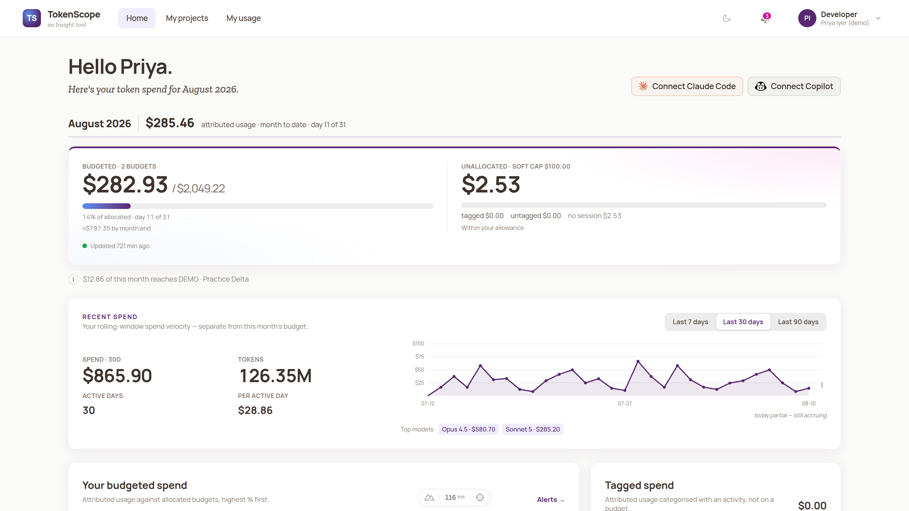
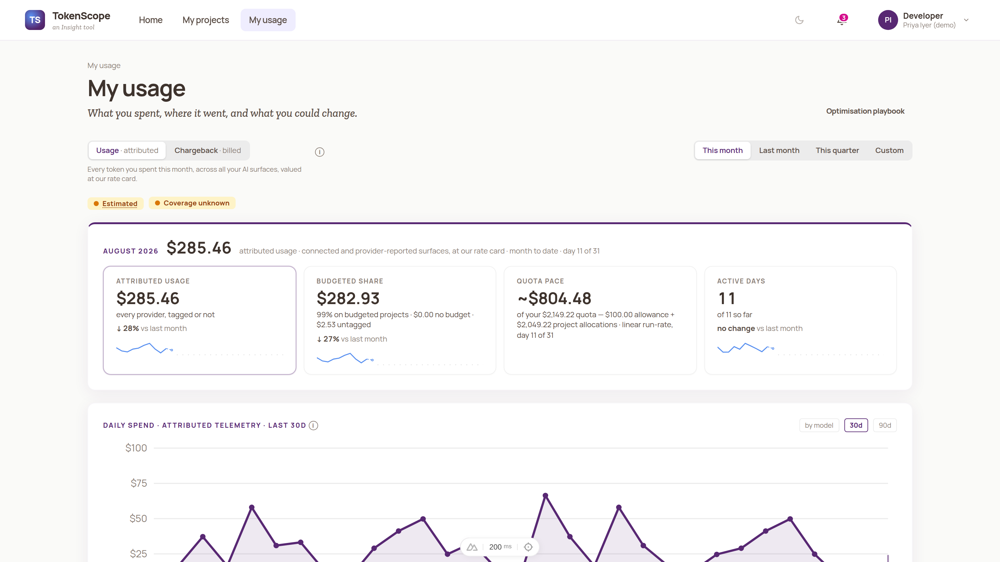
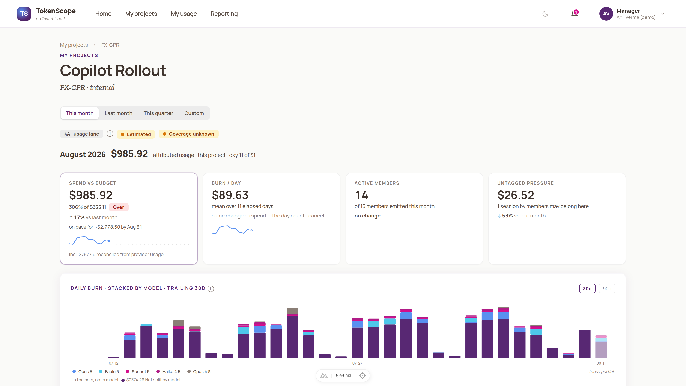
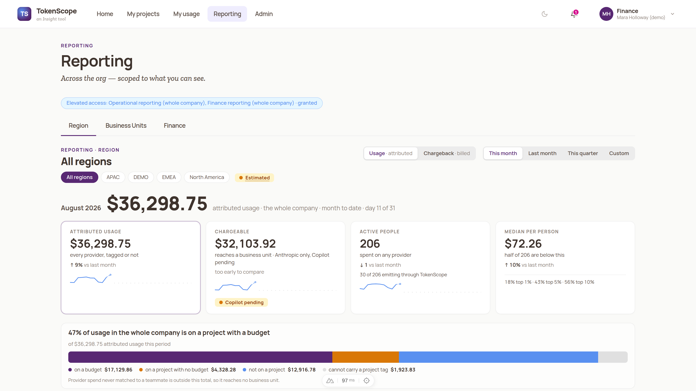
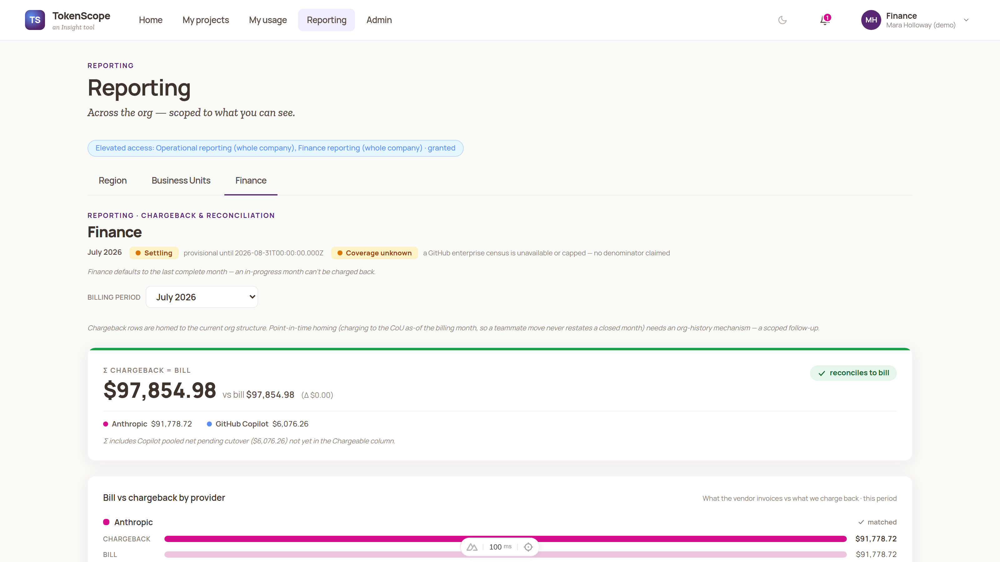
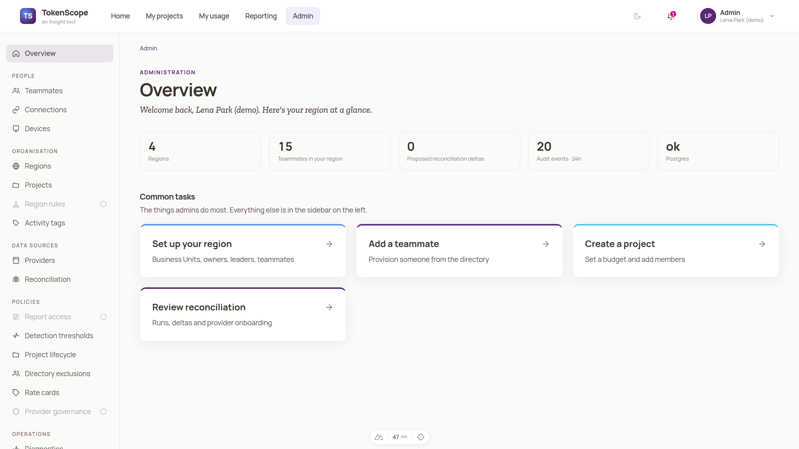

<div align="center">

# TokenScope

### Manage AI engineering the way you manage people engineering.

**People fill in timesheets. AI fills in TokenSheets.**

Both are assigned to projects. Projects carry an engineering budget — humans in
time, AI in tokens. You track burn toward completion, and when the work needs
more, a manager reviews and extends it. Same paradigm, same discipline —
TokenScope is the part that does it for your AI developers (and the people who
manage them).

[Principles](docs/PRINCIPLES.md) · [Architecture](docs/ARCHITECTURE.md) · [Providers](docs/PROVIDERS.md) · [Run locally](docs/RUN-LOCALLY.md) · [Deploy to Azure](docs/DEPLOY-AZURE.md) · [Configuration](docs/CONFIGURATION.md)

</div>

---

## What it is

TokenScope attributes AI-coding-tool token spend to **teammates, sessions, and
projects**, reconciles that usage against the provider's billing truth, and lets
project/agile managers run **token budgets** the way they run people budgets —
with burn-down, projected cost, and deliberate top-ups.

It is built on one idea: **a token is a unit of engineering effort.** If a
developer's time bills to a project, so should a developer's tokens. TokenScope
gives every token an owner (a teammate), a claim (a project), and a home (a
cost-owning unit) — and shows both the person's _usage_ and the organisation's
_cost_ without ever letting the two be confused.

## What it looks like

All screenshots come from the synthetic demo estate — fictitious people,
fictitious clients, data generated through the real ingestion pipeline.

| | |
|---|---|
| **Developer dashboard** — month spend against budget, connect nudges, rolling velocity | **My usage** — where it went, quota pace, and what you could change |
|  |  |
| **A project** — budget vs burn, per-model daily stack, every contributor | **Reporting** — the whole company, region by region, coverage made explicit |
|  |  |
| **Finance** — chargeback reconciling to the provider bill, to the cent | **Admin** — org setup, policies, and data-source operations in one place |
|  |  |

## The two lenses (why this isn't just a cost dashboard)

TokenScope keeps two concerns rigorously separate — a discipline baked into the
schema, not a reporting toggle:

- **§A — Usage completeness ("My usage").** What a person actually consumed,
  whether or not their tools were instrumented. This is _attribution_, not
  chargeback, and it must never read below the provider's own truth.
- **§B — Billing / chargeback.** The cost-of-record, charged at the grain the
  provider actually bills (per-user for some, pooled-per-cost-centre for others)
  and displayed at the grain people care about.

_Showing usage is not the same as charging for it._ Keeping that line clean is
the difference between a tool people trust and a tool people game.

## What works today

- **Two clients, one backbone.** [Claude Code](docs/PROVIDERS.md#claude-code)
  and [GitHub Copilot CLI](docs/PROVIDERS.md#github-copilot) both emit through a
  single OAuth-2.1 MCP server. **Zero-touch by design** — "emit now, attribute
  later"; a developer is onboarded once and never fills a form.
- **Attribution hierarchy.** `teammate → instance → session → project`. Every
  token is priced by a rate card into an `attribution_record`, joined on an
  unspoofable server-minted instance identity.
- **Reconciliation.** A batch truth-poller (the provider's usage API) runs
  alongside the streaming OTel signal, so usage completeness holds even for
  people who never enrolled — for the lanes that are metered today. Some
  surfaces are not yet covered; `docs/wiki/Reporting.md` §6 lists them. Reporting
  the coverage denominator alongside those totals, rather than leaving a gap
  silent, is designed and not yet built.
- **Project budgets with financial gravity.** A base allowance for exploration
  vs a real project budget for budgeted work, with **volume** and **velocity**
  limits — budgets that teach, not gates that block.
- **Reporting scopes & roles.** Developer "my usage", manager budget-burn,
  finance chargeback, and cost-centre P&L — a six-role RBAC model with
  region-scoped and platform-wide admins.
- **Cost-centre ownership & directory placement.** Every token lands on a
  project, or failing that a named cost-owning unit, placed from your identity
  directory.

Provider coverage grows as OpenTelemetry and provider usage APIs allow — Claude
and GitHub today, others to come.

## Quick start (local)

```bash
git clone https://github.com/Insight-Services-APAC/tokenscope-public.git
cd tokenscope-public
npm install
cp .env.example .env              # then generate the three secrets (see RUN-LOCALLY.md)
npm run dev:stack                 # Postgres + a local telemetry store + fakes
npm run db:migrate && npm run db:seed
npm run dev                       # the app on http://localhost:3450
```

Full walkthrough: **[docs/RUN-LOCALLY.md](docs/RUN-LOCALLY.md)**.

## Deploy to Azure

One Bicep template, two postures:

| | Use it for | How |
|---|---|---|
| **Sandbox** | Trying TokenScope on Azure: a developer or pilot environment. Public endpoints; about an hour to first sign-in. | `infra/parameters/example-sandbox.bicepparam`, deployed by hand or with the example workflows |
| **VNet-integrated** | Staging and production. Private endpoints on every data plane, internal-only app ingress, private registry. | `infra/parameters/example-vnetted.bicepparam`, deployed with the example GitHub Actions workflows |

**For production we recommend Azure Front Door Premium over Private Link:** no
TokenScope service is reachable from the internet except through Front Door's
WAF. Your own WAF or application gateway in front of the internal app is the
supported alternative.

- Deploy a **release**, not `main`: each
  [release](https://github.com/Insight-Services-APAC/tokenscope-public/releases)
  is a tag (`git checkout v<version>`) whose notes say what changed, what to do
  before upgrading, and which deployments it passed. A major version means the
  upgrade needs action; minor and patch releases are a redeploy.
- Walkthrough and prerequisites (Entra app registration, secrets, providers):
  **[docs/DEPLOY-AZURE.md](docs/DEPLOY-AZURE.md)**
- Tested GitHub Actions workflows (infra what-if/apply, build, roll, verify,
  roll back): **[examples/github-actions/](examples/github-actions/README.md)**
- Settings: **[docs/CONFIGURATION.md](docs/CONFIGURATION.md)**

## Is this for you?

TokenScope is opinionated. It's for organisations and teams that want to treat
AI engineering as **budgeted, project-assigned, managed engineering work** — the
TokenSheets paradigm. If that's your model, it should fit cleanly. If it isn't,
it won't, and that's fine — see [docs/PRINCIPLES.md](docs/PRINCIPLES.md) for the
full statement of intent so you know exactly what you're adopting.

## Status

Released: versioned releases. Each release's notes say which deployment
postures it passed on Azure, following these docs, before it was tagged. Claude Code and Copilot CLI both emit and attribute; some connectors and
provider-billing reconciliation paths are on the roadmap. Built
and open-sourced by [Insight Services APAC](https://github.com/Insight-Services-APAC).

## Contributing & security

See [CONTRIBUTING.md](CONTRIBUTING.md), [CODE_OF_CONDUCT.md](CODE_OF_CONDUCT.md),
and [SECURITY.md](SECURITY.md).

## Licence

[Apache License 2.0](LICENSE) — Copyright 2026 Insight Enterprises Australia Pty
Ltd. See [NOTICE](NOTICE).
