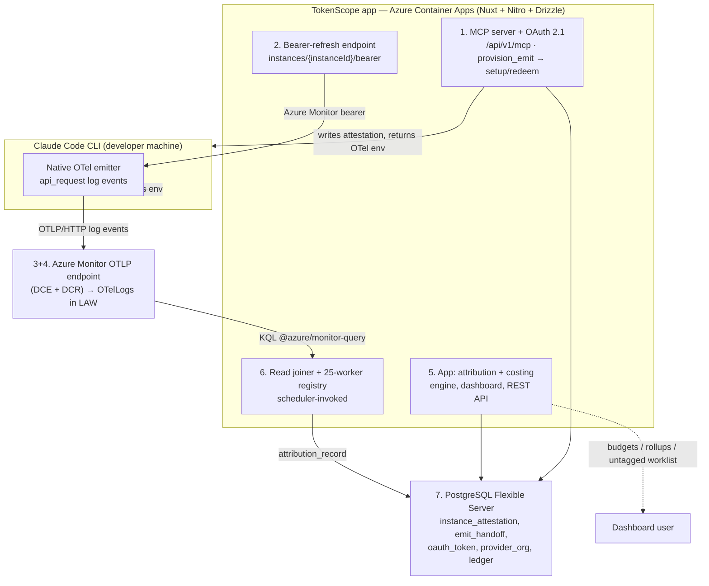
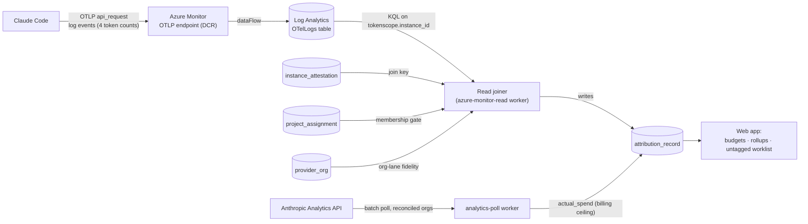
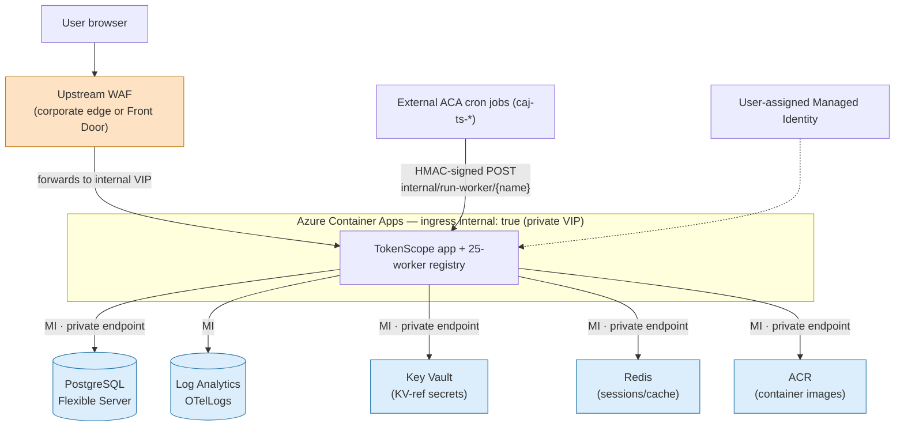

# Architecture

TokenScope attributes Claude Code token spend to projects. It is a Nuxt 3 / Nitro app with Drizzle + PostgreSQL, deployed on Azure Container Apps. The attribution surface is **OTel log events read from Log Analytics via KQL** — not metrics, not spans.

> Sibling pages hold the detail: [Data Model](Data-Model.md), [Authentication & Security](Authentication-and-Security.md), [Background Workers](Background-Workers.md), [Claude Code Client](Claude-Code-Client.md), [Deployment & Operations](Deployment-and-Operations.md).

## Terminology

The domain topology, restated for the engineering wiki. The repo-root
`AGENTS.md` §Domain model / Terminology is the canonical source; this is the
as-built mirror. The hierarchy is **teammate → instance → session → project**,
and spend is attributed per record.

- **Teammate** — the human (Entra identity); who incurred the spend.
- **Instance** — a device/enrolment: ONE per machine or container, minted once
  by the MCP `provision_emit` tool (run by the `tokenscope-setup` prompt).
  Identified by the OTel wire attribute `tokenscope.instance_id` and stored as
  `instance_attestation.instance_id`. It is the server-minted, OAuth-emit-bound,
  unspoofable teammate binding; bearer/lifecycle routes live under
  `/api/v1/instances/...`. (The table is `instance_attestation` — the per-INSTANCE
  record. It was `session_attestation` historically; migration 0019 renamed it.)
- **Session** — a Claude Code session = ONE `claude` run = a conversation. It is
  Claude's own `session.id`, captured as `attribution_record.claude_session_id`
  and `session_assignment.claude_session_id`. Subagents share their PARENT
  session's id (they are not separate sessions). This is the user-facing unit
  ("Recent sessions") and the unit of retroactive project assignment. There is
  no finer granularity than a session.
- **Project** — what the spend bills to. Resolved per record by the emitted
  `project.code_hash` (the ADR-0004 "B′" model — a claim), membership-gated
  ("tag proposes, membership disposes"). Untagged spend is retroactively
  assigned per-session via `session_assignment` (`claude_session_id →
  project_id`), also membership-gated.
- **Attribution** — `attribution_record`, one row per (instance, session, event,
  token-type, model), priced by rate card.

## Logical architecture

The as-built system is seven components. There is **no launcher, no Insight-side token broker** — those were design-era ideas the build superseded. (A remote **MCP server** + OAuth 2.1 client backbone is **built and live** for both Claude Code and GitHub Copilot CLI; component 1 below.)

- **MCP server + OAuth 2.1** — the `/api/v1/mcp` remote MCP server (read/tag tools + prompts), authenticated by one PKCE browser consent (`tokenscope.read`+`tag`). The read-scoped `provision_emit` tool locates-or-creates the `instance_attestation` and mints a one-time `emit_handoff`; the local helper redeems it at `POST /api/v1/setup/redeem` for the durable emit credential + the OTel env bundle the CLI writes into `~/.claude/settings.json`. (Replaced the retired setup-token enrolment, PR #38.)
- **Bearer-refresh endpoint** — `GET /api/v1/instances/{instanceId}/bearer`, the `otelHeadersHelper` target; OAuth `tokenscope.emit` authed (not a cookie), returns the Azure Monitor bearer.
- **Native OTel emitter** — Claude Code emits `api_request` **log events** directly to Azure Monitor with our injected `OTEL_RESOURCE_ATTRIBUTES` (`tokenscope.instance_id`, `project.code_hash`, `tool`). No TokenScope code runs in the CLI process.
- **Azure Monitor OTLP endpoint → LAW** — DCE + DCR route the built-in OTel log stream into the `OTelLogs` table on a Log Analytics Workspace.
- **TokenScope app** — attribution + costing engine, registry, dashboard, REST API, worker registry.
- **Read joiner + workers** — a static registry of **25 workers** invoked by an external scheduler; the `azure-monitor-read` worker is the read joiner. See [Background Workers](Background-Workers.md) for the full roster.
- **TokenScope DB** — the authoritative *derived* state and the join source-of-truth.

## Attribution data flow

Two ingestion paths feed attribution: the **per-event telemetry path** (live signal) and the **Analytics API poller** (batch billing truth).

- **Telemetry path (live):** Claude Code → OTLP log events → Azure Monitor → `OTelLogs` → read joiner. The joiner queries `OTelLogs` via KQL, joins on the TokenScope-minted `tokenscope.instance_id` (the device/enrolment INSTANCE id, not Claude's own per-SESSION `session.id`, which is captured per-record as `claude_session_id`), applies the membership gate and org-lane selection, computes cost, and writes `attribution_record`.
- **Analytics path (batch truth):** the `analytics-poll` worker polls each *reconciled* Anthropic org from month-start through today; idempotent daily rows upsert into `actual_spend` and act as the per-org billing ceiling. Each row lands in a **per-surface tool lane** (#142) — Claude Code plus the non-Code surfaces (chat, Cowork, Office agents, Chrome, Design, Slack; unknowns in a labelled `claude-other` fallback) — so non-Code spend is a chargeback lane of its own, not part of the `claude-code` figure. Zero reconciled orgs = clean no-op. See [Background Workers](Background-Workers.md).
- The read joiner is **pull-and-rejoin**, not write-once — it re-scans recent joinable sessions each tick, so late-arriving events get picked up when LAW recovers.

## Technical / deployment topology

The reference VNet-integrated deployment runs the app on **Azure Container Apps** with **internal ingress** (a private VIP) behind an **upstream WAF** (a shared corporate edge or an optional per-app Azure Front Door — selectable). PostgreSQL, Redis, Key Vault and ACR are all private (private endpoints); every backing service is reached by managed identity. (Instance-specific values — region, resource-group / VNet names, and which edge is used — live in your deployment's own configuration.)

- **The upstream WAF** is the only public ingress; it terminates TLS and forwards to the internal ACA VIP. Whether that edge is a shared corporate WAF (no per-app Front Door, no `X-Azure-FDID` dependency) or a per-app Azure Front Door is a per-environment choice (`enableFrontDoor`).
- **ACA ingress is internal** (`internal: true`, private VIP) — the app is not publicly reachable except through the WAF. `/api/health` remains the ACA probe target.
- **External scheduler** (ACA cron jobs) drives the workers via the HMAC-signed `run-worker/{name}` endpoint — there is no standing worker pool and no BullMQ/Redis queue.
- **PostgreSQL Flexible Server** (private endpoint) holds derived state (RLS + audit-trigger append-only). **Log Analytics** is the read-only attribution surface. **Key Vault** (private endpoint) is the single secrets surface; **Redis** (private endpoint) holds sessions/cache only; **ACR** (private endpoint) serves container images.
- The concrete region and the exact private-endpoint resource set for the Insight instance are in your deployment's own configuration.

## The two ingestion paths

| Path | Source | Cadence | Role |
|---|---|---|---|
| **Telemetry** | Claude Code OTLP log events → `OTelLogs` | continuous (joiner runs ~every 5 min) | Live per-session attribution signal |
| **Analytics API** | Anthropic Analytics API (per reconciled org) | batch (poller ~every 15 min) | Billing ceiling / reconciliation truth |

The telemetry path is full-fidelity (log events ingested in full, unsampled). The Analytics path supplies the authoritative spend that reconciliation reconciles the telemetry estimate against.

## Trust model

**Source split — attested identity × claimed project.** Attribution combines two independently-sourced facts: the **teammate** is resolved from the **authed device attestation** by `tokenscope.instance_id` (the DEVICE_SID / device-enrolment INSTANCE id, bound to the teammate at an authenticated device enrol — **unspoofable per-event**), while the **project** is taken from the emitted per-event `.tokenscope` `project.code_hash` (a *claim*). The membership gate decides whether the two combine into a bill. See [ADR-0004](../decisions/0004-attribution-trust-model.md).

**Membership gate — "tag proposes, membership disposes."** The `project.code_hash` in a session's resource attributes is a *claim*, not an authorisation. Before billing the attested teammate's spend to the claimed project, the joiner checks the teammate is a *current* `project_assignment` member. If not, it **withholds** the attribution, the spend spills to untagged (for retroactive tagging), and an `attribution-spill-unauthorized` audit event fires. The same gate guards repo tagging (the MCP `tag_session` / `resolve_repo_project` tools and the `/me/sessions/{sid}/assign` quick-assign only admit projects the teammate is a member of).

**Org-lane fidelity** — the `provider_org` registry sets each org's lane by `organization.id`:

| Lane | Fidelity / cost basis | Billing |
|---|---|---|
| **reconciled** | tier-1, cost estimated (Analytics API = ceiling) | billed |
| **indicative** | tier-2 / telemetry-only | tracked, excluded from billing |
| **unknown org** | tier-2 / telemetry-only, best-effort + `attribution-org-unclassified` audit event | never billed |

## Region & RBAC

- **Region:** multi-region operating model on the surface; the as-built dev deployment lands in a single region (see your deployment's own configuration for the instance's region). A region-local stack is design-surface only.
- **Region derivation (placement).** A cost-bearing teammate's home region/unit is derived by a fixed precedence (highest wins): **cost-centre** (exact directory cost-centre → cost-owning unit) > **chain-unit** (manager-chain resolves to an owned unit/practice) > **attribute-rule** (a configurable directory-attribute → region rule) > **chain-region** (manager-chain resolves to a region leader) > **billing-region** (provider license-org → region fallback) > **global** (the unassigned holding node). `placement-sync` runs this bill-driven placement; `region-reenrichment` re-derives it on a `0 */6 * * *` cadence to heal stale/unplaced homes (2026-07-17 change). See [Background Workers](Background-Workers.md).
- **RBAC:** roles (cost-owning unit owner, regional/global FinOps, manager, admin) scoped by region + org-unit path, enforced at two layers — PostgreSQL RLS (ground truth) plus app-level `requireRole`; dashboard auth is Entra via `nuxt-oidc-auth`. The admin area is a persistent admin shell (sidebar-navigated) with an Overview launcher, first-class Providers, a Settings split into System info + Policies, and a roles glossary.

## Built vs Planned

**Built (shipped):**
- **Claude Code client** — MCP server + OAuth 2.1 client backbone (PKCE consent, dynamic registration, grant lifecycle / revoke), `provision_emit`→`/setup/redeem` device provisioning + bearer-refresh, native OTel log-event ingestion, logs→LAW→KQL read joiner with membership gate + org-lane reconciliation.
- **GitHub Copilot CLI client** — same MCP/OAuth backbone + `copilot-plugin/` (three skills, `hooks.json`), singleton file-forwarder (`copilot-forwarder.mjs`) that tails the Copilot OTEL file, filters `chat` spans (double-count guard), transcodes to `api_request` OTLP-logs protobuf, and forwards to Azure Monitor every ~60s. Provisioning writes `~/.tokenscope/config.json`. Copilot v1 spend is **indicative** (tier-2/telemetry-only), priced at 1 AI credit = $0.01 USD.
- 25-worker scheduler-driven registry, dashboard with budgets/rollups/untagged worklist, RLS + trigger-enforced audit log, internal ACA ingress behind an upstream WAF.

**Planned (future-state, not built):**
- **GitHub-billing-API reconciliation** — lifts Copilot spend from tier-2 to tier-1 (the F2 worker).
- Financial (FIN) connectors — full Polaris/Workday/SAP adapters (only the `connector-health` worker against `sync_conflict` rows shipped).
- BullMQ/Redis job queues + audit-log mirror to Log Analytics.
- Foundry-routed AI coaching.
- Per-region self-contained stacks.
