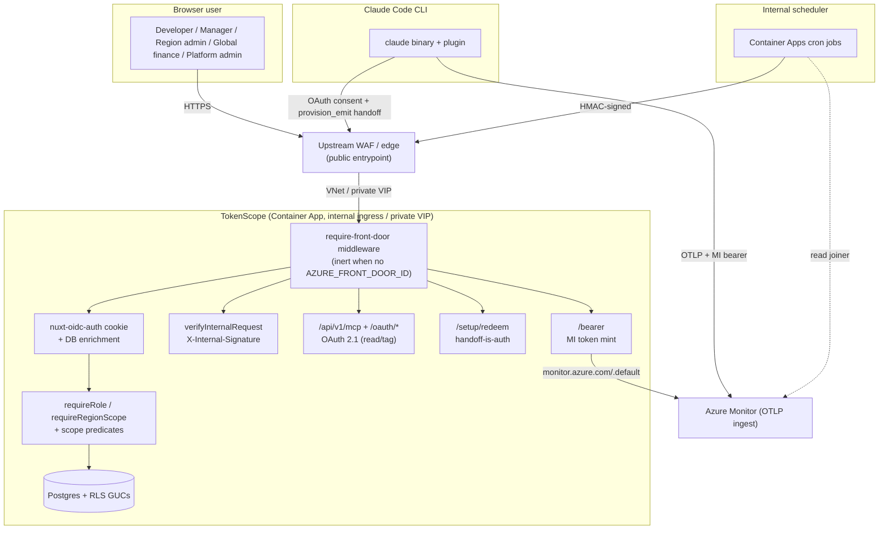
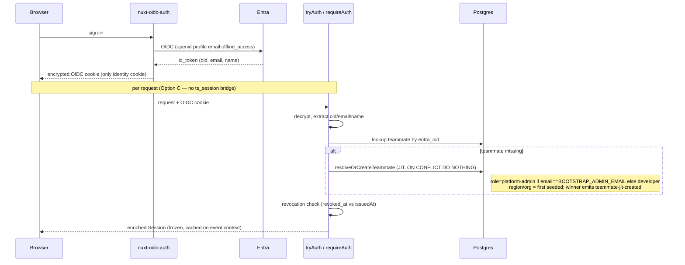
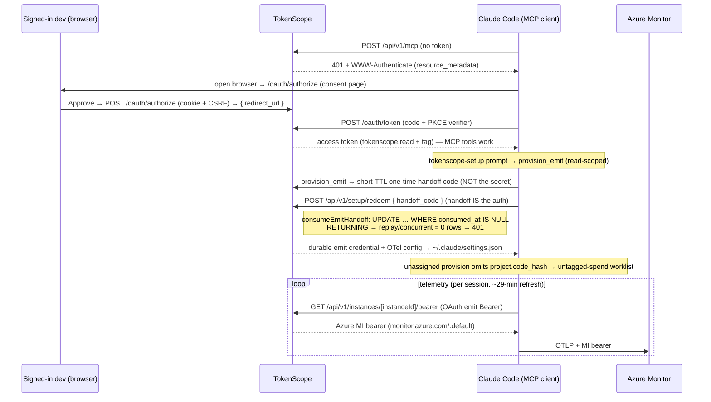
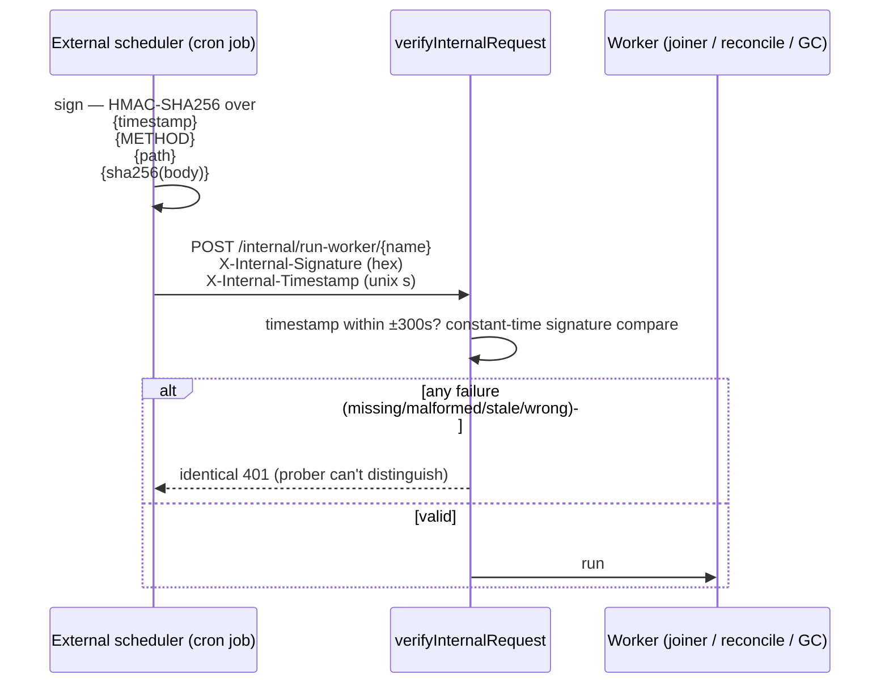

# Authentication & Security

As-built reference for how TokenScope authenticates callers and defends its data.
Names the exact mechanisms, env vars, headers, and cookies in the shipped code.
System shape: [Architecture](Architecture.md). Endpoint detail: [API Reference](API-Reference.md).

> Deployment-specific values (real hostnames, the upstream WAF, environment
> switches) are illustrated generically here; the Insight instance's specifics
> live in [Insight Deployment](Insight-Deployment.md).

## Trust boundaries

Four caller classes, four authentication mechanisms — each carries a different kind of trust.

| Caller | Mechanism | Notes |
|---|---|---|
| **Browser users** (developer / manager / region admin / global finance / platform admin) | Entra OIDC cookie (`nuxt-oidc-auth`) + per-request DB enrichment | Only path that can read "my projects"/consumption or change attribution |
| **MCP / CLI clients** (Claude Code) | **OAuth 2.1** (PKCE) — `tokenscope.read`+`tag` for the MCP tools; `tokenscope.emit` for ingest | One browser consent grants read+tag; device emit is provisioned via a secret-isolating handoff (`provision_emit` → `/setup/redeem`). Replaced the retired setup-token enrolment (PR #38). |
| **Internal schedulers / workers** | **HMAC-SHA256** request signature | Key separate from the user-session HMAC key |
| **Telemetry → Azure** | App-level **Managed Identity** bearer, `monitor.azure.com/.default` | Write-only, narrow-scope, same token every session — Azure never sees a TokenScope token |



**Defence in depth:** the **app gate** (`requireRole`, `requireRegionScope`, scope predicates) runs first and denies *loudly* — `403` RFC-9457 body + audit. **DB Row-Level Security** is the ground-truth backstop and denies *quietly* — empty result sets where it disagrees with the app.

> **As-built caveat:** RLS policies are shipped but **inert at runtime** — the app connects as the table owner (owner connections bypass RLS unless `FORCE ROW LEVEL SECURITY`). Until the non-owner DB role lands, the **app-level scope predicates are the live authorization boundary** (`allocationScopePredicate`, `assertProjectScope`, `requireReportScope`). Do not rely on RLS as the sole boundary today.

## Web authentication (Entra OIDC)



- Configured in `nuxt.config.ts` under the `entra` provider; OIDC enabled unless `NUXT_OIDC_AUTH_DEV_MODE === 'true'`.
- Secrets (`clientId`, `clientSecret`, URLs) are build-time placeholders, overridden at boot by `NUXT_OIDC_PROVIDERS_ENTRA_*` env vars — `nuxt.config.ts` is evaluated at build with no secrets present, so reading `process.env` in provider config is deliberately avoided.
- `userNameClaim = preferred_username`; `oid`/`email`/`name` passed through as optional claims.
- **Session resolution — Option C** (`docs/design/auth-session-cookie-architecture.md`): identity resolved **per request** from OIDC cookie + DB enrichment; the earlier dual-cookie `ts_session` bridge was retired.
  - `tryAuth(event)` → resolved `Session` or `null` (unauthenticated / enrichment fails).
  - `requireAuth(event)` → strict gate; `401` problem-details on no session.
  - Enriched `Session` = `teammateId, email, displayName, role, regionId, orgPath, issuedAt`; **frozen + cached per request** on `event.context.__tokenscope_session` so middleware → `withRequestRls` → route share one DB lookup.
  - **Revocation:** a session minted before the teammate's `revoked_at` is rejected.

### Persona override (non-production demo impersonation — sidecar path)

> **Structurally disabled outside demo environments.** This is a non-production
> *demo* affordance. Its availability is an **allowlist floor**, not a
> production denylist: demo / act-as / impersonation is enabled **only when the
> deploy env ∈ {`local`, `sandbox`}** (`shared/env/deploy-env.ts` —
> `DEMO_CAPABLE_ENVS`). Every other env — `dev`, `staging`, `production`, and
> `unknown` (a dropped/unrecognised env identity) — **404s BEFORE any flag or
> caller role is consulted**, so no single env flag
> (`NUXT_ALLOW_PERSONA_OVERRIDE`, `NUXT_OIDC_AUTH_DEV_MODE`) can re-open
> impersonation. The mechanism below ships in code and is documented for
> completeness; in any non-demo env it is refused at the structural floor.

```mermaid
flowchart TB
    A["Admin: POST /api/v1/auth/dev-login"] --> FLOOR{env ∈ local/sandbox?<br/>(allowlist floor)}
    FLOOR -->|no — dev/staging/production/unknown| R404F[404 — env-not-demo-capable<br/>before any flag/role]
    FLOOR -->|yes| G{evaluatePersonaGate}
    G -->|override off| R404[404 — override-disabled]
    G -->|on, no session| R401[401]
    G -->|on, wrong role| R403[403]
    G -->|DEV_MODE=true OR<br/>ALLOW_PERSONA_OVERRIDE + Entra admin/global-finops/platform-admin| OK[mint ts_persona_override cookie]
    OK --> T["tryAuth returns persona identity<br/>+ impersonatorOid/Email/At"]
    T --> AUD[persona-impersonation audit<br/>fail-closed if insert fails]
```

- **Allowlist floor first** (`server/auth/persona-override.ts` →
  `evaluatePersonaGate`): if the env is not demo-capable (`demoCapable=false`,
  i.e. not `local`/`sandbox`), the gate returns `404` immediately — before any
  flag or caller role. This replaced an older production-only denylist that only
  refused the literal string `'production'` and left `dev`/`staging`/`''`
  failing OPEN.
- HMAC-signed sidecar cookie `ts_persona_override` (`server/utils/persona-override-cookie.ts`), separate from the OIDC cookie; minted only when the gate is on (i.e. only in a demo-capable env). Wire format `base64url(payload).hex(HMAC-SHA256(payload))`, signed with `NUXT_SESSION_SECRET`; `httpOnly`, `sameSite=lax`, path `/`, `secure` on every deployed env.
- Behind the floor the gate keys on `NUXT_OIDC_AUTH_DEV_MODE` (true → sidecar is *primary* identity, no Entra) and `NUXT_ALLOW_PERSONA_OVERRIDE` (true + Entra `admin`/`global-finops`/`platform-admin`). The env classification keys on `NUXT_DEPLOY_ENV` (falling back to `NODE_ENV` only to fail closed), **not `NODE_ENV`** alone (which is always `'production'` on deployed containers).
- Two hardening guards: override honoured only when its `impersonatorOid` matches the live OIDC identity (stale cookie can't elevate another user), and target must be a `DEMO_PERSONAS` member (leaked HMAC secret still can't impersonate an arbitrary teammate). Cleared by `POST /api/v1/auth/stop-impersonating` and logout.

## RBAC — roles & scoping

| Role | Label (`ROLE_LABELS`) | Scope |
|---|---|---|
| `developer` | Developer | Own data |
| `manager` | Manager | Own org subtree (allocations within the org path) |
| `admin` | **Region admin** | A single home region (region-scoped) |
| `finance` | **Finance (retired)** | **Retired / unassignable** — kept in the `ROLES` enum only for exhaustiveness / historical rows; **excluded from `SELECTABLE_ROLES`**, never offered in role dropdowns and assigned to no one. Region-scoped finance is served by `admin`; org-wide finance by `global-finops`. |
| `global-finops` | **Global finance** | Cross-region, org-wide finance / finops |
| `platform-admin` | Platform admin | Cross-region super-admin — satisfies every gate |

Canonical human-facing labels come from `ROLE_LABELS` (`shared/auth/roles.ts`) —
`admin` = "Region admin", `global-finops` = "Global finance", deliberately
distinct from the retired `finance` = "Finance (retired)".

- `requireRole(event, ...allowed)` — variadic; permits if role ∈ `allowed`. `platform-admin` short-circuits every check. `403` RFC-9457 on denial.
- `requireRegionScope(event, regionId)` — binds an `admin` to their home region; `global-finops`/`platform-admin` are region-unbounded.

Per-resource scope helpers (the *live* boundary while RLS is inert):

| Helper | Effect |
|---|---|
| `allocationScopePredicate(tableRef)` | SQL predicate: `admin`/`global-finops` bypass; else project cost-owning unit must sit within caller's `app.user_org_path` ltree subtree. Used by every allocation read. |
| `assertProjectScope(event, project)` | Write-side mirror: `admin` bound to project region; `manager` needs project cost-owning unit in org subtree; `global-finops` unbounded. |
| `requireReportScope(event, tx, scope)` | The `/reports/*` read gate. Resolves caller + active cost-centre ownership, evaluates the admin-configurable **report-visibility policy** (`reportGrants`), and throws the same RFC-9457 `403` as `requireRole`. `requireAuth`-based (identity + an in-query/JS-computed scope) rather than a fixed-role gate — a documented exception to "every gate is `requireRole`". See [Report-visibility policy](#report-visibility-policy-report-scoping). |

Admin mutations (`server/auth/admin-guards.ts`): `evaluateRoleChange` blocks self-role-change, same-role no-ops, and enforces last-admin-per-region protection; `evaluateRevokeSessions` is always positive (revoking just forces re-sign-in).

### Report-visibility policy (report scoping)

The full RBAC above still decides *what a role can ever see*. On top of it,
**one org-wide, admin-configurable knob** decides which `/reports/*` scopes each
persona actually sees — a single named mode, default = today's behaviour.
Design: [`docs/design/report-visibility-policy.md`](../design/report-visibility-policy.md).

- **Modes** (`shared/auth/report-visibility.ts`, `REPORT_VISIBILITY_MODES`):
  - `standard` — **byte-identical to today's RBAC** (the default; no seed row ⇒
    `standard`, so an upgrade changes nothing).
  - `region-admins-see-all` — a region `admin` additionally sees the org-wide
    reports (across, finance, all regions, all cost centres).
  - `all-admins-see-all` — as above **plus** any caller with an active
    `cou_owner` row (a cost-centre owner) gets the same full report set.
  - Managers and developers are **unchanged in every mode**.
- **One source of truth.** `reportGrants(mode, caller)` returns the per-scope
  grant; a static **WHO-SEES-WHAT matrix** export drives both the admin-pane
  preview and the tests, so the preview can never drift from the gate.
- **Enforcement is `requireReportScope`** (the scope-helper row above), applied
  to the across-regions and finance report routes; the `regional` and
  `cost-centre` resolvers take a policy-computed `crossRegion` / `unbounded`
  flag. `finance` is a plain **boolean** grant — `true` sees the whole-company
  `/reports/finance` pack (region-unbounded by design), granted under `standard`
  to `global-finops` / `platform-admin` only; a region admin or cost-centre owner
  reaches it only under a loosened mode. (The tri-state finance grant and its
  `financeRegionFilter` clamp existed only for the retired `/rollups/finance*`
  surface.)
- **Pure app gate — RLS-inert.** Like every scope helper, `requireReportScope`
  is the *live* boundary; the GUC/RLS layer is untouched by this feature and
  inert at runtime (see caveat below). The loosened grants are threaded as
  explicit JS-computed scope arguments, not GUC changes.
- **Read-only blast radius.** The policy module is imported **only** by
  `/api/v1/reports/**` (+ `meta` + the admin-pane endpoints). It never touches
  write endpoints, `rollups` mutation paths, `me/*`, or provisioning. Every deny
  on an `all-regions`-required scope (across + `/reports/finance`) is audited
  (`report-scope-denied`) — those have no in-query backstop, so the audit *is*
  the record.
- **Admin surface.** `GET/PUT /api/v1/admin/report-visibility` — GET is
  `admin | global-finops` (read); PUT re-narrows to `platform-admin |
  global-finops` (org-wide config, `assertSameOrigin`, before/after
  `report-visibility-changed` audit). Editable at Admin → Settings → Report
  visibility.

## Row-Level Security (RLS)

Four session GUCs set per transaction via `withRlsContext` / `withRequestRls` using `SET LOCAL` (settings vanish on transaction return; next checkout doesn't inherit):
`app.user_region_id`, `app.user_org_path`, `app.user_role`, `app.user_teammate_id`.

- `withRequestRls(event, fn)` resolves the session via `requireAuth`, maps `platform-admin` → unbounded `global-finops` at the RLS layer (every policy already treats `global-finops` as org-wide), runs `fn` in the scoped transaction.
- Shipped policies (e.g. `allocation_admin_only`, `allocation_manager_scope`) read these GUCs.
- **Inert today** under the owner connection (see caveat above) — app-level scope predicates are the live boundary until the non-owner role ships.

## MCP/CLI auth + telemetry (OAuth 2.1)



### OAuth 2.1 consent (read + tag)

- The MCP client runs a client-initiated PKCE (S256) authorization-code flow against `/api/v1/oauth/{authorize,token,register,revoke}`. The **GET `/oauth/authorize`** gates the Entra session and validates `client_id`/`redirect_uri`, then 302s to the consent page (`app/pages/oauth/authorize.vue`); **POST `/oauth/authorize`** is the grant — the one cookie-bearing OAuth endpoint, so it **requires `assertSameOrigin`** (the cookieless token/register/revoke endpoints deliberately skip CSRF). It reuses `issueAuthCode` (teammate-bound, PKCE-carried).
- Tokens are stored as HMAC hashes only (`oauth_token`); the raw value is returned once. Refresh is **non-rotating** — revoke (not rotation) is the control (ADR-0005). `requireOAuthBearer` joins `teammate.revoked_at` for the E2 revocation cascade.
- The granted scopes are `tokenscope.read` + `tokenscope.tag` (MCP tools). The separate `tokenscope.emit` credential is provisioned via the handoff below, never granted directly to the consent.

### Device emit provisioning (secret-isolating handoff)

The everyday self-service connect path (sequence above). The read-scoped `provision_emit` MCP tool locates-or-creates the device's `instance_attestation` and mints a **short-TTL (~5 min) one-time handoff code** in `emit_handoff` — it does **not** return the durable emit credential, so the broadly-readable secret never enters the LLM's context. A local helper redeems the handoff at **`POST /api/v1/setup/redeem`** (handoff-is-auth, no cookie/CSRF, like `/bearer`), single-use enforced atomically via `consumeEmitHandoff`'s conditional `UPDATE … RETURNING`. Redeem mints the durable `tokenscope.emit` credential (scope never widened) bound to the instance — rotating out any prior live emit credential for that device — and returns the OTel bundle. This read→emit crossing is the single audited exception to the read/emit wall (ADR-0005 E1).

### Azure Monitor ingest bearer

- `GET /api/v1/instances/[instanceId]/bearer` (`server/auth/obo.ts`) returns an Azure Entra token scoped to `https://monitor.azure.com/.default`. Despite the filename this is **not** a per-developer On-Behalf-Of flow — it is an **app-level Managed Identity token** (same token every session), from the container app's user-assigned MI holding *Monitoring Metrics Publisher* on the Data Collection Rule.
- Gates issuance on the OAuth `tokenscope.emit` access token (the bound teammate must own the instance), then returns the MI-minted token; refreshed within Claude's ~29-min headers-helper window. Each mint doubles as an authenticated heartbeat for the heartbeat-coverage check. Cached app-wide with a 5-min refresh skew + single-flight guard (racing `/bearer` requests collapse onto one `getToken`).
- Rationale (inline STRIDE note): token is **write-only, narrow-scope** — ingests to one DCR only, so leakage caps at ingest noise, not exfiltration; per-developer Azure RBAC is unnecessary for telemetry.
- `NUXT_AZURE_MONITOR_AUTH` mode: `'mi'` (real `ManagedIdentityCredential`, optional `NUXT_AZURE_MI_CLIENT_ID`; needs Azure IMDS), `'static'` (`NUXT_AZURE_MONITOR_STATIC_BEARER` verbatim — local/test seam), else deterministic mock. **Static mode is guarded in production** — throws unless `NUXT_ALLOW_STATIC_BEARER=1`, so a copy-pasted non-production config can't ship a live operator credential.

## The emit channel is untrusted — spoof detection, quarantine, and the read→emit wall

The `tokenscope.emit` credential is the **most broadly-readable secret in the
system**: it lives in `~/.claude/settings.json` on every host (and every CW
sharing that host), so anyone with read access to that file/host holds it. The
OTLP records it writes land in an **Azure Monitor / Log Analytics Workspace
(LAW)** that is **effectively public-write within the org**. The emit channel is
therefore **UNTRUSTED**: anyone holding an emit token (or LAW write access) can
hand-write **spoofed** `attribution_record` rows claiming a victim's
`tokenscope.instance_id`, `project.code_hash`, and email — rows that land
*provisionally* "assigned to you."

We **deliberately do not** defend this by trusting the wire or signing per record
— emitted telemetry is transitionary, reconciled data, not budget truth, and a
signing collector / proof-of-possession was rejected as over-engineering
([ADR-0005](../decisions/0005-durable-emission-auth-and-attestation.md),
[ADR-0008](../decisions/0008-emission-spoof-detection-and-quarantine.md)). The
defense is **revoke + detect + reconcile**, behind strict **emit-credential
isolation**.

### Emit-credential isolation — the read→emit one-way wall (HARD INVARIANT)

The broadly-readable emit credential is strictly walled from **every** privileged
surface. The wall is the **per-token-row scope** (`requireOAuthBearer` returns the
row's scope): an `tokenscope.emit`-only bearer is **rejected** by every MCP tool,
every `/api/v1/me/*` read, and every `/api/v1/admin/*` route (`insufficient_scope`
/ 401/403). Consent (`POST /oauth/authorize`) runs on the Entra browser session,
not a bearer, so an emit bearer **cannot authenticate a user** either.

- **The only sanctioned crossing is one-way `read → emit`:** a logged-in user's
  read token provisioning *their own* device via the audited `provision_emit`
  tool. `emit → read/tag/session` is **never** possible — a leaked emit token
  cannot read data, tag a session, or bootstrap privilege, and cannot even
  provision *another* emit credential (`provision_emit` requires read).
- **No privileged surface derives authority from any emitted field.** Budget,
  membership, identity, and authz come from the **authenticated** paths (session /
  read+tag user token, ownership-checked `tag_session`, the consent flow) and the
  **unspoofable instance attestation** — never from a `project` / `email` /
  `activity` value that arrived over OTel.

A leaked emit token can therefore **spoof telemetry** (handled below) but can
**never** read, tag, or act.

### Detection — authenticated-heartbeat coverage + quarantine

Each successful `/bearer` mint stamps `instance_attestation.last_bearer_at` — an
**authenticated heartbeat**: unspoofable proof that the instance's **true owner**
held a valid emit credential at time T. The mint requires the owner's OAuth
`tokenscope.emit` token *bound to that instance*, so a **cross-instance spoofer
cannot mint a bearer for a victim's instance.**

A background worker (`server/workers/heartbeat-coverage.ts`, table
`session_quarantine`, migration `0032`) computes per session whether the emitted
spend window `[MIN(ts_event), MAX(ts_event)]` is **covered** by the owner's
authenticated-live window `[ts_start, COALESCE(ts_actual_end, last_bearer_at) +
grace]` (grace ~35 min, comfortably over the ~29-min refresh cadence). Spend with
**no covering heartbeat** is flagged **QUARANTINED / "unverified spend"** and
surfaced at `GET /api/v1/me/quarantined-spend` (teammate-scoped: `requireAuth` +
RLS + an explicit `teammate_id` filter) and to the reconciliation reviewer.

- **Catches:** the **cross-instance spoof** — records claiming a victim's
  `instance_id` written by someone who cannot mint that instance's bearer → no
  covering heartbeat → quarantined **early**, before reconciliation (which lags
  ~1h+).
- **Does NOT catch:** full emit-credential **theft** — if the attacker steals the
  victim's emit credential, *their* `/bearer` mints stamp a heartbeat **as the
  victim**, so the spend looks covered. That residual stays on **revoke** (revoke
  the leaked grant) **+ reconcile** (theft-inflated spend that doesn't match real
  API usage is wiped).
- **Quarantine is INFORMATIONAL ONLY** — it **never** auto-revokes or
  auto-deletes; it is early-warning + an audit trail (a `spend-quarantined` audit
  event on first detection, explicitly tagged non-enforcement). **Reconciliation
  against Anthropic actuals is the only thing that wipes spend.** A historical-data
  guard (`last_bearer_at IS NULL`) excludes instances that never minted a heartbeat
  so pre-rollout spend is never quarantined retroactively.

### Reconcile + revoke

**Reconcile** against the Anthropic Analytics API actuals is the **truth /
backstop** — spend that does not reconcile to real recorded usage is **wiped**;
the wire is never the source of truth. **Revoke** ends an emit grant
(user self-service or admin); revoking it ends the instance's emission via the
revoke ↔ instance cascade (sets `ts_actual_end`). Detection (quarantine /
went-silent) **feeds** the revoke decision — it never performs it.

## Internal worker trigger (machine-to-machine HMAC)



- `verifyInternalRequest` (`server/auth/internal-request.ts`). Key `NUXT_INTERNAL_WORKER_HMAC_KEY` is **deliberately separate** from `NUXT_HMAC_SESSION_KEY` — blast-radius separation (leaked worker key can't replay user sessions, vice-versa).
- Both keys require ≥32 chars and ≥3.5 bits/byte Shannon entropy (long-but-trivial keys rejected).

## CSRF protection

`assertSameOrigin` (`server/auth/csrf.ts`) on `POST`/`PUT`/`PATCH`/`DELETE`:

| Origin / Referer | Result |
|---|---|
| Present + mismatched | `403` |
| Present + matching | allowed |
| Both absent | allowed (server-to-server / CLI / curl don't ride a stolen browser cookie) |

- Matters because the OIDC cookie is `sameSite=lax` (blocks cross-site XHR, not top-level form POSTs).
- **Expected origin is the PUBLIC origin**, resolved through the single chokepoint `getPublicRequestURL` (`server/utils/public-url.ts`) — the same function CSRF, the bearer/OTLP endpoints, and the OAuth metadata all route through. Resolution order:
  1. **Pinned `appPublicOrigin`** (`APP_PUBLIC_ORIGIN`) — when an upstream WAF/proxy fronts the app under a fixed hostname, the app **pins its public origin from config**. This is deliberately independent of `Host`/`X-Forwarded-*`, so same-origin matching is correct **whether the proxy preserves or rewrites the `Host` header** — no reliance on the WAF forwarding the original Host.
  2. **`X-Forwarded-Host`/`X-Forwarded-Proto`** — honoured **only when `AZURE_FRONT_DOOR_ID` is set** (the same gate as `require-front-door`, inside which every request already carries a matching `X-Azure-FDID`, so the forwarded headers are trustworthy). Trusting `X-Forwarded-*` otherwise would allow header-injection origin forgery.
  3. Otherwise the request's own Host (local dev / no proxy).
- **WAF-fronted deployments** (no per-app AFD): set `appPublicOrigin` to the public hostname the WAF exposes. Same-origin validation then uses the user-facing origin, not the internal Container Apps FQDN — with no dependency on the WAF's Host-forwarding behaviour. (The Insight dev value is in [Insight Deployment](Insight-Deployment.md).)
- Token-is-auth endpoints (`/setup/redeem`, `/bearer`) and the cookieless OAuth endpoints (`/oauth/token`, `/oauth/register`, `/oauth/revoke`) have **no** CSRF check — they carry no cookie. (The cookie-bearing `POST /oauth/authorize` consent grant **does** assert same-origin.)

## Network — edge & ingress

TokenScope supports two edge topologies, selected by `enableFrontDoor` /
`AZURE_FRONT_DOOR_ID`:

**VNet-integrated mode (no per-app Front Door).** The network perimeter — **VNet +
an upstream WAF/edge** — is the edge control:

- The ACA environment is **internal** (private VIP), not publicly reachable. An
  **upstream WAF** is the public entrypoint; traffic reaches the app over the
  VNet, so the `*.azurecontainerapps.io` FQDN is not exposed to the internet.
- `require-front-door` middleware (`server/middleware/require-front-door.ts`) is
  therefore **inert**: `AZURE_FRONT_DOOR_ID` is unset, so it is a deliberate no-op
  and the app is reachable over the VNet. The network perimeter (internal ingress
  + WAF), not a header check, is the edge control here.

**Front-Door-fronted mode.** The header-check mechanism still ships for
environments that front the app with a per-app Azure Front Door:

- When `AZURE_FRONT_DOOR_ID` is populated, the middleware rejects any request
  lacking a matching `X-Azure-FDID` header (the AFD instance ID injected by Front
  Door) — for that topology, ingress stays public and protection is by header
  check rather than private networking.
- **Phased** via `AZURE_FRONT_DOOR_ID`: unset/empty (dev / non-AFD) → deliberate no-op; populated → enforces, direct-to-origin → `403`.
- `/api/health` is **exempt** — Container Apps' internal LB probes it directly (blocking it would loop-restart replicas).
- Plain equality compare (AFD ID is DNS-discoverable, not a secret); logs record only path + a coarse header-present signal, never the expected/received ID.

## Audit logging

- All security-relevant actions go through `recordAuditEvent` (`server/db/audit.ts`), the single allocation point for the **append-only** `audit_event` table. A DB trigger blocks `UPDATE`/`DELETE` — written rows are immutable. Handlers must never insert directly.
- Events: `teammate-jit-created`, `session-attested`, `emit-handoff-minted`, `emit-provisioned`, `persona-impersonation`, `report-visibility-changed`, `report-scope-denied`, admin mutations (incl. grant revocation). Each row carries actor (teammate id or system), subject, payload, optional IP / user-agent.

## Known gaps

- **CSP `style-src` allows `'unsafe-inline'`** (`nuxt.config.ts`) — baseline gap `@nuxt/ui` v4 requires for injected styles. Rest of CSP is tighter: `frame-ancestors 'none'` (clickjacking — never iframed by design), constrained `img-src`/`font-src`.
- **RLS is inert at runtime** under the owner DB connection; app-level scope predicates are the live boundary until the non-owner role ships.
