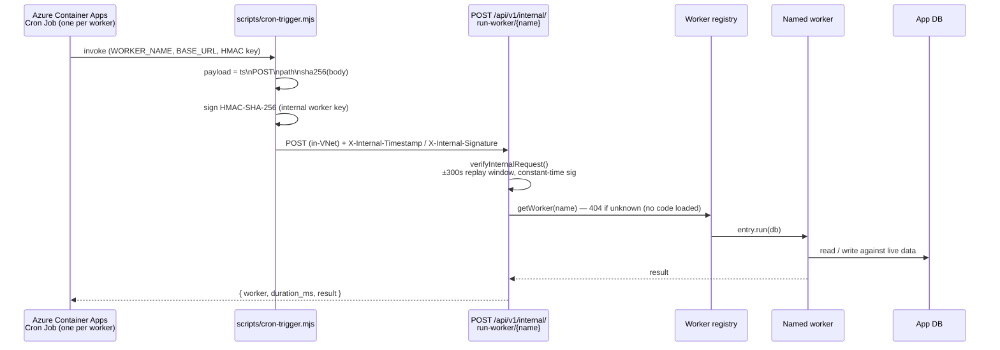

# Background Workers

TokenScope's periodic work (attribution joins, reconciliation, retention, inbox producers) runs as a set of named **workers**. There is **no in-process scheduler and no BullMQ/Redis queue** — an **external** scheduler signs an HMAC request and POSTs it to an internal HTTP endpoint, which dispatches the named worker against the **live deployment** (same app instance, same DB).

- The scheduler is external and dumb: it knows *when* and *which name*, nothing else.
- The worker logic is always the running app — no separate queue process to deploy or keep in sync.
- The trigger surface is observable (HTTP status, duration) and multi-instance safe (no boot-time singleton race).
- Each name is **single-flight**: a dispatch holds a session-level Postgres advisory lock (`worker:<name>`) for the run, and a second dispatch of the same name while it is held is a `409` no-op. The lock connection comes from a dedicated lock pool (`server/workers/dispatch-lock.ts`, max 24), never from the pool the run queries through, so a batch of simultaneous dispatches larger than either pool queues rather than deadlocks. The lock is released with the connection if the app dies mid-run.

## Scheduling model



- **One cron job per worker.** Each Azure Container Apps Cron Job runs the app image and invokes `scripts/cron-trigger.mjs` with `WORKER_NAME`, `TOKENSCOPE_BASE_URL` (the internal app URL inside the VNet), and `NUXT_INTERNAL_WORKER_HMAC_KEY`.
- **HMAC is the gate, not network position.** The cron job runs inside the VNet and reaches the internal app endpoint directly; `/api/v1/internal/*` is authorised by the signed `X-Internal-Signature` (verified `verifyInternalRequest`), independent of any edge.
- **HMAC, separate key.** The internal worker key (`NUXT_INTERNAL_WORKER_HMAC_KEY`) is distinct from the session HMAC key — a leak of one does not surrender the other. Requirements: ≥32 chars, ≥3.5 bits/byte entropy. See [Authentication & Security](Authentication-and-Security.md).
- **Signed payload:** `` `${timestamp}\nPOST\n${path}\n${sha256_hex(body)}` ``. The signed `path` is the exact request URL the server sees — a proxy that rewrites the URL (adds query params, normalizes slashes) breaks verification.
- **Replay window:** timestamps outside ±300s are rejected with a uniform 401.
- **Unknown names short-circuit** at the registry (404) before any worker code is loaded — auditable surface, defense in depth if the HMAC key ever leaks.

The registry (`server/workers/registry.ts`) is the single source of truth: a static list mapping each name to its `run(db)` function, `recommendedCron`, and description.

**How a worker connects.** Every worker takes its database handle from the worker
pool (`server/db/worker-db.ts`), which carries an estate-wide row-level-security
identity (`app.user_role=global-finops`) on the connection itself, plus the UTC
clock pin every other connection has. That is deliberate and matches what workers
are: reconciliation, rollups, retention and fleet-health detectors all operate
across the whole estate, and none of them acts on behalf of a signed-in person.
The pool verifies its own identity once at startup and refuses to hand out a
handle if it is not what was asked for — a mistyped setting connects perfectly
happily and would otherwise leave the identity silently unset. The same applies
to `npm run worker`, to the admin "run now" button and to the scheduled HTTP
trigger: all three take the same pool, so a worker behaves identically however it
was started.

An admin route that runs worker code runs it on that pool too, not on the
caller's connection — otherwise a regional administrator pressing a button would
narrow an estate-wide computation to their own region and report success.

**Kill switch.** Any scheduled worker can be turned off from the admin worker-controls card and stays off from its next tick, with no deploy. The state lives in `worker_enablement`; an absent row means enabled. Reading the fleet's state is open to `admin` and `global-finops`; **writing a toggle is `global-finops` only** — the table has no region column and every worker it governs runs globally, so a toggle reaches past a region admin's scope, and disabling one can stop attribution, budget alerting or spoof detection estate-wide. A region admin therefore sees the card and its states but is offered no toggle. Disabling requires a reason, and every toggle is attributed and audited. Routes: [`GET`/`PUT /api/v1/admin/workers/enablement`](API-Reference.md#admin).

## Dev / Ops CLI

For local runs or one-offs, bypass HTTP and hit the DB directly:

```
npm run worker -- <name>     # invoke one worker
npm run worker -- --list     # list registered workers
```

## Worker reference

The 33 registered workers and their cron cadence. The registry's `recommendedCron` is the live schedule: CI (`worker-schedule-lockstep`) asserts it equals the deployed cron job's schedule, and the admin worker-controls card shows it to operators. Listed in registry order:

| Worker | What it does | Recommended cron |
|---|---|---|
| `analytics-poll` | Poll every reconciled Anthropic org for new `actual_spend` rows — one row per surface lane since #142 (month-to-date, idempotent upserts + convergence prune) | `*/15 * * * *` |
| `placement-sync` | Provision + place cost-bearing teammates from the owed-bill queue (bill-driven placement) | `*/30 * * * *` |
| `region-reenrichment` | Re-derive the region of cost-centre-unplaced bill teammates sitting on a holding node (ongoing heal + one-shot backfill; only moves never-adopted placeholders, rehome-safe). Stamps `last_sync_at` on every row it examined, moved or not — the candidate window is ordered `last_sync_at NULLS FIRST`, so a row left unstamped would sit at the head of it for ever and the unmovable would starve the movable | `0 */6 * * *` |
| `privileged-identity-cleanup` | Report (or, under a signed `{apply:true}` body + hard cap, clean) teammate rows matching the directory-exclusion policy | `30 4 * * *` |
| `pending-placement-gc` | Garbage-collect replayed owed bills from the pending-placement queue past the 90-day retention window | `0 4 * * *` |
| `azure-monitor-read` | Join recent OTel spans into `attribution_record` (the read joiner) | `*/5 * * * *` |
| `mitigation-query` | Re-evaluate ended sessions for missing spans; write `instance_attestation_health` rows | `*/30 * * * *` |
| `reconciliation` | Detect OTel-vs-Anthropic attribution gaps; emit untagged-backlog / over-attribution inbox items | `0 */1 * * *` |
| `reconciliation-gap` | Raise a first-class reconciliation-gap alert when OTel-attributed vs Anthropic-actuals diverge past the bar | `0 */6 * * *` |
| `reconciliation-sync` | Pull vendor billing via adapters and reconcile into `reconciliation_record` (clean no-op until an adapter registers) | `0 */1 * * *` |
| `identity-sync` | Seed `teammate_identity_map` from provider seats / SCIM directories (clean no-op until a resolver registers) | `0 3 * * *` |
| `usage-reconciliation` | Reconcile provider API usage truth vs OTel-captured usage per (teammate, day); upsert the taggable "unaccounted usage" records (§A) | `0 */2 * * *` |
| `reconciliation-backfill` | Drain the admin backfill queue — pull a historical window for one credential scope + run §A reconcile so older days surface as unaccounted usage | `*/15 * * * *` |
| `telemetry-recovery` | Drain the admin widened-read queue (mig 0093) — re-read scoped instances at a wider reader lookback + deep rescan, in resumable slices, to recover a backlog older than the 7-day default | `*/5 * * * *` |
| `copilot-pool-bill` | Read the enterprise billing usage report → write the pooled Copilot chargeback, homed org → cost-owning unit (a reader, not a calculator; §B) | `0 5 * * *` |
| `ending-soon` | Warn devs assigned to / contributing on a project entering its `end_date` window; one inbox item per (dev, project) | `0 8 * * *` |
| `session-gc` | Close abandoned sessions (set `ts_actual_end` on expired, still-open attestations) | `0 2 * * *` |
| `soft-purge` | Apply 12-month retention — clear PII from expired rows, keep FK-load-bearing columns | `0 3 * * *` |
| `archive-ledger` | Archive cold `attribution_record` partitions to warm storage + retire (off by default) | `0 4 1 * *` |
| `aggregate-rollup` | Materialise `attribution_aggregate` (teammate/project × day × tool × model × token-type) — the consumption-dashboard read path | `*/15 * * * *` |
| `usage-rollup` | Materialise `usage_rollup_daily` from `v_complete_usage` (day-grain §A, quarantine-aware, all arms) — the read path for the region reports and, for its SETTLED days only, `/api/v1/me/usage`. Mig 0136 seeds full history at deploy; the worker's own backfill (resumable, chunk-capped per run) covers empty-database bootstraps — completion state is the worker-owned `kv_store` marker (`usage-rollup`/`backfill-complete`; `worker_run.result` is a fallback only), never inferred from row count, and an EMPTY table forces backfill regardless of the marker (a truncated/restored table rebuilds — also the reset runbook: truncate + delete the markers). Steady state recomputes today + 2 prior days, with ONE wide pass per UTC day (first run at/after 03:00 UTC re-runs today + 40 prior; gated on the `usage-rollup`/`wide-through` marker, written only after every wide chunk committed, so a mid-run crash re-runs wide — result rows carry `wide: true` on that pass), plus any day whose §A source rows were written after the day's own `refresh_at` (the source-write signal — capped per run and self-advancing), then drains the `usage_rollup_refresh` retro-mutation queue per teammate (capped; delete-after-recompute) | `7,22,37,52 * * * *` |
| `velocity-watch` | Flag per-teammate weekly spend >25% over the 4-week trailing mean — evaluated in the last minutes of the ISO week, when the week is complete | `50 23 * * 0` |
| `connector-health` | Emit sync-conflict inbox items from pending `sync_conflict` rows | `*/30 * * * *` |
| `budget-alert` | Scan complete spend (Claude + Copilot) vs allocation; emit over-budget inbox items — hourly, since the threshold it evaluates is month-grain | `0 * * * *` |
| `went-silent` | Alert the owning teammate when a live instance's emit credential is being rejected at `/bearer`; auto-resolve on recovery | `0 */1 * * *` |
| `read-path-health` | Alert admins when the OTel read path (`azure-monitor-read`) has silently stalled while clients still emit; auto-resolve on recovery | `*/15 * * * *` |
| `attribution-gap` | Alert admins when an individual device is minting ingest credentials (so it is emitting) while its attribution has fallen days behind — the per-instance counterpart to `read-path-health`'s fleet-wide gate; auto-resolves when the gap closes | `*/30 * * * *` |
| `heartbeat-coverage` | Quarantine "unverified spend" — sessions whose claimed instance has no covering `/bearer` heartbeat (cross-instance-spoof signal); informational only, never auto-revokes | `*/30 * * * *` |
| `governance-key-backfill` | Resolve `provider_org_id` / `provider_enterprise_id` governance keys on historical `actual_spend` / `reconciliation_record` / `pending_placement` rows the ingest-time writers could not stamp; parks truly-unresolvable rows for operator review (bounded/resumable; cron/HMAC-only) | `0 * * * *` |
| `governance-recompute` | Recompute `actual_spend.chargeback_exempt` from authoritative `provider_org` / `provider_enterprise` billing. Reaches EVERY month, including recorded ones — a rule change matters most on the month somebody read, and the movement shows up as that month's delta (cron/HMAC-only) | `*/15 * * * *` |
| `github-coverage-sweep` | Compute + persist GitHub enterprise-org coverage state for every registered GitHub enterprise; dispatch a deduplicated admin inbox alert on a transition into a non-connected state or a capability loss | `0 * * * *` |
| `provider-transform` | Derive the normalised provider layer `provider_usage_fact` (teammate/day/tool/model/cost-type/context-window grain) from `actual_spend.raw_payload` over the same trailing 30-day window the poller re-polls; upsert-then-guarded-prune, homing stamped once (cron/HMAC-only) | `0 * * * *` |
| `ops-alert` | Evaluate the ops conditions — a bounded read of the joiner's real Log Analytics table, the private-link network sweep, attribution stall (joiner zero-writes while the fleet still emits AND the reader is processing sessions — the work-evidence term, without which one Claude Code process left open holds "emitting" true forever via its 29-minute bearer refresh and pages an idle estate), per-worker fleet failures — and page the operator on the external ntfy channel. **ONLY `critical` is pushed**: warnings (per-worker failures) are damped, persisted, audited as `ops-alert-suppressed` and written to the admin inbox, but never sent, so one systemic outage pages once rather than once per failing worker. Both severities two-run damped, 6 h reminders, recovery notices, with one admin inbox item + audit event per condition. Every raised condition records WHY it fired — a closed-vocabulary reason (and a correlation id where a probe produced one) on the run's `result.conditions` and the inbox item, readable from Admin → Workers; the external payload stays minimal and carries neither. Disabled when `NUXT_OPS_ALERT_NTFY_URL` is empty; its own liveness is covered by the Azure-native dead-man metric alert on the job's execution count (`docs/design/ops-alerting.md`) | `9,24,39,54 * * * *` |

## `analytics-poll` — the Anthropic billing truth

Polls every *reconciled* Anthropic org's Enterprise Analytics API and upserts per-(teammate, day, tool) rows into `actual_spend`.

- **`group_by` dimensions.** The usage report is grouped by `product, model, context_window`; the cost report by `product, model, cost_type, context_window` — `context_window` on **both** reports or neither (the two are at different grains, and a dimension on one side only makes the join harder), added for the context-residency/context-tier reads (mig 0127). `speed` is deliberately not requested (no card needs it). The band strings (`0-200k` / `200k+` today) ride verbatim into `raw_payload` and from there into `provider_usage_fact.context_window`; history heals exactly as far as the trailing 30-day window re-polls — older raw holds only what `group_by` asked at the time and stays un-banded forever.
- **Per-surface lanes (#142).** Each API row's `product` maps to a tool lane via `mapProductToTool` (`shared/usage/surface.ts` — the single source of truth): `claude_code` → `claude-code`, plus the non-Code surfaces (`claude-ai`, `claude-cowork`, `claude-office`, `claude-chrome`, `claude-design`, `claude-slack`). Unknown or null products land in the labelled `claude-other` lane — logged and audited, never silently dropped or re-collapsed into `claude-code`. Non-Code lanes carry no sessions and no OTel, so they can never become taggable worklist items: `INGEST_ONLY_USAGE_TOOLS` (`shared/usage/surface.ts`) excludes them from the §A needs-tagging reconciliation, while they remain in the §A usage truth (`v_teammate_usage_daily`, mig 0101) for showback and velocity.
- **Stale-row convergence prune.** The upsert never deletes, so pre-split collapsed rows and revised-away days would linger and double-count. After a fully successful pull the worker prunes rows in (this source × the pulled window × the Claude-family lanes) whose `pulled_at` predates the run's DB-clock start marker. An identity-failure **ratio guard** skips the prune when more than 50% of the pull's API rows failed to bind a teammate (identity resolution looks broken); a genuinely quiet window still prunes. A prune or any unmapped-`product` drift emits an `actual-spend-surface-adjusted` audit event.
- **Historical re-split re-pull.** Rows older than the trailing 30-day revision window keep their pre-split value until an operator re-pulls them with a signed `{startingAt, endingAt, externalOrgId}` body (or `npm run worker -- analytics-poll --opts '…'`), scoped to one org at a time. Runbook: `docs/build/worker-scheduler.md` §"Historical re-split re-pull (#142)".

## The attribution pair

Two workers carry the attribution loop. They share a lane model: every `attribution_record` row pins a `fidelity_tier` and `cost_basis`, and reconciliation only compares the reconcilable lane against actuals.

### `azure-monitor-read` — the read joiner

Scans recent joinable sessions and joins their emitted usage into `attribution_record`.

- **Scan scope.** Joins active sessions (re-scanned every tick so long-lived Claude sessions keep attributing in near-real-time) plus ended-but-unattributed sessions, bounded to a recent window; only `attested`, non-purged rows.
- **Per-run selection cap.** One run scans at most `NUXT_JOINER_INSTANCE_CAP` devices (default 500). Candidates are ordered active-first, then by most recent activity, so what gets shed is the least recently active. A scheduled run whose selection is truncated raises a `joiner-selection-cap` inbox item at `attention`, routed to the cross-region ops roles (`global-finops` / `platform-admin`) — the cap is a property of the deployment, not of any region. One open item per episode: a second truncated run adds nothing, and the first run whose selection fits again resolves it. Only the **scheduled** path signals; an operator's scoped run ran no selection at all, so it neither raises nor clears. Raising the cap is deliberate — each device costs two to three serial Log Analytics queries inside one run — and the signal is observability only: a failure to record it is logged and never stops the join.
- **Membership gate.** A session's project tag is a *claim*. Cost is billed to the project only if the teammate is a current member (`project_assignment.effective @> now()`). A tag from a non-member is **withheld** (it later surfaces as untagged spend at reconciliation) and the rejection is audited as `attribution-spill-unauthorized`. *Tag proposes, membership disposes.*
- **Org-lane fidelity.** The Claude-stamped `organization.id` selects the lane via the `provider_org` registry: a reconciled org → `tier-1` / `estimated` (the Anthropic API is the ceiling); indicative or unknown org → `tier-2` / `telemetry-only` (excluded from reconciliation). An unknown org is attributed best-effort and flagged (`attribution-org-unclassified`) for classification.
- **Cost.** Derived at write time from the matching `rate_card` / `rate_line`, with `rate_card_id` + version pinned on each row. A span with no matching rate card is skipped (counted), never silently zeroed.
- **Idempotent.** Inserts use `ON CONFLICT DO NOTHING` on the `(instance_id, COALESCE(claude_session_id,''), ts_event, token_type, model, COALESCE(source_run_id,''))` unique index (migs 0017/0035, re-created on the partitioned table in 0055), so a replayed trigger or a concurrent inline assign-join cannot double-count spend, while distinct Claude sessions on one instance — and distinct same-millisecond spans, via the span/request id — dedup independently.

### `reconciliation` — gap detection

Compares authoritative Anthropic actuals against attributed OTel spend per teammate per month.

- **Truth source.** `actual_spend` (Anthropic Analytics) is authoritative; OTel attribution is best-effort. `gap = (actual − otel) / actual`.
- **Lane-aware.** The OTel side sums only the reconcilable lane (`cost_basis <> 'telemetry-only'`); telemetry-only spend lives in a provider org the Anthropic API cannot see, so comparing it would manufacture false gaps. The Anthropic side matches both the legacy single-org source and per-org `anthropic-analytics-api:<orgId>` lanes.
- **Under-attribution** (gap ≥ 10%): some spend was never tagged → emit an `info` **untagged-backlog** inbox item nudging the dev to claim sessions.
- **Over-attribution** (gap ≤ −10%): reconciled-lane tagged spend exceeds the authoritative actual — a mis-tag or forgery backstop. Emit an `attention` **over-attribution** item and audit `over-attribution-flagged`. Advisory only — the actual is the ceiling, but reconciliation never hard-caps.
- **Idempotent.** One open item per `(teammate, category, month)`; over-attribution is never evaluated without a real actual (no false storm when the poller hasn't run).

## See also

- [Architecture](Architecture.md) — where workers sit in the attribution data flow.
- [API Reference](API-Reference.md) — the `/api/v1/internal/run-worker/{name}` endpoint.
- [Authentication & Security](Authentication-and-Security.md) — internal HMAC, key separation, replay protection.
