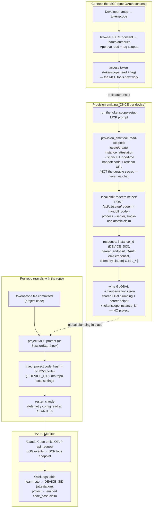

# Claude Code Client

Built spec for **TokenScope maintainers**: how the Claude Code client is wired —
the marketplace plugin plus the telemetry contract that makes a developer's
`claude` sessions emit attributable token usage to Azure Monitor. This is the
as-built mechanism, not an end-user tutorial.

See also: [Architecture](Architecture.md) · [API Reference](API-Reference.md).
Source of truth for the emission recipe:
`docs/development/claude-code-telemetry-contract.md`.

> **MCP-first cutover (PR #37 backbone + PR #38).** The old setup-token enrolment
> (`/tokenscope:enrol` → `POST /api/v1/me/setup-token` → `POST /api/v1/setup/exchange`)
> was **retired**. Device onboarding is now an MCP OAuth flow: connect the MCP
> (one browser consent), then run the `tokenscope-setup` prompt, which provisions
> emitting via a secret-isolating handoff (`provision_emit` → `/api/v1/setup/redeem`).
> See MCP-first client backbone (`docs/design/mcp-client-backbone.md`).

## Connect + emission flow

Two distinct developer actions: **connect + provision the device once** (one
OAuth consent → global config), then **tag each repo** with a committed
`.tokenscope` file. Identity is anchored to the device attestation (by
`tokenscope.instance_id` / DEVICE_SID, minted by `provision_emit`); the
**project** is an emitted per-event claim, membership-gated at join (see
ADR-0004).

- **One consent authenticates AND provisions.** Connecting the MCP runs the
  browser PKCE consent (read + tag). The `tokenscope-setup` prompt then calls the
  read-scoped `provision_emit` tool, which locates-or-creates this device's
  `instance_attestation` and returns a **short-TTL one-time handoff code** — never
  the durable emit credential. A local helper redeems that handoff
  process→server at `/api/v1/setup/redeem` for the durable OAuth emit credential +
  the OTel bundle, and writes the **global** `~/.claude/settings.json`. The
  durable secret never enters the LLM's context (the secret-isolating handoff;
  the single audited read→emit crossing, ADR-0005 E1).
- **Per-repo project travels with the repo.** Each repo commits a `.tokenscope`
  file (the project code). The `project` MCP prompt (or the `SessionStart` hook)
  resolves it and injects `project.code_hash = sha256(code)` (with the DEVICE_SID)
  into the **repo-local** settings, so the project rides along with the repo
  across every ephemeral session — no per-repo token, no re-provision. The
  repo-local block is written with the endpoints and exporter config the device
  needs but **without the durable OAuth refresh token** — the emit helper falls
  back to the device credential store (0700 state dir) for that, so the durable
  credential is not planted in every tagged working tree.
- **Membership-gated attribution.** The joiner resolves the **teammate from the
  attestation by DEVICE_SID** (unspoofable per-event) and takes the **project
  from the emitted `code_hash` claim**, billing it only if that teammate is a
  _current_ member of the project; otherwise the spend spills to untagged + an
  `attribution-spill-unauthorized` audit (ADR-0004).
- **Untagged-first.** A device with no repo `.tokenscope` (or an
  unrecognised/unauthorised code) emits without a `project.code_hash` claim, so it
  surfaces in the web **untagged-spend** card. Assign it to a project later via
  the untagged-spend quick-assign picker (`POST /api/v1/me/sessions/[sid]/assign`).
- The **OAuth `tokenscope.emit` access token is the bearer-helper credential**
  (minted by the helper via the refresh-token grant), not a static OTLP header —
  Azure rejects the TokenScope token directly.

## Client surfaces: MCP tools + prompts, plus local commands

The reusable spine is the **MCP server** (`plugin/.mcp.json` → `/api/v1/mcp`):
every MCP client supports tools + prompts, so this is the cross-client surface.

- **MCP tools** (talk to the server): `list_my_projects`, `list_activity_types`,
  `my_usage`, `tag_session`, `resolve_repo_project`, `provision_emit`.
- **MCP prompts** (orchestration skills, surfaced in Claude Code's slash menu
  tagged **(MCP)**): `tokenscope-setup`, `tag`, `project`, `usage`. A prompt tells
  the agent which tools to call; the agent does the genuinely local steps — a
  tool never writes the user's disk. It writes `.tokenscope` with its own file
  tool, and it **runs a script** for anything that touches the credential store:
  `claude-redeem.mjs` redeems the handoff and writes the device's settings
  itself, and `device-id.mjs` answers the one question setup needs from that
  store.

**The device store is never opened by the agent.** Re-running setup should
*rotate* this device rather than mint a duplicate, which needs one non-secret
fact: the `tokenscope.instance_id` the host was last provisioned with. That id
sits in `~/.claude/settings.json` next to `TOKENSCOPE_OAUTH_REFRESH_TOKEN` (and,
on the Copilot side, in `~/.tokenscope/config.json` next to
`oauth_refresh_token`), so instructing the agent to read the file would pull a
durable credential into the model's context on every ordinary setup — no attacker
required. `plugin/scripts/device-id.mjs` reads the store out of process and
prints a fixed five-key object and nothing else:
`{enrolled, tool, instance_id, bearer_host, reason}`. The object is built from a
fixed key set rather than a spread of the parsed store, so a key added to either
store later cannot leak through it. It takes `--tool claude-code|copilot-cli` and
reads only that tool's store, reporting `enrolled: false` with a `reason` of
`no-enrolment` or `tool-mismatch` rather than an id the caller would misuse —
instances are per-host but bound to one emit tool, and provisioning the other
tool's id revokes that tool's credential. `bearer_host` is also how the prompts
tell which deployment a device currently points at. The file is dependency-free
so it vendors verbatim into the Copilot plugin.

The **device-local** commands (`plugin/commands/*.md` → `plugin/scripts/*.mjs`)
are the Claude-specific surface that the MCP spine can't cover — genuinely local
or emit-probe work. Install — **slash form, inside Claude Code** (no `claude` CLI
on PATH needed): `/plugin marketplace add Insight-Services-APAC/tokenscope-public` then
`/plugin install tokenscope@tokenscope`. The manifest is the repo-root
`.claude-plugin/marketplace.json`; the add is an authenticated git clone (works
for the private repo). A lighter terminal-CLI alternative
(`claude plugin marketplace add … --sparse .claude-plugin plugin`)
sparse-checks-out only those two dirs but requires the standalone `claude` CLI.

| Command                            | What it does                                                                                                                                                                                                                                                                                             | Backing                                                                  |
| ---------------------------------- | -------------------------------------------------------------------------------------------------------------------------------------------------------------------------------------------------------------------------------------------------------------------------------------------------------- | ------------------------------------------------------------------------ |
| `/tokenscope:setup`                | Set up TokenScope on this device — connect + provision emitting in one OAuth consent. The **local counterpart** to the `tokenscope-setup` MCP prompt: it calls `provision_emit`/`my_usage` and runs the local redeem helper, so the durable emit credential is redeemed process→process, never via chat. | `provision_emit` + `my_usage` (MCP) + local `device-id.mjs` and `claude-redeem.mjs` |
| `/tokenscope:status`               | Report whether your sessions are emitting **and** whether the MCP is connected — the 3-state verdict (🟢 emit+MCP / 🟡 emit-only / 🔴 not emitting).                                                                                                                                                     | local emit probe (`otel-headers-helper.sh` → `/bearer`) + MCP-auth probe |
| `/tokenscope:statusline [on\|off]` | Install/remove the status line (emission health + MCP-connection state + session id).                                                                                                                                                                                                                    | local-only                                                               |
| `/tokenscope:backfill`             | Re-emit recent local Claude usage that may have been dropped (short emission-gap catch-up).                                                                                                                                                                                                              | local-only                                                               |

Each script resolves the API base via `api-base.mjs`, most explicit first: the
caller's explicit argument, else `TOKENSCOPE_API_BASE` **but only when it names
loopback**, else the MCP server's **registered origin** (discovered from
configuration the user wrote, never from the repository), else the **baked
deployment default** (the API base is part of the plugin, since the marketplace
ships it per-deployment). `plugin/.mcp.json` reads the same base for the MCP
server.

**Neither of the two channels a repository or a model can reach may name a
destination.** Claude Code merges a project's `.claude/settings.local.json` env
over the global one, so `TOKENSCOPE_API_BASE` is something a cloned repository
can set and nothing downstream can tell that value apart from one the developer
exported — hence loopback-only, for every script, with no opt-out flag. And on
the redeem path `--api-base` may only **select** an origin the device already
knows (loopback, the baked default, or the discovered registration), never
introduce one, because that argv is composed by a model under a prefix
`allowed-tools` grant that pre-approves every tail. The redeem request carries a
live single-use handoff code whose answer is a durable emit credential, so it is
the one call that must not be steerable. Local dev against
`http://localhost:3450` still works: to be served by loopback something must
already be running on the machine, and whoever registered an MCP server there is
discovered from their own configuration anyway. When resolution fails, the remedy
is to register the server with the CLI — not to pass a flag, which on a device
that discovered nothing can only accept loopback values.

`status` (emission probe) invokes the real emit path
(`otel-headers-helper.sh`). Reads and tagging are now over MCP and authenticate
with the connection's **`tokenscope.read`/`tag` OAuth** grant — a client
authenticates as itself, never via a borrowed browser cookie. The old
`TOKENSCOPE_AUTH_COOKIE` crutch is gone.

The published versions are declared in three places that must move
together, and this page deliberately does NOT restate the numbers: a literal
version in prose drifts the moment a plugin is bumped, and it drifted exactly
that way (this paragraph said 0.1.28 / 0.1.7 while the manifests had moved on).
Read them from `.claude-plugin/marketplace.json` (both entries) and each plugin's own
manifest. Claude Code caches an installed plugin **by version** and re-installs
only when the number **increases** — a fix shipped without a bump reaches no
device, however many restarts the fleet does. A CI check fails the build on a
plugin-code change with no version bump, and a sync-manifest guard keeps the
vendored `copilot-plugin/` copies byte-identical to their sources.

## Plugin trust boundary

Claude Code merges a repository's `.claude/settings.local.json` over the device's
global `~/.claude/settings.json`, **per key**, with the repo-local value winning
any key present in both — measured against Claude Code 2.1.232 in
`env-precedence-capture.md`.
(ADR-0006
§2 previously described this as wholesale replacement; that claim is amended.)
Any cloned repository therefore gets a vote on the environment the plugin's own
scripts run under — which is fine for a project claim and not fine for anything
that carries a credential. Merge makes the boundary **more** important than
replacement would: a repo can override a single key and leave every other value
looking untouched.

- **The repo may supply `OTEL_RESOURCE_ATTRIBUTES`, and nothing else.**
  `repoTagEnv(globalEnv, repoEnv)` in `plugin-runtime.mjs` is a **positive
  allowlist**: the resource attributes come from the repo-local file, every other
  key comes from the device's global settings. A deny-list would have missed
  `TOKENSCOPE_STATE_DIR`, which is credential-bearing — the bearer helper writes
  the freshly minted emit access token into that directory, so a repo-steered
  state dir drops a live token inside the attacker's working tree with no network
  call to catch.
- **The two keys with no legitimate global source are deleted, not outvoted.**
  `TOKENSCOPE_STATE_DIR` and `TOKENSCOPE_API_BASE` are never written to global
  settings, so spreading the global block last cannot overrule a repo-supplied
  value. Every env handed to a child process or used for a fetch removes them
  outright, and `stateDir()` ignores a passed `env` entirely, reading the
  override from `process.env`. The direct readers (`landed-check.mjs`,
  `project-check.mjs`) route through the same helper so one deletion covers them
  all.
- **Provenance for `TOKENSCOPE_STATE_DIR` is established at the hook, not in
  `stateDir()`.** Reading `process.env` is a narrowing, not a boundary: Claude
  Code merges the repo-local settings `env` into the process environment, so by
  the time `stateDir()` runs the two sources are indistinguishable. The settings
  *files* still carry provenance, so `hookStateDir()` in `session-start.mjs`
  reads them: if any `.claude/settings.json` or `.claude/settings.local.json`
  from the cwd up to and including the **git root** names the key at all (matched
  case-insensitively), the inherited value is replaced with the global settings
  value, or removed so the state dir falls back to `~/.tokenscope` on the passwd
  home. A repo that says nothing about the key leaves a genuine process-level pin
  untouched. It matters because that directory is where the bearer helper caches
  the freshly minted emit access token and where the forwarder reads the stash
  naming its upstream. Every state-dir read in the hook goes through this, and
  anything the hook spawns is pinned to its result.
- **One endpoint validator, shared.** `assertSafeEndpoint()` in
  `endpoint-guard.mjs` is the single validator every credential-bearing call
  routes through — redeem, enrol, status, backfill, the landed check, the project
  check, the bearer helper and the OTLP forwarder. It requires an absolute
  `https:` URL for any off-box host (loopback is exempt only when the caller
  explicitly opts in, for the local dev override and the forwarder's own on-box
  relay) and rejects a value beginning with `-`, which a shell interpolation would
  otherwise read as a flag. `isUsableDce()` lives beside it and rejects loopback
  unconditionally, so the forwarder's own address can never masquerade as the real
  DCE. The file is dependency-free precisely so it can be vendored verbatim into
  the Copilot plugin rather than reimplemented there.
- **One argv validator, shared — because the ARGV is repo-steerable too.** A
  slash command's `allowed-tools` entry is a **prefix** grant
  (`Bash(node "${CLAUDE_PLUGIN_ROOT}/scripts/claude-redeem.mjs":*)`), so every
  argument tail is pre-approved with no prompt, and a prompt-injected model can
  append flags to the documented invocation. Copilot CLI has no grant mechanism
  at all. `argv-guard.mjs` (vendored the same way `endpoint-guard.mjs` is) is
  therefore the control: an unknown `--flag` refuses the whole argv, a flag
  missing its value is refused rather than reinterpreted, `--api-base` may only
  select a known origin (and a value outside that set is warned about and
  dropped, not fatal — exiting would hand a prompt injection a denial of setup),
  and the path-valued flags (`--settings-path` for the credential file,
  `--shell-rc` for the shell init block) are confined to the home directory and
  to the filename each flag exists to name. Confinement compares **real**,
  symlink-resolved paths on both sides, so a `~/.claude` pointing out of the home
  cannot pass. **No flag names the POST target**: the redeem path is fixed at
  `/api/v1/setup/redeem` on the resolved base. That is also why refusal, not
  tolerance, is the right answer to an unknown flag — a tolerated one degrades to
  "silently ignored", where its value still lands as a stray positional.

## Telemetry contract

The load-bearing detail. Claude Code emits OTLP **directly** to Azure Monitor —
**no collector on the Claude path** (ADR-0003). Verified against Claude Code
v2.1.158 (2026-06-01). Full recipe:
`docs/development/claude-code-telemetry-contract.md`.

- **Emit LOG events, not metrics.** Attribution joins on the `api_request` log
  event — it carries `input_tokens`, `output_tokens`, `cache_read_tokens`,
  `cache_creation_tokens`, `cost_usd`, `model`, `request_id` in one record. The
  plugin sets `OTEL_LOGS_EXPORTER=otlp`, `OTEL_METRICS_EXPORTER=none`.
- **Ingest URL** is the full DCR logs path:
  `https://<logs-dce>/dataCollectionRules/<dcrImmutableId>/streams/Microsoft-OTLP-Logs/otlp/v1/logs`,
  pointed at by `OTEL_EXPORTER_OTLP_LOGS_ENDPOINT`.
- **Stream segment** `Microsoft-OTLP-Logs` (service-managed built-in) — **not**
  the older `Microsoft-OTel-Logs` (that's only the DCR `dataFlows` id; wrong
  name → `400 InvalidStream`).
- **Protocol** `http/protobuf` (`OTEL_EXPORTER_OTLP_LOGS_PROTOCOL`).
  Content-Type `application/x-protobuf` (JSON → `415`). **Content-Length must be
  explicit** — chunked streaming → `400 MissingContentLengthHeader`. Success is
  HTTP **204**.
- **Bearer** minted by TokenScope's managed identity at scope
  `https://monitor.azure.com/.default`. It is refreshed dynamically by
  `otelHeadersHelper` (configured in settings, **not** an env var — there is no
  `OTEL_*_HEADERS_HELPER` env). Claude runs the helper at startup and every
  ~29 min; `scripts/otel-headers-helper.sh` mints a short-lived OAuth
  `tokenscope.emit` access token and presents it to `TOKENSCOPE_BEARER_ENDPOINT`
  (`/api/v1/instances/{instanceId}/bearer`) to mint the Azure token. grpc cannot use the helper.
  **The helper takes its state dir as an argument (`--state-dir`), never from
  `TOKENSCOPE_STATE_DIR`.** Claude Code invokes it *itself*, as a sibling of every
  hook and with its own merged environment, so no hook can repair what it reads;
  argv is the one channel a settings file cannot contribute to. With no argument
  it resolves `~/.tokenscope` from the **passwd database**, which `$HOME` cannot
  move. Our own callers pass the dir they resolved. The helper also prepends a
  trusted `PATH` and passes `curl -q`, because it is handed the durable refresh
  token and both the interpreter and the tools were otherwise repo-selectable.
  *One documented gap:* on a host with **no passwd entry for the uid** (some
  minimal containers) it falls back to `$HOME` — leak-susceptible again — and
  says so loudly on stderr. Pass `--state-dir` there.
- **Join key** is **`tokenscope.instance_id`** (the device INSTANCE id, minted by
  `provision_emit` at setup and carried verbatim in `OTEL_RESOURCE_ATTRIBUTES`) —
  **NOT** Claude's own `session.id`, which is the per-SESSION id we don't
  know at provision time. We do capture Claude's `session.id` per-record as
  `claude_session_id` on `attribution_record`.
- **Landing + latency.** Events land in the **`OTelLogs`** table: resource
  attributes → `ResourceAttributes` column, per-event token fields →
  `Attributes` column (there is no `Properties` column). Ingest→queryable
  latency is **~4–5 min**. `server/azure/reader.ts` (`LogAnalyticsReader`)
  reads it via KQL.

### Version-aware Content-Length shim (CC #72671)

Some Claude Code CLI versions shipped a regression that streamed the OTLP request
**chunked**, so Azure Monitor rejected it with `400 MissingContentLengthHeader` and
telemetry silently vanished. The plugin ships a **local Content-Length forwarder** to
work around it — but it is **off by default** and **version-aware AUTO**, so a healthy
fleet emits **directly** with no forwarder in the path:

- `SessionStart` resolves the shim policy (`plugin/scripts/otlp-shim-policy.mjs`). The
  forwarder is spawned (and the global/repo logs endpoint re-pointed at it) **only**
  when the session's CLI version falls in a known-broken range
  (`OTLP_BROKEN_RANGES`, currently `[2.1.191, 2.1.212)`); on any other version it stays
  dormant and emission goes direct.
- The regression was **fixed in CLI 2.1.212** — on a fixed CLI the shim is off, and a
  session that started under a stale/wedged forwarder self-heals the endpoint back to
  the direct DCE.
- Manual override `TOKENSCOPE_OTLP_PROXY`: `1` forces the forwarder on (a suspected
  regression not yet listed), `0` forces it off, unset/other = AUTO. A future
  re-regression is handled by appending one range to `OTLP_BROKEN_RANGES`.
- The spawn/self-heal is fail-open (never breaks session start), and on an
  auto-activated broken CLI the hook surfaces an informational note explaining the
  forwarder is running and that upgrading the CLI retires it.

### Why restart, and where to verify

- Claude reads telemetry config **at startup**. Running the `tokenscope-setup`
  or `project` prompt in an already-running session does nothing until `claude`
  is relaunched in that directory. (The `SessionStart` hook sidesteps this for
  the per-repo project injection on a fresh session.)
- The `SessionStart` hook does more than per-repo project injection. On each fresh
  session it also: resolves every state-dir read through **`hookStateDir`**
  (above), so a repo-claimed `TOKENSCOPE_STATE_DIR` reaches neither the hook nor
  anything it spawns — and repairs the **execution-steering** variables
  (`PATH`, `NODE_OPTIONS`, `BASH_ENV`, `ENV`, `LD_PRELOAD`, `LD_LIBRARY_PATH`,
  `NODE_PATH`) on the same provenance test, because a repo-set `PATH` chooses the
  `sh` that runs the emit helper and a repo-set `NODE_OPTIONS=--require` runs code
  inside the forwarder. **Neither repair reaches the ~29-minute
  `otelHeadersHelper` refresh** — Claude Code invokes that one directly, which is
  why the helper's own state dir moved to argv (above) rather than being fixed
  here. It also **emit-on-install auto-enrols** (`enrollIfNeeded`, a no-op unless a
  bundled secret is present and the device is not yet enrolled), **self-heals** the
  plugin script paths and the global OTLP logs endpoint (CC #72671), spawns the
  version-aware Content-Length forwarder when needed, and surfaces one-line warnings —
  emission health, the OTLP-stash wedge, the auto-shim note, and a
  project-not-billable-here warning, and a superseded-instance-pin warning. Every
  step is fail-open, so a failure never breaks session start.
- `/tokenscope:status` showing not-emitting right after setup usually means the
  ~4–5 min ingest lag or a missing restart — not a wiring fault.
- In a repo with a `.tokenscope` tag, re-enrolling takes **two** relaunches. The
  repo keeps its own merged copy of the enrolment and the hook can only reconcile
  it *after* the session has read its env, so the first relaunch repairs the file
  while still emitting under the previous instance. That session prints the
  superseded-instance-pin warning; the next one is correct. Untagged repos have no
  repo-local override and pick the new instance up on the first relaunch.

## Key files

| Concern                            | Path                                                                         |
| ---------------------------------- | ---------------------------------------------------------------------------- |
| MCP server config                  | `plugin/.mcp.json`                                                           |
| MCP tools + prompts (server)       | `server/utils/mcp.ts`                                                        |
| MCP endpoint                       | `server/api/v1/mcp/[...].ts`                                                 |
| Local commands                     | `plugin/commands/{setup,status,statusline,backfill}.md`                      |
| Local scripts                      | `plugin/scripts/{status,statusline,statusline-toggle,backfill,tag-repo}.mjs` |
| Device-identity accessor           | `plugin/scripts/device-id.mjs`                                               |
| Redeem-argv validator              | `plugin/scripts/argv-guard.mjs`                                              |
| OTel env/settings builder          | `plugin/scripts/env-builder.mjs`                                             |
| Bearer-refresh helper              | `plugin/scripts/otel-headers-helper.sh`                                      |
| Emit-handoff redeem                | `server/api/v1/setup/redeem.post.ts`                                         |
| OAuth 2.1 routes                   | `server/api/v1/oauth/*.ts`                                                   |
| Retroactive assign                 | `server/api/v1/me/sessions/[sid]/assign`                                     |
| Telemetry reader                   | `server/azure/reader.ts`                                                     |
| Telemetry contract (full recipe)   | `docs/development/claude-code-telemetry-contract.md`                         |
| MCP-first client backbone (design) | `docs/design/mcp-client-backbone.md`                                         |
| Plugin user guide                  | `plugin/README.md`                                                           |

> [VERIFY] `claude plugin marketplace add` / `claude plugin install` verb names
> against live `code.claude.com` docs at install time.
> [VERIFY] VS Code honors the settings `env` block for `OTEL_RESOURCE_ATTRIBUTES`
> — validated on the CLI, not yet exercised in VS Code.
