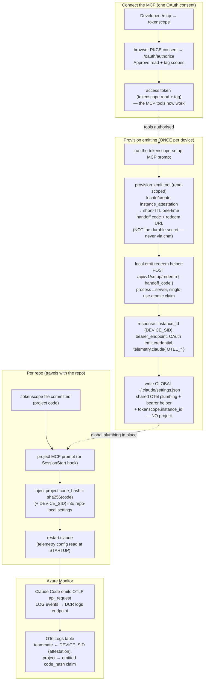

# Claude Code Client

Built spec for **TokenScope maintainers**: how the Claude Code client is wired —
the marketplace plugin plus the telemetry contract that makes a developer's
`claude` sessions emit attributable token usage to Azure Monitor. This is the
as-built mechanism, not an end-user tutorial.

See also: [Architecture](Architecture.md) · [API Reference](API-Reference.md).
Source of truth for the emission recipe:
`docs/development/claude-code-telemetry-contract.md`.

> **MCP-first cutover (PR #37 backbone + PR #38).** The old setup-token enrolment
> (`/tokenscope:enrol` → `POST /api/v1/me/setup-token` → `POST /api/v1/setup/exchange`)
> was **retired**. Device onboarding is now an MCP OAuth flow: connect the MCP
> (one browser consent), then run the `tokenscope-setup` prompt, which provisions
> emitting via a secret-isolating handoff (`provision_emit` → `/api/v1/setup/redeem`).
> See [MCP-first client backbone](../design/mcp-client-backbone.md).

## Connect + emission flow

Two distinct developer actions: **connect + provision the device once** (one
OAuth consent → global config), then **tag each repo** with a committed
`.tokenscope` file. Identity is anchored to the device attestation (by
`tokenscope.instance_id` / DEVICE_SID, minted by `provision_emit`); the
**project** is an emitted per-event claim, membership-gated at join (see
[ADR-0004](../decisions/0004-attribution-trust-model.md)).

- **One consent authenticates AND provisions.** Connecting the MCP runs the
  browser PKCE consent (read + tag). The `tokenscope-setup` prompt then calls the
  read-scoped `provision_emit` tool, which locates-or-creates this device's
  `instance_attestation` and returns a **short-TTL one-time handoff code** — never
  the durable emit credential. A local helper redeems that handoff
  process→server at `/api/v1/setup/redeem` for the durable OAuth emit credential +
  the OTel bundle, and writes the **global** `~/.claude/settings.json`. The
  durable secret never enters the LLM's context (the secret-isolating handoff;
  the single audited read→emit crossing, ADR-0005 E1).
- **Per-repo project travels with the repo.** Each repo commits a `.tokenscope`
  file (the project code). The `project` MCP prompt (or the `SessionStart` hook)
  resolves it and injects `project.code_hash = sha256(code)` (with the DEVICE_SID)
  into the **repo-local** settings, so the project rides along with the repo
  across every ephemeral session — no per-repo token, no re-provision.
- **Membership-gated attribution.** The joiner resolves the **teammate from the
  attestation by DEVICE_SID** (unspoofable per-event) and takes the **project
  from the emitted `code_hash` claim**, billing it only if that teammate is a
  *current* member of the project; otherwise the spend spills to untagged + an
  `attribution-spill-unauthorized` audit ([ADR-0004](../decisions/0004-attribution-trust-model.md)).
- **Untagged-first.** A device with no repo `.tokenscope` (or an
  unrecognised/unauthorised code) emits without a `project.code_hash` claim, so it
  surfaces in the web **untagged-spend** card. Assign it to a project later via
  the untagged-spend quick-assign picker (`POST /api/v1/me/sessions/[sid]/assign`).
- The **OAuth `tokenscope.emit` access token is the bearer-helper credential**
  (minted by the helper via the refresh-token grant), not a static OTLP header —
  Azure rejects the TokenScope token directly.

## Client surfaces: MCP tools + prompts, plus local commands

The reusable spine is the **MCP server** (`plugin/.mcp.json` → `/api/v1/mcp`):
every MCP client supports tools + prompts, so this is the cross-client surface.

- **MCP tools** (talk to the server): `list_my_projects`, `list_activity_types`,
  `my_usage`, `tag_session`, `resolve_repo_project`, `provision_emit`.
- **MCP prompts** (orchestration skills, surfaced in Claude Code's slash menu
  tagged **(MCP)**): `tokenscope-setup`, `tag`, `project`, `usage`. A prompt tells
  the agent which tools to call; the agent does any **local** step (write
  `.tokenscope`, redeem the handoff, write `settings.json`) with its own file
  tools — a tool never writes the user's disk.

The **device-local** commands (`plugin/commands/*.md` → `plugin/scripts/*.mjs`)
are the Claude-specific surface that the MCP spine can't cover — genuinely local
or emit-probe work. Install — **slash form, inside Claude Code** (no `claude` CLI
on PATH needed): `/plugin marketplace add Insight-Services-APAC/tokenscope-public` then
`/plugin install tokenscope@tokenscope`. The manifest is the repo-root
`.claude-plugin/marketplace.json`; the add is an authenticated git clone (works
for the private repo). A lighter terminal-CLI alternative
(`claude plugin marketplace add … --sparse .claude-plugin plugin`)
sparse-checks-out only those two dirs but requires the standalone `claude` CLI.

| Command | What it does | Backing |
|---|---|---|
| `/tokenscope:setup` | Set up TokenScope on this device — connect + provision emitting in one OAuth consent. The **local counterpart** to the `tokenscope-setup` MCP prompt: it calls `provision_emit`/`my_usage` and runs the local redeem helper, so the durable emit credential is redeemed process→process, never via chat. | `provision_emit` + `my_usage` (MCP) + `Bash(node:*)` local redeem |
| `/tokenscope:status` | Report whether your sessions are emitting **and** whether the MCP is connected — the 3-state verdict (🟢 emit+MCP / 🟡 emit-only / 🔴 not emitting). | local emit probe (`otel-headers-helper.sh` → `/bearer`) + MCP-auth probe |
| `/tokenscope:statusline [on\|off]` | Install/remove the status line (emission health + MCP-connection state + session id). | local-only |
| `/tokenscope:backfill` | Re-emit recent local Claude usage that may have been dropped (short emission-gap catch-up). | local-only |

Each script resolves the API base via `api-base.mjs` — `TOKENSCOPE_API_BASE`
env as an override, else the **baked deployment default** (the API base is part
of the plugin, since the marketplace ships it per-deployment); `plugin/.mcp.json`
reads the same base for the MCP server. `status` (emission probe) invokes the
real emit path (`otel-headers-helper.sh`). Reads and tagging are now over MCP and
authenticate with the connection's **`tokenscope.read`/`tag` OAuth** grant — a
client authenticates as itself, never via a borrowed browser cookie. The old
`TOKENSCOPE_AUTH_COOKIE` crutch is gone.

## Telemetry contract

The load-bearing detail. Claude Code emits OTLP **directly** to Azure Monitor —
**no collector on the Claude path** (ADR-0003). Verified against Claude Code
v2.1.158 (2026-06-01). Full recipe:
`docs/development/claude-code-telemetry-contract.md`.

- **Emit LOG events, not metrics.** Attribution joins on the `api_request` log
  event — it carries `input_tokens`, `output_tokens`, `cache_read_tokens`,
  `cache_creation_tokens`, `cost_usd`, `model`, `request_id` in one record. The
  plugin sets `OTEL_LOGS_EXPORTER=otlp`, `OTEL_METRICS_EXPORTER=none`.
- **Ingest URL** is the full DCR logs path:
  `https://<logs-dce>/dataCollectionRules/<dcrImmutableId>/streams/Microsoft-OTLP-Logs/otlp/v1/logs`,
  pointed at by `OTEL_EXPORTER_OTLP_LOGS_ENDPOINT`.
- **Stream segment** `Microsoft-OTLP-Logs` (service-managed built-in) — **not**
  the older `Microsoft-OTel-Logs` (that's only the DCR `dataFlows` id; wrong
  name → `400 InvalidStream`).
- **Protocol** `http/protobuf` (`OTEL_EXPORTER_OTLP_LOGS_PROTOCOL`).
  Content-Type `application/x-protobuf` (JSON → `415`). **Content-Length must be
  explicit** — chunked streaming → `400 MissingContentLengthHeader`. Success is
  HTTP **204**.
- **Bearer** minted by TokenScope's managed identity at scope
  `https://monitor.azure.com/.default`. It is refreshed dynamically by
  `otelHeadersHelper` (configured in settings, **not** an env var — there is no
  `OTEL_*_HEADERS_HELPER` env). Claude runs the helper at startup and every
  ~29 min; `scripts/otel-headers-helper.sh` mints a short-lived OAuth
  `tokenscope.emit` access token and presents it to `TOKENSCOPE_BEARER_ENDPOINT`
  (`/api/v1/instances/{instanceId}/bearer`) to mint the Azure token. grpc cannot use the helper.
- **Join key** is **`tokenscope.instance_id`** (the device INSTANCE id, minted by
  `provision_emit` at setup and carried verbatim in `OTEL_RESOURCE_ATTRIBUTES`) —
  **NOT** Claude's own `session.id`, which is the per-SESSION id we don't
  know at provision time. We do capture Claude's `session.id` per-record as
  `claude_session_id` on `attribution_record`.
- **Landing + latency.** Events land in the **`OTelLogs`** table: resource
  attributes → `ResourceAttributes` column, per-event token fields →
  `Attributes` column (there is no `Properties` column). Ingest→queryable
  latency is **~4–5 min**. `server/azure/reader.ts` (`LogAnalyticsReader`)
  reads it via KQL.

### Version-aware Content-Length shim (CC #72671)

Some Claude Code CLI versions shipped a regression that streamed the OTLP request
**chunked**, so Azure Monitor rejected it with `400 MissingContentLengthHeader` and
telemetry silently vanished. The plugin ships a **local Content-Length forwarder** to
work around it — but it is **off by default** and **version-aware AUTO**, so a healthy
fleet emits **directly** with no forwarder in the path:

- `SessionStart` resolves the shim policy (`plugin/scripts/otlp-shim-policy.mjs`). The
  forwarder is spawned (and the global/repo logs endpoint re-pointed at it) **only**
  when the session's CLI version falls in a known-broken range
  (`OTLP_BROKEN_RANGES`, currently `[2.1.191, 2.1.212)`); on any other version it stays
  dormant and emission goes direct.
- The regression was **fixed in CLI 2.1.212** — on a fixed CLI the shim is off, and a
  session that started under a stale/wedged forwarder self-heals the endpoint back to
  the direct DCE.
- Manual override `TOKENSCOPE_OTLP_PROXY`: `1` forces the forwarder on (a suspected
  regression not yet listed), `0` forces it off, unset/other = AUTO. A future
  re-regression is handled by appending one range to `OTLP_BROKEN_RANGES`.
- The spawn/self-heal is fail-open (never breaks session start), and on an
  auto-activated broken CLI the hook surfaces an informational note explaining the
  forwarder is running and that upgrading the CLI retires it.

### Why restart, and where to verify

- Claude reads telemetry config **at startup**. Running the `tokenscope-setup`
  or `project` prompt in an already-running session does nothing until `claude`
  is relaunched in that directory. (The `SessionStart` hook sidesteps this for
  the per-repo project injection on a fresh session.)
- The `SessionStart` hook does more than per-repo project injection. On each fresh
  session it also: **emit-on-install auto-enrols** (`enrollIfNeeded`, a no-op unless a
  bundled secret is present and the device is not yet enrolled), **self-heals** the
  plugin script paths and the global OTLP logs endpoint (CC #72671), spawns the
  version-aware Content-Length forwarder when needed, and surfaces one-line warnings —
  emission health, the OTLP-stash wedge, the auto-shim note, and a
  project-not-billable-here warning. Every step is fail-open, so a failure never
  breaks session start.
- `/tokenscope:status` showing not-emitting right after setup usually means the
  ~4–5 min ingest lag or a missing restart — not a wiring fault.

## Key files

| Concern | Path |
|---|---|
| MCP server config | `plugin/.mcp.json` |
| MCP tools + prompts (server) | `server/utils/mcp.ts` |
| MCP endpoint | `server/api/v1/mcp/[...].ts` |
| Local commands | `plugin/commands/{setup,status,statusline,backfill}.md` |
| Local scripts | `plugin/scripts/{status,statusline,statusline-toggle,backfill,tag-repo}.mjs` |
| OTel env/settings builder | `plugin/scripts/env-builder.mjs` |
| Bearer-refresh helper | `plugin/scripts/otel-headers-helper.sh` |
| Emit-handoff redeem | `server/api/v1/setup/redeem.post.ts` |
| OAuth 2.1 routes | `server/api/v1/oauth/*.ts` |
| Retroactive assign | `server/api/v1/me/sessions/[sid]/assign` |
| Telemetry reader | `server/azure/reader.ts` |
| Telemetry contract (full recipe) | `docs/development/claude-code-telemetry-contract.md` |
| MCP-first client backbone (design) | `docs/design/mcp-client-backbone.md` |
| Plugin user guide | `plugin/README.md` |

> [VERIFY] `claude plugin marketplace add` / `claude plugin install` verb names
> against live `code.claude.com` docs at install time.
> [VERIFY] VS Code honors the settings `env` block for `OTEL_RESOURCE_ATTRIBUTES`
> — validated on the CLI, not yet exercised in VS Code.
