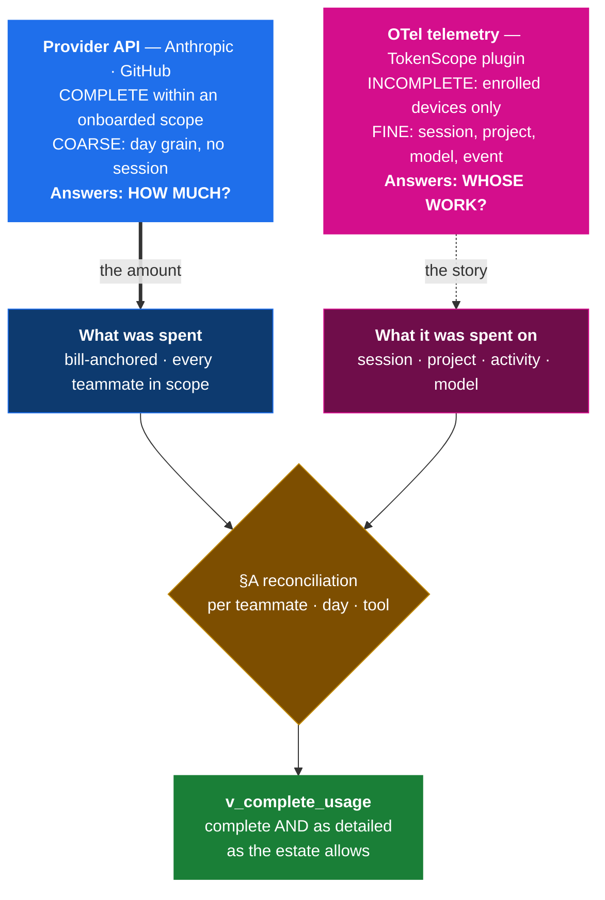
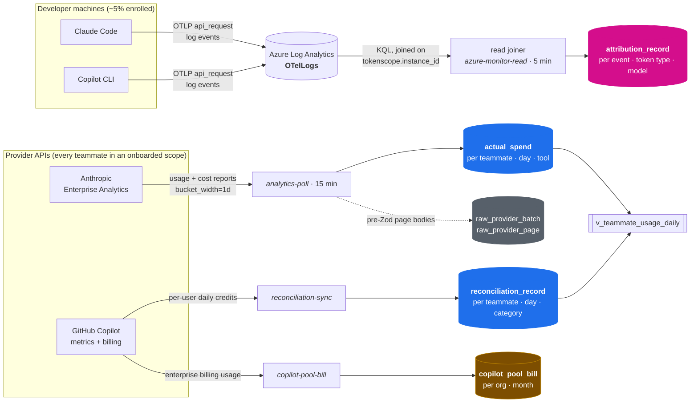
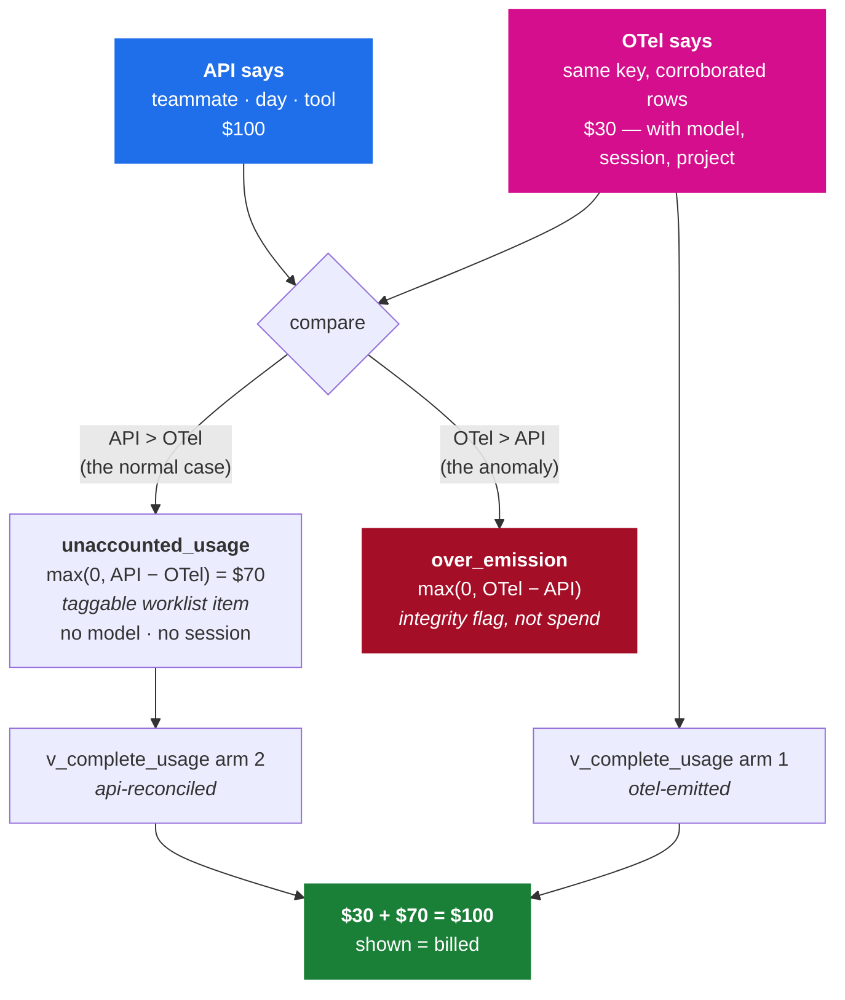
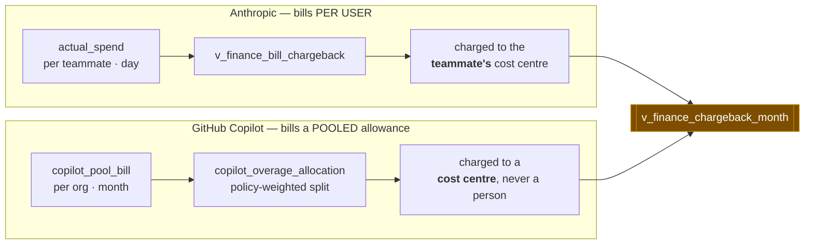
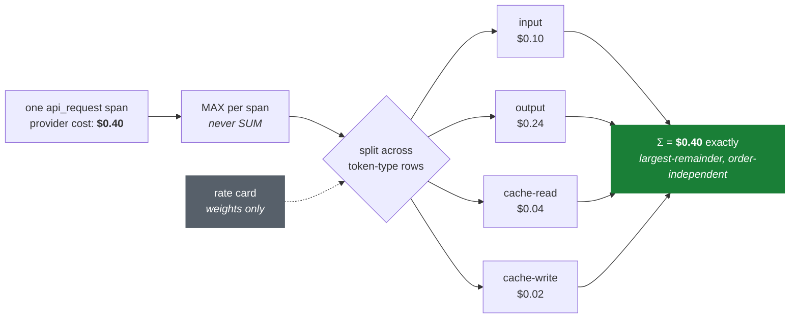

# Data Flow

**What this page is for.** It answers one question: *where does a dollar of
TokenScope spend come from, and what is it allowed to be used for?* Read it
before changing anything that touches money, and before designing any report
that puts two spend numbers on the same axis.

The companion page [Data Lineage](Data-Lineage.md) is the data-architect view:
every table, column, transformation and invariant. This page is the shape; that
page is the detail.

> **Status.** Rewritten 2026-08-02 from a full code trace. Every claim below
> carries a `file:line` or a dated observation. Where two canonical documents
> disagree, this page says so and names which wins — it does not silently pick
> one. Claims that could not be closed from code are marked `[VERIFY]`.

---

## 1. The one principle

Everything on this page follows from a single fact, and most mistakes made
against this system are a variant of forgetting it:

> **The provider API states HOW MUCH was spent, for every teammate in a scope
> we have onboarded.**
> **OTel telemetry states WHOSE WORK it was, only where the plugin is enrolled.**
>
> They are not two spend feeds to be added together. One is truth; the other is
> detail.

**The API's completeness is scoped, not absolute.** It covers every teammate in
an org that is registered *and* set to `reconciliation_mode = 'reconciled'`. An
unregistered or `indicative` org yields **no rows at all** — and no row is not an
authoritative zero. The over-emission detector encodes exactly this caution:
`api_usd = 0` is treated as ambiguous between "org unreconciled" and "genuinely
zero", and is never flagged (`over-emission-detection.ts:173-179`). Zero
reconciled orgs is a clean no-op, not a report of zero spend
(`server/workers/registry.ts:148-152`).

Detected rows carry which lane found them, in `over_emission.reason` (mig 0132):
`api-uncorroborated` is the high-confidence lane — emitted spend materially above
a bill that *does* exist — and `no-bill-to-corroborate` is the weaker one, where
no bill has landed to compare against. Only the high-confidence lane reaches a
developer: every user-facing reader filters on it, so a `no-bill-to-corroborate`
row is counted and alertable without ever being shown to the person it concerns.

Two adjacent things are **not** the same as absence, and conflating them is its
own error:

- **A failed poll** writes no *fresh* rows but leaves earlier ones standing. The
  stale-row prune is reached only after every day in the window succeeds
  (`analytics-poller.ts:626-629`), so a partial failure never deletes what it
  could not re-assert. The figure you read may simply be older than you think —
  check `pulled_at`.
- **An unsettled day still has rows.** The current day is fetched and written
  like any other (`analytics-poller.ts:463-469`, `:616-623`); settling is
  *reporting metadata* (`server/reports/settling.ts:53-68`), not an ingestion
  filter. Recent figures are provisional and will move under the 31-day revision
  window, but they are present.

The solid line carries money. The dashed line carries meaning. **A design that
sums the two lines is wrong**, and a chart that puts them side by side without
saying which is which is misleading.

### Why the coverage looks the way it does

Roughly **5% of the estate runs the TokenScope plugin**. That is the *designed*
state, not a shortfall to be closed — the plugin is opt-in and the API is the
permanent primary source for everyone else. A reporting axis built only from
OTel is therefore blank for 95% of spend **by construction**, and the fix is
never "chase enrolment"; it is "read the dimension the API already carries."

This once meant most of the model axis rendered as a "Not split by model"
bucket (58% of Dev spend on 2026-08-01). That state is superseded. Both
providers send a model dimension on every row
(`docs/design/provider-data-capture-and-shaping.md:14-45`, captured live), and
it is now read, not discarded: the hourly `provider-transform` worker stores it
in `provider_usage_fact` (migs 0118–0122), and `v_complete_usage` names a model
on every row the sources can name (mig 0124) —

| rows | model comes from |
|---|---|
| arm 1 — OTel-emitted | the wire, per event |
| arm 2 — the API residual | the stored subtraction split: `unaccounted_usage_model` children, `cap(max(0, API_model − OTel_model))` per model, written with the parent (mig 0123) |
| arm 3 — ingest-only lanes | the provider's own `provider_usage_fact` cost rows for the same (teammate, day, tool) key |

What cannot be named is one **reason-typed remainder row** per key
(`model_gap_reason`: `provider-day-grain` — Copilot money carries no per-model
dollars; `awaiting-provider-detail` and `provider-revision-drift` — transient
fact-lane lag, self-healing; `unmodelled-provider-cost` / `surface-remainder` —
provider cost reported without a model). Remainders preserve the sum-back
(Σ per key = the day's total) and render as the Top-models card's coverage
footer, never as a category row.

---

## 2. The two axes — §A and §B

The system separates two concerns that look alike and are not. Conflating them
has produced wrong decisions repeatedly, which is why the canonical document
(`docs/design/provider-billing-attribution-model.md`, owner-ratified 2026-06-28)
exists to hold them apart.

| | **§A — usage completeness** | **§B — billing / chargeback** |
|---|---|---|
| Question | "Is my usage fully shown, and whose was it?" | "Who pays for this?" |
| Grain | teammate · day · tool | cost centre · month |
| Anthropic source | `actual_spend` → `v_teammate_usage_daily` | `actual_spend`, per teammate |
| Copilot source | `reconciliation_record` | `copilot_pool_bill` |
| Uses OTel? | Yes — for the detail axis | **Never** |
| Surface | `v_complete_usage` | `v_finance_chargeback_month` |

**A §B fact never settles a §A question, and vice versa.** Copilot billing
being *pooled per cost centre* (§B) says nothing about whether per-*user* usage
is available (§A — it is, and we already store it). This exact confusion has
been made and corrected twice; `CLAUDE.md` §Decision discipline records it.

---

## 3. The generic model

### 3.1 Three ingest paths, not two

The wiki has long said "two ingestion paths." There are three live paths writing
three different tables, plus two dormant lanes.

Magenta is OTel (detail). Blue is API (§A truth). Amber is the §B bill. Grey is
raw capture.

Two further lanes exist and are **not** shown because they are dormant or
non-monetary: the native-GenAI Copilot read (`server/azure/reader.ts:552-589`,
gated `NUXT_COPILOT_NATIVE_OTEL`, **default off** at `reader.ts:539-543`) and the behavioural
`usage_signal` lane into `usage_signal_record`
(`server/workers/azure-monitor-reader.ts:1689-1715`), whose values are gauges and
are **never summed as spend**.

### 3.2 The §A reconciliation

Both sides collapse to **(teammate, day, tool)** — and the reason is the single
most consequential provider limitation in the system:

> **Neither provider API carries a session identifier.** The day is therefore
> the finest grain at which API truth and OTel detail can be compared at all.
>
> In code: the OTel side is collapsed to the day by
> `GROUP BY ar.teammate_id, (ar.ts_event AT TIME ZONE 'UTC')::date, ar.tool`
> (`unaccounted-reconciliation.ts:119`), because the API side already arrives at
> that grain. The rationale is stated at `:14`.

**The invariant, stated precisely** (imprecision here is what makes people
propose designs that break it):

> For a given (teammate, day, tool) **where OTel ≤ API**:
> `Σ arm 1 + arm 2 = the API figure`.
>
> Where **OTel > API**, arm 2 is clamped to zero by `GREATEST(0, …)` and arm 1
> alone exceeds the API figure. That case is not reconciled — it is *detected*,
> by `over_emission`. The clamp is deliberate: §A guarantees never
> under-counting, and an overshoot is the integrity lane's problem
> (the clamp is at `unaccounted-reconciliation.ts:121-124`; rationale at `:20-22`).

**How the residual carries a model without breaking conservation.** The
residual's per-model split is `max(0, API_m − OTel_m)` — a subtraction of two
observed operands — written as `unaccounted_usage_model` child rows in the same
transaction as the parent. Naive flooring alone would over-state: API model X
$10 / model Y $10 against OTel X $15 / Y $0 gives per-model floors summing to
$10 against a day residual of $5. The cross-model overshoot rule is a
**deterministic cap**: children are allocated in descending order, each taking
`min(floored, remaining)`, so `Σ children ≤ parent` always, and the view emits
any positive difference as one reason-typed remainder row. Never a ratio —
a named cell is an observed subtraction, possibly truncated, never inflated.

Tags survive recomputation. `project_id`, `activity`, `tagged_at`, `tagged_by`
and the dismissal columns are deliberately absent from the upsert's `SET` list
(`unaccounted-reconciliation.ts:129-134`), so a developer's tag persists while
its amount shrinks under them.

### 3.3 The third arm — ingest-only lanes

Eight tools never emit OTel at all (`INGEST_ONLY_USAGE_TOOLS`,
`shared/usage/surface.ts:111`): `copilot-agent` plus the seven non-Code Claude
surfaces. For these, `API − OTel` would equal the full amount every single day,
turning every dollar into a permanent untaggable worklist item
(excluded at `unaccounted-reconciliation.ts:98`; rationale at `:30-38`).

So they are excluded from arms 1 and 2, and are the *only* members of arm 3.
The three arms are **structurally disjoint** — arms 1 and 2 exclude exactly the
set arm 3 includes — so no data anomaly can land one tool in two arms
(`drizzle/migrations/0101_…sql:198-201`).

Arm 3 rows carry `project_id` and `activity` as NULL **by construction**: the
lane is untaggable, so no activity axis exists for that money. That is a
structural absence, not a bookkeeping gap, and readers must render it as a
named bucket rather than as zero or as "untagged"
(`drizzle/migrations/0113_complete_usage_activity.sql:17-22`).

### 3.4 §B — chargeback

Chargeback never reads OTel. The two providers bill differently and are charged
differently, and this asymmetry is the whole content of §B:

Three consequences that are enforced, not conventional:

- **Copilot `actual_spend` rows are showback-only.** The `copilot-cli` flat-seat
  rows are firewalled out of every chargeback view *by name*
  (`drizzle/migrations/0085_…sql:62`, `:114`, `:135`). A reader who assumes
  Copilot charges flow through `actual_spend` will be wrong.
- **§B money is READ, never priced.** Net/gross/discount come straight off the
  bill (`server/workers/copilot-pool-bill.ts:141-179`). Computing
  `seats × rate` was wrong by 27% against a live invoice
  (`provider-billing-attribution-model.md:164-173`).
- **No double charge is structural.** The pool view charges either the
  allocation *or* the org-homed figure, made mutually exclusive by a
  `WHERE NOT EXISTS` (`drizzle/migrations/0107_…sql:44-47`).

---

## 4. How money is valued — and the rate card's real job

This is the point on which the two canonical documents contradict each other,
and where a wrong belief has been propagated for months. Resolving it:

**The cost-precedence ladder** (`server/usage/span-costing.ts:209-225`,
`docs/design/provider-cost-precedence.md`):

| rung | fires when | effect |
|---|---|---|
| 1 `provider` | the provider sent a usable cost | the provider figure **is** the span total |
| 2 `rate-card` | provider cost missing, zero, negative or unstorable | our card prices each row — **and raises an alert** (`azure-monitor-reader.ts:1750-1756`) |
| 3 `skip` | neither | the span is not written at all |

**Observed on Dev, one 7-day sample (2026-08-01): 21,839 spans provider-priced,
0 rate-card-priced.** That is a dated observation from one environment, **not** a
proof that rung 2 is dead. Rung 2 is live code: it fires for missing, zero and
negative provider cost (`tests/integration/azure/joiner-provider-cost.test.ts:330-380`)
and for an unstorable one (`:793-842`). Any decision that depends on rung 2 being
rare needs production-wide rung counts, not this sample.

### The conflict, and which document wins

- `docs/design/provider-billing-attribution-model.md:74` and
  `server/usage/over-emission-detection.ts:11-23` both describe
  `attribution_record` as the *"OTel rate-carded estimate"*, a different money
  basis from the bill.
- `docs/design/provider-cost-precedence.md` and the live evidence say the
  amounts are provider-priced.

**The precedence doc plus the evidence wins** on the common case. But "rate-carded"
and "provider-priced" are both too absolute, because the card plays **three
different roles depending on the rung**:

| situation | what the card does |
|---|---|
| provider cost present, and every row has a **positive** card weight | **weights the split** — the provider total is divided in proportion to those weights |
| provider cost present, but the weights are unusable — any row unpriceable, any negative weight, or a total weight of zero | **nothing** — no split is defensible, so the whole total lands on one deterministic carrier row (`span-costing.ts:258-273`, `:434-462`) |
| provider cost missing, zero, negative or unstorable (**rung 2**) | **sets the amount** — each *priceable* row keeps its own card estimate, rows the card cannot price are **skipped entirely**, and an alert fires (`span-costing.ts:394-407`, `azure-monitor-reader.ts:1360-1367`, `:1750-1756`) |

The mechanics behind role 1: one `api_request` span fans out to up to four
token-type rows, but the provider sends **one** cost for the whole span. The
total is therefore taken as `MAX` per span, never `SUM`
(`azure-monitor-reader.ts:1119-1126`) — summing would multiply it up to 4× — then
allocated by largest-remainder so the parts sum to the whole exactly
(`span-costing.ts:429-468`, `:262-308`).

`rate_card_id` is pinned **only** when the card decided the *amount*, which makes
`rate_card_id IS NULL` the reliable "not card-priced" marker for `claude-code`.
Pinned on rung 2 and NULL on provider-priced, both asserted at
`tests/integration/azure/joiner-provider-cost.test.ts:230`, `:360`, `:440`.

If **any** token type has no rate line, no split is defensible, so the whole
provider total lands on one deterministic carrier row rather than being guessed
(`span-costing.ts:434-462`).

### Two open questions this raises

1. **The over-emission threshold stays at 2×. Owner-settled 2026-08-02.**
   `over-emission-detection.ts:11-23` justifies the 2× band plus a $25 floor as
   absorbing "honest rate-card drift", on the premise that OTel is an estimate
   and the API is a bill. That rationale is now stale — but the **threshold is
   still right, for a different reason**: the alarm is an informational
   "something looks off" signal, not an integrity control, *because OTel is
   never billed*. The API is the bill; OTel is project direction and indicative.
   A loose threshold on an advisory signal is correct.
   Note also that the two figures do **not** share a basis even on the common
   rung: OTel cost is the client-emitted per-event `Attributes['cost_usd']`
   (`server/azure/reader.ts:476`), while the API figure is aggregated from
   cost-report rows (`analytics-poller.ts:568-613`). Different provider surfaces,
   free to differ on rounding, timing and inclusion. **Do not "tighten" this
   threshold as a correctness fix.**
2. **A stale rate card silently skews the token-type split.** The card is
   flagged stale and measured ~36% off. When it prices nothing it still acts as
   the *weight vector* deciding how each span's exact total is distributed across
   input/output/cache rows — so span totals stay correct while the per-token-type
   breakdown drifts. The same card also feeds rate-derived estimates in
   `server/usage/insights.ts:225-254` and `:319-349` (loaded by `fetchRateLines`,
   `:676-690`).
   **Owner decision 2026-08-02: refresh the card and keep the savings advice
   on.** Refreshing fixes both consumers at once — the nudges become accurate and
   the token-type split stops drifting. **Open — issue #42.**

### The personal-subscription false positive

A teammate on a personal or team Claude subscription emits OTel that never
appears in the enterprise API, because the billing email differs. They are
protected: `api_usd = 0` and the material lane requires `api_usd > 0`
(`over-emission-detection.ts:177`). A declaration additionally suppresses the
lower-confidence no-bill lane (`:199-203`).

**One case is not protected, deliberately.** A teammate with *both* enterprise
spend and a personal subscription on the same enrolled device has `api_usd > 0`,
while their OTel carries both sources — so the material lane can fire, and the
personal declaration explicitly does not waive it (*"a REAL bill mismatch is
never waived by a personal declaration"*, `:194`). Accepted as-is: the signal is
advisory and costs nobody money.

**Copilot never uses a rate card at all.** Its cost is `nano_aiu × 1e-11` at a
fixed $0.01/credit (`azure-monitor-reader.ts:294`, `:317-332`); the seeded
Copilot card was deleted as "dead and misleading"
(`drizzle/migrations/0037_…sql`).

---

## 5. Insight-specific wiring

Everything above is the generic model. This is what is actually configured here.

### Anthropic

| | |
|---|---|
| Plan | **Usage-based.** Seat-based plans are no longer purchasable. |
| API kind | **`enterprise-analytics`** — *not* `claude-code-admin` |
| Branch | `server/workers/analytics-poller.ts:810`, on `provider_org.api_kind` |
| Endpoints | `/v1/organizations/analytics/user_usage_report` and `…/user_cost_report` |
| Grain requested | `bucket_width=1d`; `group_by[]` = `[product, model, context_window]` for usage, `[product, model, cost_type, context_window]` for cost |
| Window | trailing **31 days inclusive** — `[now−30d, now]`, `server/workers/registry.ts:132-141`. **Not** month-start. |
| Cadence | `*/15 * * * *` |
| Credential | `x-api-key` from Key Vault, per `provider_org.credential_secret_name` |
| Raw capture | **yes** — mig 0117, pre-Zod page bodies |

The `claude-code-admin` path (`server/anthropic/client.ts`) is **dormant here**.
It is a different endpoint with no `group_by`, no `bucket_width`, a hardcoded
`tool='claude-code'` and no raw capture. Evidence drawn from it does not
describe production, and has been mistaken for production before.

The two `group_by` arrays differ in exactly one member, deliberately:
`cost_type` exists only on cost rows, so sending it to the usage report would
fragment rows on an unreadable dimension against the page ceiling. Requesting it
on the cost report is what makes the `web_search` / `code_execution` exclusion
**reachable at all** — the filter reads a field that is otherwise never
populated. `context_window` goes on **both** reports or neither: the two reports
are at different grains, and a dimension on one side only makes the join harder.
`speed` is the other dimension the same rule names and is deliberately not
requested — no surface needs it, and every added dimension multiplies rows
against the page ceiling.

> **Dated observation, not a code-proven fact:** a live probe on 2026-08-01
> returned `cost_type` populated 240/240, where a capture before the `group_by`
> change had it null 395/395. The inference that the exclusion had therefore
> never fired before that change is consistent with both captures but is **not**
> established by execution evidence — no query counted excluded rows historically.

### GitHub Copilot

| | |
|---|---|
| Target mode | **App mode** — owner-ratified 2026-07 (`github-pat-to-github-app-transition.md:62-72`) |
| App read | `GET /enterprises/{ent}/copilot/metrics/reports/users-1-day?day=` → signed NDJSON `download_links[]`, fetched **with no `Authorization` header** (a bearer breaks the signature) |
| PAT read | `GET /enterprises/{ent}/settings/billing/ai_credit/usage?user=…` — carries full SKU/gross/discount/net |
| §B bill | `GET /enterprises/{ent}/settings/billing/usage?year=&month=` |
| Rate | $0.01 per AI credit |
| Raw capture | **no** — no GitHub writer exists |

**`[VERIFY]` — which mode Dev/Prod actually runs.** The repo cannot answer it.
The branch is `provider_enterprise.github_app_id` being non-NULL
(`server/reconciliation/credentials.ts:216-245`), which is set through the admin
UI, not by seed or env. Repo state points to PAT (seed has no `github_app_id`;
only `NUXT_GITHUB_PAT_*` appears in any env file), while the 2026-08-01 live
capture is explicitly App mode. Assume App mode is live and confirm before
relying on either.

The modes are **not** interchangeable, and the difference is load-bearing:

| | PAT | App |
|---|---|---|
| Per-user billing detail | ✅ full SKU array, USD, gross/discount/net | ❌ 403, GitHub-acknowledged |
| Per-user usage | ✅ | ✅ credits only |
| Category split | per SKU → `copilot_interactive` / `copilot_coding_agent` | one `copilot_interactive` line only |
| Verdict grain | per license org | **one verdict for the whole enterprise** — a mixed enterprise cannot be split (`legacy-chargeback-heuristic.ts:122-128`) |

Every classic PAT scope that reaches `ai_credit/usage` is mutate-capable
(`manage_billing` / `admin:enterprise`) — there is no read-only billing scope.

### Enrolment

The plugin ships via a server-managed marketplace; `provision_emit` mints the
instance. Enrolment is effectively **per-host**: the credential lives in
`~/.claude/settings.json`, so every container sharing a home directory on one
host emits the same `tokenscope.instance_id` (verified in the 2026-06-05 dogfood
incident).

---

## 6. Failure modes

What each hop does when it breaks, and what a reader sees as a result.

| hop | failure | behaviour | visible as |
|---|---|---|---|
| Client emit | CLI in `[2.1.191, 2.1.212)` sends chunked; Azure DCE 400s it | loopback forwarder adds `Content-Length` (header added at `plugin/scripts/otlp-forwarder.mjs:205-207`; affected range at `otlp-shim-policy.mjs:21-23`) | silent total telemetry loss if the shim is bypassed |
| LAW → joiner | event lands late | absorbed only within a **5-minute** watermark overlap; older events need the ~24 h deep rescan or an operator `telemetry-recovery` run | spend appears hours late, then reconciles |
| Joiner | no rate line for any token type | whole span total lands on one carrier row | token-type split distorted; total correct |
| Joiner | rung 3 — no provider cost, no card | **span not written at all** | usage silently missing from OTel; the API residual absorbs it |
| Joiner | membership gate fails | row **is** written, `project_id` NULL | spend appears as unallocated, never lost |
| Poller | one org's fetch throws | per-org catch; other orgs unaffected | that org writes **no rows this cycle** |
| Poller | Zod parse fails on a report | same per-org catch → "poll failed" | deterministic outage for that org until fixed |
| Poller prune | >50% of rows fail identity binding | prune skipped, warning logged | stale rows survive rather than money being deleted |
| Poller prune | any day in the window throws | prune never runs | partial pull can never delete rows it did not re-assert |
| Copilot report | `download_links` empty on a 200 | **fail loud** — treated as a retryable gap | never recorded as an authoritative zero |
| Copilot bill | `netAmount` absent or renamed | **throws** — no `.default(0)` | never silently coerced to $0 |
| Seat prune | roster empty, short page, or page cap hit | prune skipped | stale seat rows survive |

The recurring shape: **every guard fails toward keeping stale data rather than
deleting real money**, and every "authoritative zero" is treated as a bug until
proven otherwise.

---

## 7. What the providers cannot give us — and the standing obligation

**Dated 2026-08-02. This section has a shelf life.**

| limitation | consequence | verified |
|---|---|---|
| No session identifier on either API | §A reconciles at day grain; the residual is untaggable to a conversation | 2026-08-02 |
| Anthropic cost report has no token columns; usage report has no cost | the two reports must be read separately and cannot be joined per row | 2026-08-02 |
| Copilot App mode returns credits only, no USD, no SKU | §B cannot be derived from the metrics report | 2026-06-30 |
| Copilot App mode cannot read per-user *billing* | 403, GitHub-acknowledged (community #184208) | 2026-06-30 |
| Copilot App mode cannot read `consumed-licenses` | identity resolves via org SAML `externalIdentities` instead | 2026-07-02 |

> ### Standing obligation — re-check the provider API specs
>
> **Every limitation above is a fact about a provider's API on a date, not a law
> of nature.** These specs move. If Anthropic or GitHub adds a session
> breakdown, a `session_id` group-by, or per-user billing to an App
> installation, the day-grain compromise in §3.2 stops being necessary and
> several designs built around it should be revisited.
>
> **Our wire-shape probe cannot detect this.** It reports new *fields on
> responses we already request*. It cannot see a new *capability* we do not ask
> for — a `group_by` value we never send is invisible to it. Detecting these
> needs someone reading the changelogs.
>
> Re-read both providers' API references at least quarterly, and whenever a
> reconciliation design decision leans on "the API cannot do X". Record the date
> and the finding here. Tracked as issue **#43**.

---

## 8. Known gaps

Real and current unless marked CLOSED (kept in place so numbering stays
stable). Listed so they are not rediscovered as surprises.

1. **The model dimension is discarded at ingest — CLOSED.** Both providers send
   it on every row; `actual_spend` still has no model column, and no longer
   needs one: `provider-transform` derives `provider_usage_fact` (teammate ·
   day · tool · **model** · cost_type · context_window) from the captured
   payloads (migs 0118–0122, 0127), the §A residual stores its per-model
   subtraction as
   `unaccounted_usage_model` children (mig 0123), and `v_complete_usage` fans
   both NULL-model arms out into named models plus reason-typed remainders
   (mig 0124). See §1.
2. **§A residuals are not frozen by finance close.** The close guard
   (mig 0116) protects `actual_spend` only. `unaccounted_usage` keeps being
   recomputed on a 35-day trailing window across a closed month boundary. No
   guard, no comment claiming one, no test. `[VERIFY]` whether this is intended.
3. **The over-emission threshold and the stale rate card** — §4, issue #42.
4. **Copilot has no raw capture.** Mig 0117 covers Anthropic only.
5. **`is_frozen` enforces nothing.** Written `true` on every
   `attribution_record` row and read nowhere; no trigger, CHECK or policy makes
   the row immutable.
6. **Shadow→real identity confirmation does not re-key rollups.**
   `confirm-instance.ts:277-290` re-points `teammate_id` without bumping
   `ts_recorded`, and the incremental rollup keys its day-set on `ts_recorded` —
   so aggregates may hold the shadow teammate's dimensions until a backfill.
   `[VERIFY]` — no re-keying path found.
7. **Point-in-time cost-centre homing is not implemented for Copilot.**
   Re-pointing an org's cost centre restates prior months.
8. **Dangling doc references.** `copilot-surface-lanes` is cited by four
   migrations and three server files and **does not exist**;
   `docs/design/reconciliation-engine.md` exists only under `archive/`.

---

## See also

- [Data Lineage](Data-Lineage.md) — tables, columns, transformations, invariants
- [Data Model](Data-Model.md) — schema reference *(stale on this path; see gaps)*
- [Reporting](Reporting.md) — what reads these surfaces
- `docs/design/provider-billing-attribution-model.md` — canonical §A/§B
- `docs/design/provider-cost-precedence.md` — canonical cost ladder
- `docs/design/github-pat-to-github-app-transition.md` — credential modes
