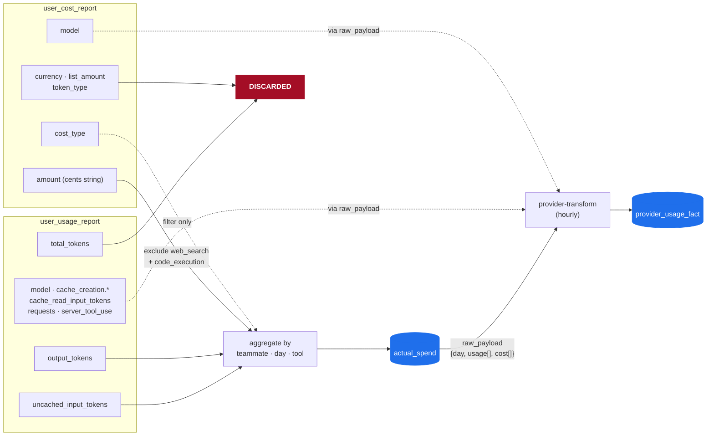
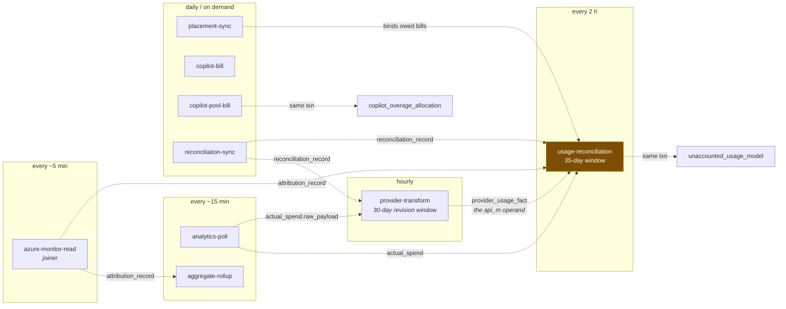

# Data Lineage

**What this page is for.** The data-architect view of the spend pipeline: every
table on the money path with its grain, key, writers and readers; field-level
lineage from provider response to stored column; what is dropped at each hop and
why; and every invariant classified by *how* it is enforced.

Read [Data Flow](Data-Flow.md) first — it holds the shape and the one principle.
This page assumes it.

> **Status.** Written 2026-08-02 from a full code trace at `7ad1e83`. Every row
> carries a `file:line`. Unclosed claims are marked `[VERIFY]`.

---

## 1. Table catalogue

Grain, unique key, and — the column that matters most — **what each table is
authoritative for**. Getting this wrong is how the same dollar gets counted
twice.

| table | grain | unique key | authoritative for | NOT authoritative for |
|---|---|---|---|---|
| `attribution_record` | event · token type · model | `(instance_id, COALESCE(claude_session_id,''), ts_event, token_type, model, COALESCE(source_run_id,''))` — mig 0055:101-102 | **the detail axis**: session, project, activity, model, query source | total spend — it covers ~5% of the estate |
| `actual_spend` | teammate · date · tool · source | `(teammate_id, date, tool, source)` | **Anthropic §A usage truth** and **Anthropic §B chargeback** | Copilot chargeback — those rows are showback-only |
| `reconciliation_record` | provider · enterprise · date · category · scope · teammate | partial unique **WHERE `status='proposed'`** — `engine.ts:355-358` | **Copilot §A usage** | any chargeback figure — Copilot lines are always `indicative` |
| `copilot_pool_bill` | enterprise · org · month | `(…_month_org_uidx)` + a residual index for `provider_org_id IS NULL` | **the Copilot §B charge** | anything per-teammate — the view carries no user column, by test |
| `unaccounted_usage` | teammate · day · tool | `(teammate_id, day, tool)` | **the §A residual** and the tagging worklist — the key also serves a model breakdown: stored `unaccounted_usage_model` children plus the by-key `provider_usage_fact` detail read (`/me/unaccounted/{id}`) | a session breakdown — the API has no session ids |
| `unaccounted_usage_model` | parent fill row · model | PK `(unaccounted_usage_id, model)`, FK CASCADE — mig 0123 | **the stored §A residual model split** — `cap(API_m − OTel_m)` per model, `Σ children ≤ parent` | tagging — the parent carries the one decision; children have no tag columns |
| `provider_usage_fact` | source · teammate/actor · date · tool · model · cost_type · context_window | NULL-safe expression uidx (0118, replaced by 0127 to admit the newest member) — `(source, COALESCE(teammate_id::text, 'actor:' \|\| lower(actor_ref)), date, tool, COALESCE(model,''), COALESCE(cost_type,''), COALESCE(context_window,''))` | **the provider's own per-model/per-cost_type facts** — billed cost (anthropic) / gross consumption (github), per provider | the §B charge (`actual_spend` / `copilot_pool_bill` own that); any cross-provider blind `SUM(cost_usd)` |
| `over_emission` | teammate · day · tool | `(teammate_id, day, tool)` | **an integrity signal** | spend — it is never summed into any total |
| `copilot_overage_allocation` | enterprise · month · cost centre | two partial uniques (allocated + unallocated) | **the distribution** of pooled overage | its magnitude — that comes from the bill |
| `raw_provider_batch` / `_page` | batch · page | batch owns completion; page has an XOR check on body/duplicate | **the untransformed provider response** | anything read by reporting — nothing reads it yet |
| `attribution_aggregate` | scope · day · tool · model · token type · query source | — | dashboard rollups | finance — it is derived, not a ledger |
| `spend_rollup_daily` | full contributor grain incl. point-in-time org context | — | **the durable ledger** surviving raw retention | live figures — it is a rollup |
| `finance_period` | month | `period_month` (first-of-month CHECK) | **whether a month is closed** | any amount |

**Absence of a `finance_period` row means OPEN** — `finance-period.ts:6-8`,
mirrored in the trigger at `0116:42-43`. This is easy to get backwards.

### Views

| view | arms / lanes | live definition |
|---|---|---|
| `v_teammate_usage_daily` | `actual_spend` ∪ `reconciliation_record` | **mig 0101:142-197** — *not* 0084/0086, which it explicitly reverts |
| `v_complete_usage` | 3 arms, structurally disjoint; arms 2 and 3 each fan out per model — arm 2 into the stored `unaccounted_usage_model` children + one reason-typed remainder per parent, arm 3 against `provider_usage_fact` cost rows + one reason-typed remainder per key (overrun-guarded) — with `model_gap_reason` on every remainder. The remainder row is emitted when the cost remainder OR the token remainder is positive, each measure capped independently (0125). Arm 3a reads its per-key fact total as a window aggregate over `arm3_fact_model` — a performance shape, output byte-identical to 0125 (pinned by `tests/integration/reports/view-rewrite-identity.test.ts`); the arm-2/3 `AT TIME ZONE 'UTC'` date expressions carry expression indexes on `unaccounted_usage`/`actual_spend`/`reconciliation_record` | **mig 0126** (semantics 0124/0125, base copied forward from 0113) |
| `v_finance_chargeback_month` | Anthropic arm ∪ Copilot pool view | mig 0085:108-118 |
| `v_finance_copilot_pool_chargeback` | `copilot-license` / `copilot-usage` / `copilot-unclassified` | mig 0107:25-61 |
| `v_effective_spend` | hot `attribution_record` ∪ cold `spend_rollup_daily` | mig 0056:74-91 |

`v_complete_usage` is read by **20+ modules** and is the single §A lane for
project spend at every grain (`server/usage/complete-spend.ts:254`). The
reports-depth reads added for the drill surfaces sit on it too — the per-teammate
contribution view (`server/reporting/teammate.ts`) and the project reports depth
(`server/reporting/project-depth.ts`), both inside the lane-firewall scan roots,
so neither can reach `attribution_record`, raw `actual_spend` or
`attribution_aggregate`.

**Two dashboard reads are allowed to touch the ledger directly, and both are
named.** `v_complete_usage` has no session axis, so anything counting
CONVERSATIONS cannot come from it. The consumption perf gate
(`tests/unit/server/consumption-perf-gate.test.ts`) therefore sanctions exactly
two exceptions — `server/usage/project-detail.ts` (a project's untagged
pressure) and `server/usage/session-economics.ts` (the My-usage per-conversation
distribution) — each ONE query, scoped to its subject and bounded on **both**
sides of `ts_event`; a lower bound alone is not a window. Because the ledger is
arm 1, both see OTel only: a provider-recorded day is not a conversation and
never enters them.

---

## 2. Writers

The count matters: it is why the finance-close guard is a **table trigger**
rather than per-statement `CASE` guards. Two of the writers are `DELETE`s, which
no `ON CONFLICT` clause can reach (`0116:16-22`).

### `actual_spend` — eight writers

| # | writer | op | cite |
|---|---|---|---|
| 1 | `analytics-poller.ts` `upsertActualSpend` | INSERT … ON CONFLICT DO UPDATE | `:212` |
| 2 | `analytics-poller.ts` stale-row prune | **DELETE** | `:664` |
| 3 | `copilot-bill.ts` `upsertCopilotBillRow` | INSERT … ON CONFLICT DO UPDATE | `:151` |
| 4 | `copilot-bill.ts` seat-convergence prune | **DELETE** | `:355` |
| 5 | `placement-store.ts` owed-bill replay | INSERT … ON CONFLICT DO UPDATE | `:377` |
| 6 | `governance-key-backfill.ts` | 3 × UPDATE | `:75`, `:92`, `:188` |
| 7 | `governance/recompute.ts` | UPDATE (verdict) | `:190` |
| 8 | `governance/finance-period.ts` | UPDATE (`governance_verdict_locked_at`) | `:223`, `:272`, `:328` |

### `attribution_record` — three writers

| writer | op | cite |
|---|---|---|
| `azure-monitor-reader.ts` (the joiner) | INSERT … ON CONFLICT DO NOTHING | `:1554`, `:1561` |
| `tag-session.ts` | UPDATE `project_id`/`cost_owning_unit_id`, `activity` — bumps `ts_recorded` | `:188`, `:200` |
| `confirm-instance.ts` | UPDATE identity + dimensions — **does not bump `ts_recorded`** | `:277-290` |

That last omission is gap #6 in [Data Flow](Data-Flow.md#8-known-gaps).

---

## 3. Field-level lineage

### 3.1 Anthropic Enterprise Analytics → `actual_spend`

Two reports per UTC day, fetched **serially** (a shared 60-RPM org-wide cap,
`analytics-poller.ts:485-487`), aggregated in memory by
`${teammateId}:${day}:${tool}`, then upserted.



**Stored:**

| column | source | cite |
|---|---|---|
| `teammate_id` | `lower(email)` match, `AND NOT provisional` | `:218`, `:261-278` |
| `date` | the loop's UTC day | `:463` |
| `tool` | `mapProductToTool(row.product)` | `:554` |
| `input_tokens` | Σ `uncached_input_tokens` | `:563` |
| `output_tokens` | Σ `output_tokens` | `:564` |
| `cost_usd` | Σ `centsStringToUsd(amount)` where `cost_type ∉ {web_search, code_execution}` | `:575-577` |
| `source` | `anthropic-analytics-api:<orgId>` | `:147-150` |
| `raw_payload` | `{day, usage[], cost[]}` | `:618` |
| `region_id`, `org_unit_id`, `cost_owning_unit_id`, `dimension_source` | teammate's placement **at insert time**; never refreshed | `:222`, `dimension-snapshot.ts:69-78` |
| `provider_org_id`, `provider_enterprise_id`, `governance_key_status` | resolved once per call | `:223-224` |
| `chargeback_exempt`, `governance_verdict_source` | `resolveAnthropicVerdict(...)`; **only when `governance_verdict_locked_at IS NULL`** | `:225`, `:236-239` |

**Not on the `actual_spend` row, read by the transform instead.** These fields
survive into `raw_payload` and are read there by `provider-transform.ts`, which
lands them on `provider_usage_fact` (migs 0118/0122):

| field | lands as |
|---|---|
| `model` (both reports) | `provider_usage_fact.model` — the model axis reads it directly |
| `cache_creation.ephemeral_5m/1h`, `cache_read_input_tokens` | the `cache_creation_tokens` / `cache_read_tokens` lanes on the token row |
| `requests` (usage report) | `provider_usage_fact.requests` on the token row |
| `server_tool_use.web_search_requests` | `provider_usage_fact.web_search_requests` (mig 0122) |
| `cost_type` | `provider_usage_fact.cost_type` on the cost row (pre-#226 payloads stamped `tokens`) |

**Discarded — parsed and never read:**

| field | why it matters |
|---|---|
| `total_tokens` | derivable; not stored on either table |
| `list_amount` | list-vs-net discount invisible |
| `token_type` | cost collapsed across token types |
| `currency` | **USD is assumed and never checked** |
| `actor.user_id` | identity binds on email only; the provider's stable id is dropped |
| `data_refreshed_at` | written to `raw_provider_batch` only — no `actual_spend` row records whether its figure was still moving (`provider_usage_fact` carries the column, but this source has none to fill it with) |
| time-of-day | `date.slice(0,10)`; day grain only |

The **envelope** is a non-passthrough `z.object` — undeclared envelope keys are
stripped entirely (`enterprise-client.ts:67`, `:103`).

> **`.default(0)` does not catch `null`.** It substitutes only for *absent*.
> The provider returns a null `requests` when `cost_type` is grouped; the fix is
> `.nullish().transform(v => v ?? 0)`. Getting this wrong throws inside the
> per-org catch and the org writes **no rows on any cycle** — a deterministic,
> silent outage.

### 3.2 OTel → `attribution_record`

Join key is `ResourceAttributes['tokenscope.instance_id']` = the server-minted
enrolment id — **not** Claude's `session.id`, which is stored alongside as
`claude_session_id` (instance filter `server/azure/reader.ts:466`; `session.id` extracted at `:472`).

| column | origin | source |
|---|---|---|
| `instance_id`, `teammate_id`, `region_id`, `org_unit_id`, `tool`, `identity_state` | **DB lookup** on `instance_attestation` | unspoofable |
| `claude_session_id`, `model`, `tokens`, `ts_event`, `source_run_id`, `query_source` | **wire** | the event |
| `token_type` | **KQL** `mv-expand` into 4 lanes | `reader.ts:483` |
| `cost_usd` | **computed** — §4.1 | `span-costing.ts` |
| `project_id`, `cost_owning_unit_id` | **computed** — hash → `session_assignment` → NULL, membership-gated | `:928-1025` |
| `fidelity_tier`, `cost_basis` | **computed** — org lane | `:1027-1060` |
| `credit_qty` | **computed** — `nano_aiu / 1e9`, Copilot only | `:350-355` |
| `rate_card_id` | **DB lookup**, pinned **only** on rung 2 | `:1370-1377` |
| `is_frozen` | constant `true` — **read nowhere** | `:1522` |

**Dropped at the read boundary:**

- zero-token rows (`reader.ts:485`) — an `api_request` with all four counts zero
  disappears **with its cost**
- unparseable timestamp → row skipped rather than a `now()` fabricated (a
  fabricated stamp would never match the unique index and would re-attribute
  every tick)
- over-length or control-char `model` → **whole row dropped** (model is in the
  unique index)
- over-length `claude_session_id` / `source_run_id` / `project.code_hash` →
  **that field only** dropped; row still written
- rung-3 spans — not written at all
- `organization.id` — selects the org lane, then discarded; not a column
- `user.email`, `duration_ms`, `prompt.id`, and the `user_prompt` / `api_error`
  event types — never projected
- **all OTel metrics** — `OTEL_METRICS_EXPORTER=none`

### 3.3 Copilot → three destinations

| destination | mode | payload shape |
|---|---|---|
| `reconciliation_record` (§A) | PAT | `{login, licenseOrg, periodDate, category, items[]}` — full SKU array with gross/discount/net |
| `reconciliation_record` (§A) | App | `{login, periodDate, credits, record}` — one metrics record, no SKU, no USD |
| `copilot_pool_bill` (§B) | either | `{organizationName, month, items[]}` |
| `actual_spend` (showback) | either | `{kind:'flat-seat', login, licenseOrg, month, priceUsd, showbackOnly:true}` |

**App mode receives ~20 fields; the schema now declares most of them.**
Declared: `user_login`, `user_id`, `day`, `ai_credits_used`,
`totals_by_model_feature`, `totals_by_cli.token_usage`, the four `loc_*_sum`
counters, the three activity counts (`code_generation_activity_count`,
`code_acceptance_activity_count`, `user_initiated_interaction_count`), and both
language arrays (`totals_by_language_model`, `totals_by_language_feature`).
Still undeclared but present, captured live 2026-08-01: `totals_by_feature`,
`totals_by_ide`, `ai_adoption_phase`, `enterprise_id`, and six `used_*`
booleans.

Because the schema is `.passthrough()` and the adapter stores the whole record,
**all ~20 fields DO survive into `reconciliation_record.raw`** — what a
declaration changes is the *typed* surface, not the persisted JSONB.
`totals_by_cli.token_usage` carries real prompt/output token sums, so Copilot is
richer than "credits only".

Two consumers read the raw record today, both by key and neither copying it
into a second store: the billed lane's GitHub arm
(`provider-transform-github.ts` → `provider_usage_fact`) and the My-usage
engagement card (`server/usage/copilot-engagement.ts`, over the engagement
fields above). `ai_adoption_phase` is a provider-assigned per-user cohort score
and is deliberately left unread.

> The baseline at `server/diagnostics/baselines/github-user-daily-credits.json`
> is `"provenance": "schema-derived"`, `"capturedAt": null`. It records what
> TokenScope **assumes**, not what was observed. Do not cite it as evidence.

---

## 4. Transformations

### 4.1 Span costing

```
span identity  = claude_session_id \0 ts_event \0 source_run_id
row identity   = token_type \0 model
```

1. **Span total** = `MAX(law_cost_usd)` across the span's rows, never `SUM` —
   the `mv-expand` copies the provider figure onto every surviving row
   (`:1119-1126`).
2. **Rung** = `provider` if `> 0`, else `rate-card` if the card can price ≥1 row,
   else `skip`.
3. **Split**: rows deduped to distinct ledger rows *first* (otherwise the split
   leaks into rows that collapse on insert), then largest-remainder allocation
   weighted by each row's rate-card estimate; residue handed out one micro at a
   time by largest remainder, ties broken by `TOKEN_TYPE_PRIORITY` then key.
   Order-independent by construction.
4. **Carrier fallback**: if any token type has no rate line, the whole total
   lands on one deterministic row.
5. **Re-plan against booked**: an advisory transaction lock reads exact booked
   micros and allocates `provider_total − booked` across unwritten rows only,
   clamped at zero.

**Exactness starts at the micro-USD boundary, not before it.** Once provider and
card figures are normalised to `bigint` micro-USD, Claude's apportionment is
exact integer arithmetic (`span-costing.ts:122-141`). The inputs are not: a
rate-card cost is computed as `(tokens / unit_qty) * unit_cost` in IEEE-754 and
rounded with `toFixed(6)` before that conversion
(`azure-monitor-reader.ts:1906-1922`), and Copilot's cost is `nano_aiu × 1e-11`
in floating point throughout (`azure-monitor-reader.ts:317-331`). Do not describe
the money path as uniformly exact-integer — describe the *allocation* that way.

There is **no plausibility band, ceiling or ratio check** on either lane —
`MAX_COST_MICROS` is a storability check only.

### 4.2 The §A residual

```sql
cost_usd = GREATEST(0, api.usage_usd - COALESCE(otel.otel_usd, 0))::numeric(14,6)
tokens   = GREATEST(0, api.tokens    - COALESCE(otel.otel_tokens, 0))::bigint
```

Both sides exclude OTel rows whose session sits in an unresolved
`session_quarantine` with `reason='api-uncorroborated'` — **the same exclusion is
applied by the over-emission detector**, deliberately, so the under and over
lanes net against identical OTel (`unaccounted-reconciliation.ts:112-118`).

Orphan handling: a key the filtered view no longer backs is **DELETEd if
undecided**, **zeroed but kept if decided** (`project_id IS NOT NULL OR activity
IS NOT NULL OR dismissed_at IS NOT NULL`) — one shared predicate so the two
branches stay complementary.

### 4.3 Over-emission

`over_usd = GREATEST(0, otel_usd − COALESCE(api_usd, 0))`, flagged only when
**all four** hold:

1. `api_usd > 0` — `api=0` cannot distinguish "org unreconciled" from "genuinely zero"
2. `over_usd > GREATEST($25, 1.0 × api_usd)` — i.e. **2× the bill and ≥$25**
3. `day ≤ endDate − 3` (settle lag)
4. the OTel sum excludes quarantined sessions

A separate **no-bill lane** (`api_usd = 0`, `over_usd > $250`, no unrevoked
personal-subscription declaration) never writes to `over_emission` — the table
has no `reason` column — and instead dispatches a non-accusatory inbox prompt.

See [Data Flow §4](Data-Flow.md#4-how-money-is-valued--and-the-rate-cards-real-job)
for why threshold 2 is mis-calibrated.

### 4.4 The stale-row prune

```sql
DELETE FROM actual_spend
 WHERE source = <this org's source>
   AND date BETWEEN <startingAt> AND <endingAt>
   AND tool IN (CLAUDE_FAMILY_TOOLS)
   AND pulled_at < <runStarted>
```

Nine guards, and the reasoning behind two of them is subtle enough to be worth
stating:

- `runStarted` comes from the **DB clock**, not `Date.now()`, so app/DB skew
  cannot widen the deletion window.
- The skip-ratio denominator is `identityEligible`, **not** `total`. Org-grain
  rows (`web_search`, `code_execution`) increment `total` but not
  `identityEligible` — counting them would dilute a 1-of-1 bind failure to
  1-of-3 and let a broken run prune.
- A genuinely quiet window (zero eligible rows) yields ratio 0 and **does**
  prune, which is correct.
- The finance-close trigger is a hard DB-level stop on this DELETE.

---

## 5. Invariants, by enforcement

The distinction matters: an invariant "enforced" by a comment is a wish.

### Enforced by the database

| invariant | mechanism |
|---|---|
| one row per `(teammate, date, tool, source)` / `(teammate, day, tool)` ×2 | unique indexes |
| one `attribution_record` per event · token type · model | expression unique index, mig 0055 |
| a closed month's **`actual_spend`** money cannot move — INSERT-new, DELETE, amount-UPDATE, or re-date **in either direction** | BEFORE ROW trigger, mig 0116 |
| **`actual_spend`** cannot be TRUNCATEd while any period is closed | BEFORE TRUNCATE statement trigger |

| an `unaccounted_usage` row cannot be both tagged and dismissed | CHECK, mig 0094/0095 |
| one `provider_usage_fact` row per (source, identity, date, tool, model, cost_type, context_window) — NULL-safe | expression unique index (every nullable member COALESCEd; identity = teammate uuid or `actor:`+lower(actor_ref)), mig 0118, replaced by mig 0127 for the `context_window` member |
| every `provider_usage_fact` row carries a usable identity | CHECK `provider_usage_fact_identity_chk`, mig 0118 |
| a fact row is a cost row or a token row, never both | CHECK `provider_usage_fact_measure_chk`, mig 0118 |
| no blank fact dimensions, no negative measures | CHECKs `provider_usage_fact_shape_chk` (0118) + `_web_search_chk` (0122) + `_context_window_shape_chk` (0127 — shape only; the band vocabulary is the provider's, so no value CHECK) |
| GitHub money is never at model grain | CHECK `provider_usage_fact_github_money_grain_chk`, mig 0120 |
| a residual model child is non-negative and unique per (parent, model), and dies with its parent | PK + CHECKs + FK `ON DELETE CASCADE`, mig 0123 |
| rate plans never overlap per enterprise | `EXCLUDE USING gist` |
| `finance_period.period_month` is first-of-month | CHECK |
| attribution rows scoped by region + org-unit ltree path | RLS policy |

> **Both triggers are attached to `actual_spend` alone** (`0116:165-196`).
> `unaccounted_usage`, `over_emission`, `reconciliation_record`,
> `copilot_pool_bill` and `attribution_record` carry **no close guard**. Closing a
> month freezes the Anthropic bill rows and the governance verdict — it does not
> freeze every monetary or usage-derived table. `copilot_pool_bill` is protected
> instead by an application-level closed-period refusal, not by a trigger.

The INSERT branch of the close trigger has a subtlety worth preserving: a
`BEFORE INSERT` fires *before* Postgres resolves `ON CONFLICT`, so it cannot
distinguish a new row from one about to become an UPDATE. Every writer is an
upsert, so a blanket refusal would reject a routine re-poll and the per-org catch
would stop the org writing rows **at all**. The trigger therefore lets an
existing key through to be judged by the UPDATE branch (`0116:97-131`).

### Enforced by code

| invariant | mechanism |
|---|---|
| a verdict never moves once frozen | `CASE WHEN governance_verdict_locked_at IS NULL` in all three upserts |
| a re-poll never re-homes a historical day | dimension columns omitted from every `ON CONFLICT SET` list |
| money binds only a non-provisional teammate | `AND NOT provisional` |
| the prune never fires on a partial pull or broken identity | control flow + ratio guard |
| close never freezes a partial snapshot | convergence loop **throws** rather than committing |
| close/reopen/restate serialise | one advisory lock, taken first in all three |
| capture can never break ingestion | best-effort writes, hook throws swallowed at the client boundary |
| an App private key can never be sent as a PAT bearer | `withPat` runs `decodePem` and refuses |
| an App-opted enterprise never silently falls back to PAT | `MissingGithubAppKeyError` |
| Σ allocated == overage to the cent | read-back assertion, throws → rolls back the month |
| exempt orgs are not written at all | no pool leak, no allocation |

`reopen` deliberately updates **rows before state** — step 4 survives the guard
only because it touches none of the three amount columns. Widening the guard
would break reopen, and the fix would be to reorder that file (`0116:30-40`).

### Enforced by test

- `Σ(row costs) === span total, exactly` — 2000-span property sweep
- allocation is deterministic and order-independent
- a span's rows are all-or-nothing
- provider total is `MAX`, never `SUM`
- §A(metered) ≥ §B(metered) — and the *global* form is deliberately false
- the three `v_complete_usage` arm literals equal `INGEST_ONLY_USAGE_TOOLS`
- `flat_seat_price_usd` never reaches a pooled chargeback surface (grep test)
- the pool chargeback view carries no user column (`pg_get_viewdef`)
- absent `netAmount` throws rather than coercing to $0
- usage present with all money $0 forces UNSETTLED, never a confident zero
- `recommendedCron` in the registry equals the deployed bicep cron
- **API-minus-OTel conservation** — worked scenarios at
  `tests/integration/usage/unaccounted-reconciliation.test.ts:111-171`
  (API $34 / OTel $19 → one $15 record; API == OTel → $0 delta)
- **`rate_card_id` pins the rung** — NULL on provider-priced, non-NULL on
  card-priced: `tests/integration/azure/joiner-provider-cost.test.ts:230`,
  `:360`, `:440`

> **The arm-disjointness pin reads mig 0101, not the live mig 0124 copy**
> (`tests/unit/usage/surface.test.ts:222-223`). 0113 and 0124 copy 0101's tool
> lists forward verbatim, so it holds today — but the pin does not protect the
> definition actually in use. `[VERIFY]` / worth fixing.

### Asserted only — comment or doc, nothing enforcing it

| claim | where |
|---|---|
| concurrent-poller safety ("bounded and self-healing") | `analytics-poller.ts:645-653` — reasoned, untested |
| rows are frozen after write (`is_frozen`) | written `true`, read nowhere; two paths do UPDATE the row |
| `chargeback_exempt` is "always false for Anthropic rows" | it is a computed verdict |
| 1 GitHub AI credit = $0.01 | comment, "VERIFIED 2026-06-01"; no test pins it to a provider fact |
| currency is USD | never checked, either provider |
| the Copilot bill-report wire shape, and its App-mode reachability | both marked `[ASSUMPTION]`, not live-verified |
| §A residuals are unfrozen by finance close | no guard, no comment, no test — an *observed absence* |

---

## 6. Idempotency and concurrency

| path | model |
|---|---|
| Read joiner | **pull-and-rejoin.** Re-selects joinable instances every tick; per-instance high-water-mark minus a 5-minute overlap; every insert `ON CONFLICT DO NOTHING`, so the overlap is free |
| Analytics poller | idempotent upsert on the natural key + an ownership prune |
| §A reconciliation | recomputes the delta from scratch each run; the unique key collapses re-runs; the `SET` list is closed so tags survive. One transaction for the whole recompute (upsert, child replace, orphan passes) — no reader sees the residual set half-recomputed |
| §A model children (`unaccounted_usage_model`) | **wholesale replace per parent, inside the parent's transaction**: DELETE the in-scope parents' children, re-INSERT from the fresh subtraction (two statements, not one data-modifying CTE — a same-statement delete+reinsert of one PK can race its own unique index). The orphan paths clean children in the same transaction: the undecided-orphan DELETE cascades through the 0123 FK; the decided-orphan zero-out deletes its parents' children in the same statement set |
| Provider transform (`provider_usage_fact`) | idempotent **upsert on the NULL-safe expression index** (every nullable dimension COALESCEd, 0118:104-131) with homing omitted from the `SET` list, then a **guarded prune** for rows the provider revised away — one transaction per `(provider_org, surface)` ownership domain under `providerTransform(9)` |
| `copilot_pool_bill` | full **DELETE + INSERT per (enterprise, month)**, in one transaction with its allocation |
| Seat lane | idempotent upsert + a convergence prune scoped to the enterprise's whole org set |

**A dimension key must be made NULL-safe before it can be a conflict target.**
`model`, `cost_type`, `token_type` and `speed` are routinely NULL, and
`context_window` — a requested, populated grain member since mig 0127 — is
still NULL on pre-collection history (raw stores only what `group_by` asked,
so days older than the trailing poll window never heal) and on every github
row (no such dimension on that wire). Postgres treats every NULL as distinct —
a plain conflict target over them dedupes nothing. The shipped breakdown table
solves this the way `provider_usage_fact_grain_uidx` shows: **COALESCE every
nullable member into the expression index and upsert on that** (the 0127
replacement adds `COALESCE(context_window, '')` as the newest member), keeping
the guarded prune for revised-away rows (0118:104-131; rationale in
`target-state-data-architecture.md` §6 — delete-and-replace was rejected
because a full replacement re-homes every row to current placement).
Delete-and-insert remains correct only where the set is owned wholesale under
one lock and point-in-time homing is not carried on the row —
`copilot_pool_bill`, and the `unaccounted_usage_model` children above (whose
dimensions all come from the parent).

**Lock ordering**, fixed and load-bearing: `LOCK_NAMESPACE`
(`server/db/advisory-lock.ts`) is totally ordered — `instance(1)` →
`principal(2)` → `globalCap(3)` → `financePeriod(4)` → `governanceCutover(5)` →
`copilotOverageAllocation(6)` → `personalSubscription(7)` → `directoryRule(8)` →
`providerTransform(9)` — and every path acquires ascending. On the finance path:
`financePeriod(4)` → `governanceCutover(5)` → `copilotOverageAllocation(6)`;
`reopen` does **not** take the cutover lock; `close` and `restate` do. The
provider transform's lock (9) is acquired last and alone, keyed on its
`(provider_org, surface)` ownership domain.

**Late-arriving telemetry** older than the 5-minute overlap is recovered only by
the ~24 h deep rescan or an operator-scoped `telemetry-recovery` run. An ordinary
tick will not find it.

---

## 7. Retention

| store | retention |
|---|---|
| `OTelLogs` (Log Analytics) | workspace policy; the joiner scans a 7-day default window, 90-day max |
| `attribution_record` | partitioned; archived by `archive-ledger` **only when `LEDGER_ARCHIVE_ENABLED=true`** — a hard no-op otherwise |
| `spend_rollup_daily` | the durable ledger; survives raw archival and is the cold arm of `v_effective_spend` |
| `spend_session_daily` | **cannot be recomputed** after raw is retired — the distinct-session count is not derivable from rollups |
| `provider_usage_fact` | **unresolved, recorded as unresolved** (0118:95-104) — coupled to raw-capture retention (#41). Derived and rebuildable only while its source payloads (`actual_spend.raw_payload` / `reconciliation_record.raw`) survive; if those are pruned it becomes the sole copy of model-grain history. De-facto policy today: permanent, pending #41 |
| `raw_provider_batch` / `_page` | **no reaper, no retention policy.** ~350 GB/year at full-body capture. Tracked as issue #41 |

Archive is fail-closed: it never drops a partition whose spend is not fully in
`spend_rollup_daily`, never drops without a verified export, and stops at the
first gap so archival stays contiguous from the oldest month.

---

## 8. Where the same fact lives more than once

Denormalisation on this path is deliberate — point-in-time org context must
survive a reorg — but it means several tables hold the same fact and **only one
copy wins** for any given question. This table says which.

### Org placement — the most duplicated fact in the system

`region_id`, `org_unit_id` and `cost_owning_unit_id` are stored on **seven**
tables plus the live `teammate` row.

| holder | stamped from | refreshed on rewrite? |
|---|---|---|
| `teammate` | Entra / placement rules | **live** — always current |
| `actual_spend` | teammate at INSERT | **no** — omitted from every `ON CONFLICT SET` |
| `attribution_record` | `instance_attestation` at join | no (except identity confirmation) |
| `reconciliation_record` | teammate at insert | no |
| `unaccounted_usage` | teammate at recompute | **YES** — `region_id`, `org_unit_id` are in the `SET` list |
| `over_emission` | teammate at recompute | **YES** |
| `spend_rollup_daily` | copied from `attribution_record` | no — the durable point-in-time record |
| `copilot_pool_bill` | `provider_org.cost_owning_unit_id` | rewritten with the month |

> ### Known defect — the freeze is asymmetric. Policy settled, fix outstanding.
>
> `actual_spend` freezes placement deliberately: *"a re-poll must refresh money
> but never re-home a historical day against a post-reorg placement"*
> (`analytics-poller.ts:180-184`). But `unaccounted_usage`, which is **derived
> from `actual_spend`**, re-homes on every recompute, and `over_emission` with it.
>
> Today's behaviour is therefore **not any coherent policy**: after a reorg the
> residual follows the teammate to their new org unit for 35 days (the trailing
> reconciliation window), then freezes wherever it happened to be when the window
> rolled past it. The same teammate-day can sit in two org units at once, and
> which answer a report gives depends on when it is run.
>
> **Owner decision, 2026-08-02: spend stays where it was earned.** Point-in-time
> homing applies to the residual exactly as it does to the bill row — a closed
> month must never silently change. The fix is to snapshot `region_id` /
> `org_unit_id` at first write and drop them from the `ON CONFLICT … SET` list in
> `unaccounted-reconciliation.ts:129-134`, matching `actual_spend`. Tracked as
> **issue #44**. Until it lands, treat residual org placement in the last 35 days
> as reflecting *current* placement, not placement as at the usage date.

**Which copy wins.** `v_teammate_usage_daily` resolves a (teammate, day, tool)
that spans more than one source by taking
`(array_agg(… ORDER BY pulled_at DESC))[1]` — **the most recently written row's
already-frozen snapshot** (`0101:148-151`). So the winner is decided by write
recency, not by which placement is more correct.

Rows predating mig 0101 carry `dimension_source='legacy-current-placement'`: no
point-in-time evidence exists for them and none can be reconstructed.

> **The three arms carry three DIFFERENT cost-owning units — check which you
> are reading.**
>
> | arm | CoU | provenance |
> |---|---|---|
> | 1 `otel-emitted` | the **project's** CoU (`ar.cost_owning_unit_id`, `0113:32`) | resolved per event from the membership-gated project; NULL when unallocated or spilled |
> | 2 `api-reconciled` | **always `NULL::uuid`** (`0113:52-61`) | `unaccounted_usage` has no such column |
> | 3 `provider-usage` | the **provider snapshot's** CoU (`0113:71-80`) | via `v_teammate_usage_daily` — and that view has **two branches**, see below |
>
> Arm 3's provenance splits by tool, because `v_teammate_usage_daily` unions two
> sources and the ingest-only set spans both:
> - the seven non-Code **Claude** lanes take `actual_spend`'s frozen ingest
>   snapshot, picked by `(array_agg(… ORDER BY pulled_at DESC))[1]` (`0101:150-153`)
> - **`copilot-agent`** takes `reconciliation_record.cost_owning_unit_id`, picked
>   by `(array_agg(… ORDER BY computed_at DESC))[1]` (`0101:172-175`)
>
> Both are point-in-time by design — the view's own comment states the snapshot
> exists "so `v_complete_usage`'s ingest-only arm homes AS AT THE USAGE DATE".
>
> Arm 2's NULL holds **even after a developer tags the record to a project**. A
> cost-centre consumer must not fill that gap by joining back to `actual_spend`:
> arm 3 already does exactly that join, so doing it for arm 2 as well would
> double-count the same snapshot into a lane that deliberately has none.

### Other duplicated facts

| fact | copies | which wins |
|---|---|---|
| provider response body | `actual_spend.raw_payload` (shaped subset) and `raw_provider_page.body` (pre-Zod, whole) | `raw_provider_page` — but Anthropic only, and nothing reads it yet |
| spend amount | `attribution_record` (hot) and `spend_rollup_daily` (cold) | `v_effective_spend` picks hot for live periods, cold for archived |
| teammate ↔ provider identity | `teammate.email`, `instance_attestation.teammate_id`, `teammate_identity_map` (login→teammate) | enterprise lane beats self lane on a duplicated login (`DISTINCT ON … ORDER BY (enterprise_slug IS NULL) ASC`) |
| the `model` dimension | **three copies at three grains**: `attribution_record.model` (per event, OTel wire); `provider_usage_fact.model` (per identity · day · tool · cost_type, the provider's own report); `unaccounted_usage_model.model` (the stored per-parent residual split) | **the lane decides.** The usage axis reads `v_complete_usage`, which serves a named model from all three (arm 1 wire model; arm 2 the stored children; arm 3 the fact fan-out); the billed axis reads `provider_usage_fact` directly. A NULL model has **four distinct meanings** and every one is typed, never a merged bucket: (1) a usage-lane remainder whose gap is **structural** — `provider-day-grain`, github money carries no per-model dollars; (2) a **transient** remainder — `awaiting-provider-detail` / `provider-revision-drift`, heals on the next fact refresh; (3) a **model-less-cost** remainder — `unmodelled-provider-cost` / `surface-remainder`, provider cost the source reported without a model; (4) the billed lane's own NULL — a grain the provider reported without a model (`BILLED_NO_MODEL_KEY`). Remainders keep the sum-back (Σ per key = the parent / vtd total) and render as the Top-models coverage footer, never as category rows |
| chargeback verdict | `actual_spend.chargeback_exempt` + `governance_verdict_source`; `reconciliation_record.indicative_reason` | `resolveGithubVerdict` / `resolveAnthropicVerdict` are the single gateways; post-cutover the verdict is **enterprise-grain** and the org is never consulted |

---

## 9. Scheduling — there is no DAG

Every worker is an independent cron. **Nothing orchestrates them, and no worker
waits on another.** Convergence is by repetition: each run is idempotent, so a
run that sees stale upstream data simply produces the right answer on the next
tick.



Dotted arrows are **data** dependencies, not execution order. Two consequences
that have caused real incidents:

1. **`usage-reconciliation` is meaningfully ordered after placement.** Spend for
   an unbindable email queues to `pending_placement`; until `placement-sync`
   replays it into `actual_spend`, the API side of the residual is missing that
   money. Re-run `usage-reconciliation` **after** a placement change or the
   rollups stay at $0 — this exact stacking produced the Copilot
   aggregate-visibility incident.
2. **A worker with no cron never runs, and fails silently when it happens.**
   The registry entry looks healthy; there is no error and no alert. This is
   better guarded than it used to be: `tests/unit/workers/worker-schedule-lockstep.test.ts`
   **fails** any registered worker with no bicep job unless it is deliberately
   recorded in `KNOWN_UNSCHEDULED` (`:93-101`), forbids that list from growing
   once a worker is scheduled (`:103-112`), rejects ghost entries (`:114-118`),
   and checks the reverse direction — a cron for a worker that no longer exists
   (`:120-126`).
   **The residual risk is deployment, not the registry/bicep pair**: the test
   compares two files in the repo and cannot see whether the job actually exists
   in the environment. When a worker appears dead, check
   `az containerapp job list` against the bicep, and check `KNOWN_UNSCHEDULED`
   for a deliberate gap.

Two pairs are the exception to "no orchestration", each a **single
transaction**: `copilot-pool-bill` with its `copilot_overage_allocation` (the
bill and its allocation are never observably out of step), and
`usage-reconciliation` with its `unaccounted_usage_model` child replace (a
parent is never readable against last run's children). The cadence gap between
`provider-transform` (hourly) and `usage-reconciliation` (2 h) is also why
`model_gap_reason = 'awaiting-provider-detail'` exists: a fill can be
recomputed before the key's facts have landed, and the next run heals it.

---

## 10. Scale and precision

| quantity | measured | when |
|---|---|---|
| OTel spans | 21,839 over 7 days (Dev) | 2026-08-01 |
| — of those, rate-card-priced | **0** | 2026-08-01 |
| Anthropic cost rows | ~250/day at pilot scale | 2026-08-01 |
| `cost_type` fan-out | 80 usage rows → 240 cost rows, same day (3×) | 2026-08-01 |
| Copilot metrics records | 43 for one day | 2026-08-01 |
| page ceiling | `PAGE_LIMIT 1000 × MAX_PAGES 100` = 100k rows/report/day | — |
| raw capture growth | ~350 GB/year at full-body capture | estimated |

**Money precision.** Four different representations, and mixing them is a live
foot-gun:

| where | type | note |
|---|---|---|
| Claude span **allocation** | `bigint` **micro-USD** | exact; the only place exact arithmetic happens |
| rate-card cost **input** | IEEE-754 `number` → `toFixed(6)` | `(tokens / unit_qty) * unit_cost` before the micro-USD conversion |
| Copilot costing | IEEE-754 `number` | `nano_aiu × 1e-11`, bounded, then `toFixed(6)` — **not** exact-integer |
| `actual_spend.cost_usd`, `unaccounted_usage.cost_usd` | `numeric(14,6)` | 6 dp; poller writes `toFixed(6)` |
| Anthropic wire | **cents, as a decimal string** | `centsStringToUsd` shifts and divides; returns `NaN` on unparseable, and a non-finite row is warned and **skipped** |
| GitHub wire | USD float | `netAmount` has **no** `.default` — absent throws rather than coercing to $0 |

`MAX_COST_MICROS = 99_999_999_999_999` is a **storability** bound, not a
plausibility one. There is no upper sanity check on any provider figure.

---

## See also

- [Data Flow](Data-Flow.md) — the shape, the principle, the known gaps
- [Data Model](Data-Model.md) — schema reference; carries the full column docs
  for `provider_usage_fact`, `unaccounted_usage` and `unaccounted_usage_model`.
  **Still missing there:** `over_emission`, `finance_period`,
  `reconciliation_record`, `copilot_overage_allocation`, `copilot_rate_plan`,
  `pending_placement`, `session_quarantine` and `raw_provider_batch`/`_page`.
