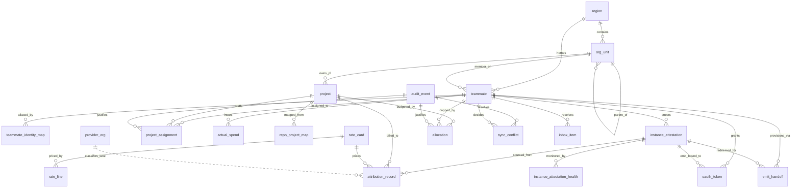

# Data Model

This page is the as-built data model of the running TokenScope system, written
for developers and maintainers. TokenScope is a Nuxt 3 application backed by
Drizzle ORM and PostgreSQL 16. Its job is to attribute Claude Code (and, in
future, Copilot CLI) token spend to the right project, person, and
cost-owning unit — and to govern that spend with budgets, allocations, and an
audit trail you can defend to finance.

The schema lives in two layers, both of which are ground truth:

- `drizzle/schema/*.ts` — the Drizzle table definitions used by the app.
- `drizzle/migrations/*.sql` — the applied DDL. The migrations carry the
  things Drizzle can't express natively: `EXCLUDE USING gist` exclusion
  constraints, partial / functional unique indexes, the append-only audit
  trigger, RLS policies, and `CHECK` constraints. When this page names a
  constraint or index, it names the migration that introduced it.

The design intent and rationale live in `docs/design/data-model.md`. Where the
design doc and the code disagree, this page follows the code and flags the
difference. See also [Architecture](Architecture.md) and
[Authentication & Security](Authentication-and-Security.md).

## How the data is organised

The shape of the system follows the path a token takes from a developer's
keystroke to a finance-grade ledger row. Read it as a pipeline:

1. **Identity.** Every developer is a `teammate` — the canonical record that
   maps a Microsoft Entra identity to a position in the org hierarchy
   (`region` → `org_unit`, a materialised-path tree). A teammate may also be
   known by other systems (GitHub login, Workday ID, a second Claude email);
   `teammate_identity_map` records those aliases so telemetry that arrives
   under any of them resolves back to one person.

2. **Attestation.** Before a CLI session emits any telemetry it is *attested*:
   a `instance_attestation` row binds a device to a teammate and (usually) a
   project. This is the load-bearing trust anchor — the read path joins
   telemetry back to this row to decide who spent what on which project.
   Device emit is provisioned via the MCP `provision_emit` tool: it mints a
   one-time `emit_handoff`, redeemed at `/api/v1/setup/redeem` for the durable
   emit credential. (The legacy `setup_token` enrolment was retired and the
   table dropped in migration 0034 — see [emit_handoff](#emit_handoff).)

3. **Attribution.** Telemetry is reconciled into the `attribution_record`
   ledger — one immutable, frozen row per cost event, pinned to the exact rate
   card that priced it. A `provider_org` registry decides *how* each upstream
   org's spend is treated (authoritatively reconciled vs indicatively
   tracked). `actual_spend` holds a parallel truth source pulled from the
   Anthropic Analytics API.

4. **Governance & allocation.** `project`, `project_assignment`, and
   `allocation` describe which developers are on which projects and what
   budget they draw against — either a shared project pool or a per-developer
   fixed cap.

5. **Cross-cutting surfaces.** An append-only `audit_event` log records every
   consequential action; `inbox_item` routes alerts and action requests to the
   actors who can resolve them; `sync_conflict` parks disagreements between
   manual edits and future sync connectors.

Two ideas thread through all of it and are worth holding in mind before you
read any table:

- **Provenance.** Many tables that an admin can hand-edit carry a
  `source` / `is_pinned` / `last_sync_at` triple so a future sync connector
  never silently clobbers a human's edit. See
  [Sync-vs-manual provenance](#sync-vs-manual-provenance).
- **Region / org scoping.** Multi-tenant tables carry `region_id` and an
  `org_unit_id` (or `cost_owning_unit_id`) and are protected by row-level
  security so a manager in one region can't read another's data. See
  [Row-level security](#row-level-security).

> **As-built note.** The design doc describes `burst_request`,
> `coaching_nudge`, and `fin_project_staging` tables. These are **not built** —
> they exist in neither the Drizzle schema nor any migration. They are
> forward-looking design and are omitted from the detail below. The built
> ledger-side tables the design doc also lists — `attribution_aggregate`,
> `spill_record` — *are* present and are documented here.

## Entity relationships



The spine of the diagram is the attribution flow:
**teammate → instance_attestation → attribution_record → project / rate_card**,
with `provider_org` deciding the fidelity lane and `audit_event` standing
beside every governance write.

## Identity

The identity domain (`drizzle/schema/identity.ts` — also `directory-exclusion.ts`;
migration 0001 plus 0005/0006/0010/0012/0022/0038/0048/0057/0062/0067/0068/0083/0088)
answers "who is this and where do they sit in the org?" Everything downstream joins
back to a `teammate`.

### region

The top of the org tree. A small, configured set of logical regions
(`apac`, `emea`, `na`, …).

| Column | Type | Notes |
|---|---|---|
| `id` | UUID PK | `gen_random_uuid()` |
| `code` | TEXT NOT NULL | region short code |
| `display_name` | TEXT NOT NULL | |

### org_unit

A self-referential hierarchy (region → BU → team → practice) stored as a
PostgreSQL `LTREE` materialised path, so ancestor/descendant queries are a
single GIST-indexed operator. Any level can be flagged a cost-owning unit
(the P&L owner) via `is_cost_owning_unit`. Carries the provenance triple.

| Column | Type | Notes |
|---|---|---|
| `id` | UUID PK | |
| `region_id` | UUID NOT NULL → region | |
| `parent_id` | UUID | self-reference; tree shape |
| `path` | LTREE NOT NULL | materialised path, e.g. `apac.services.consulting` |
| `code` | TEXT NOT NULL | region-local short code |
| `display_name` | TEXT NOT NULL | |
| `unit_type` | TEXT NOT NULL | `bu` / `team` / `practice` — region-variable |
| `is_cost_owning_unit` | BOOL NOT NULL = false | designable at any level |
| `retired_at` | TIMESTAMPTZ | soft-retire (mig 0022); NULL = active. Set when a cost centre that still has history (referencing projects/teammates) is retired — a hard DELETE is only allowed when the unit is empty |
| `metadata` | JSONB | |
| `source` / `is_pinned` / `last_sync_at` | provenance triple | |

Constraints / indexes: `UNIQUE (region_id, code)`
(`org_unit_region_code_unique`); GIST index on `path`
(`org_unit_path_gist`) backing the `<@` / `@>` subtree lookups that RLS and
reporting depend on.

### teammate

The canonical member record. Maps an Entra object id to an org position and
carries a durable role.

| Column | Type | Notes |
|---|---|---|
| `id` | UUID PK | |
| `entra_oid` | TEXT NOT NULL UNIQUE | Entra object id |
| `email` | TEXT NOT NULL | uniqueness is enforced by two functional/partial indexes, not a plain UNIQUE — see below |
| `display_name` | TEXT | |
| `region_id` | UUID NOT NULL → region | |
| `org_unit_id` | UUID NOT NULL → org_unit | |
| `role` | TEXT NOT NULL = `developer` | durable role anchor (mig 0005); JIT bootstrap writes the resolved role here, and stop-impersonating restores from it rather than a hardcoded default |
| `competency_tier` | TEXT | nullable until assessed |
| `provisional` | BOOL NOT NULL = false | emit-on-install shadow teammate (mig 0057): minted by the enroll path before the human authenticates, in the reserved `entra_oid = 'provisional:'\|\|uuid` namespace. A confirm-on-auth merge re-points its instances to the real teammate and flips this false. Display-only; never moves money |
| `is_active` | BOOL NOT NULL = true | the durable retirement axis, and the one the privileged-identity-cleanup worker writes (it never touches `revoked_at`). `false` denies **every** credential for the teammate — cookie session, OAuth bearer, refresh grant, authorization-code exchange and token issuance alike — with no timestamp comparison, unlike `revoked_at` below. Also the eligibility flag for assignability |
| `joined_at` | TIMESTAMPTZ NOT NULL = now() | |
| `ended_at` | TIMESTAMPTZ | soft-delete; attribution history is preserved |
| `metadata` | JSONB | |
| `source` / `is_pinned` / `last_sync_at` | provenance triple | |
| `revoked_at` | TIMESTAMPTZ | active-session / emit-cascade revocation anchor (mig 0006, ADR-0005 §E2) — any session issued at or before this instant is treated as cleared by the validate-session middleware; written by role-change, region-change, and explicit revoke endpoints. **Overloaded: NOT an eligibility/offboarding flag.** Because benign role/region changes bump it too, assignability (project-member / CoU-owner add) gates on **`is_active` only**, never `revoked_at` (PR #120); a revoked-but-active teammate stays assignable as an inert billing row while `isRevoked()` + the E2 emit cascade still block live access. |

Email uniqueness is **not** a plain `UNIQUE` — two indexes enforce it together:
a **partial** unique `UNIQUE (email) WHERE NOT provisional` (mig 0057), which
excludes provisional shadow rows so a claimed email never collides with the real
Entra JIT sign-in's slot; and a functional **`UNIQUE (lower(email))`** (mig 0067)
so casing variants can't split one person into two. Drizzle can't render either
predicate, so the inline `.unique()` is dropped in the model and the migrations own
the constraints.

### teammate_identity_map

Cross-system identity aliases — Entra ↔ GitHub ↔ Workday ↔ Polaris/PSR, and a
developer's secondary Claude/client emails. This is what lets telemetry that
arrives under any known identifier resolve to a single teammate.

| Column | Type | Notes |
|---|---|---|
| `id` | UUID PK | |
| `teammate_id` | UUID NOT NULL → teammate (ON DELETE CASCADE) | |
| `system` | TEXT NOT NULL | `entra` / `github` / `workday` / … |
| `identifier` | TEXT NOT NULL | login, person id, email |
| `identifier_kind` | TEXT NOT NULL | `email` / `username` / `system-id` |
| `is_canonical` | BOOL NOT NULL = false | one canonical per (teammate, system) |
| `verified_at` | TIMESTAMPTZ | |
| `github_login` | TEXT | directory-sourced (mig 0038); the billing-join key for the GitHub/Copilot reconciliation lane |
| `enterprise_slug` | TEXT | qualifies `github_login` so one login can recur across enterprises (mig 0038) |
| `license_org` | TEXT | provider-side license org (mig 0038) |
| `sso_email` | TEXT | the SSO email the provider knows this identity by (mig 0038) |
| `billing_relationship` | TEXT NOT NULL = `indicative` | `enterprise-reconciled` / `indicative` (mig 0038) |
| `metadata` | JSONB | |
| `source` / `is_pinned` / `last_sync_at` | provenance triple | |

Constraint: the authoritative uniqueness key is
**`UNIQUE (system, COALESCE(enterprise_slug, ''), lower(identifier))`** (mig 0038) —
case-insensitive (per the mig 0012 lowercasing that replaced the case-sensitive
mig 0010 index) and enterprise-qualified so the same login under two enterprises
doesn't collide. It matches the lowercasing read path and preserves the trust
invariant that one identifier maps to at most one teammate. Drizzle can't express
`COALESCE` / `lower()`, so the model def is approximate and mig 0038 owns the index.

### cou_owner

Explicit cost-owning-unit ownership (mig 0048) — a **Business Unit owner**.
Ownership is an explicit assignment, never derived from `LTREE` adjacency.
`1..n` owners per CoU; soft-revoke keeps history.

**At most one active BU per person.** Enforced by
`POST /admin/org-units/{id}/owners`, which returns **409** naming the BU the
teammate already owns, and serialises on the teammate so two concurrent grants
cannot both succeed. There is no database constraint yet: existing data holds
violations, and `GET /admin/diagnostics/multi-bu-owners` must report `clean`
before a partial-unique index can be added. The rule matters beyond tidiness —
the manager-chain placement walk treats an owner of more than one active
cost-owning unit as ambiguous and places nobody through them.

| Column | Type | Notes |
|---|---|---|
| `id` | UUID PK | |
| `org_unit_id` | UUID NOT NULL → org_unit | the cost-owning unit |
| `teammate_id` | UUID NOT NULL → teammate | the owner |
| `assigned_by` | UUID → teammate | |
| `assigned_at` | TIMESTAMPTZ NOT NULL = now() | |
| `revoked_at` | TIMESTAMPTZ | NULL = active; active `(org_unit_id, teammate_id)` is a partial-unique in mig 0048 |
| `revoked_by` | UUID → teammate | |

### directory_region_rule

Curated region-derivation config (mig 0088, generalised from the earlier
`department_to_region`; see `docs/design/org-entra-region-derivation.md`). Each row
says "when a user's directory `attribute` matches `match_value`, their region is R",
so any tenant can key on whichever directory field is region-correlated on *their*
directory — not just `department`.

| Column | Type | Notes |
|---|---|---|
| `id` | UUID PK | |
| `attribute` | TEXT NOT NULL | which directory attribute to match (`companyName` / `country` / `officeLocation` / `state` / `department` / `division`) |
| `match_mode` | TEXT NOT NULL = `exact` | `exact` / `prefix` (prefix maps a whole country/state at once) |
| `match_value` | TEXT NOT NULL | normalised `trim().lower()` value compared against the user's attribute |
| `match_value_raw` | TEXT NOT NULL | original casing, for display |
| `region_id` | UUID NOT NULL → region | |
| `created_by` | UUID → teammate | |
| `created_at` | TIMESTAMPTZ NOT NULL = now() | |
| `updated_at` | TIMESTAMPTZ | |

Constraint: `UNIQUE (attribute, match_value)`
(`directory_region_rule_attr_value_unique`) — one region per (attribute, value),
the upsert key.

### region_leader

The manager-walk fallback target for region derivation (mig 0068): when no
`directory_region_rule` matches, the placement engine walks a user's manager chain
looking for one of these leaders, keyed on the leader's stable Entra oid.

| Column | Type | Notes |
|---|---|---|
| `id` | UUID PK | |
| `region_id` | UUID NOT NULL → region | |
| `leader_oid` | TEXT NOT NULL | the leader's Entra oid — the manager-chain match key; active oid is partial-unique in the migration |
| `leader_email` | TEXT NOT NULL | display / admin only |
| `kind` | TEXT NOT NULL = `region-svp` | |
| `display_name` | TEXT | |
| `added_by` | UUID → teammate | |
| `added_at` | TIMESTAMPTZ NOT NULL = now() | |
| `revoked_at` / `revoked_by` | TIMESTAMPTZ / UUID → teammate | soft-revoke keeps history |

### directory_exclusion_pattern

Admin-configurable UPN glob patterns for directory accounts that must never become
teammates — privileged / service accounts (mig 0083). Matched accounts are excluded
from people-pickers, refused on assign, and (opt-in) retro-cleaned. Portable: the
org edits this data; nothing is hardcoded.

| Column | Type | Notes |
|---|---|---|
| `id` | UUID PK | |
| `pattern` | TEXT NOT NULL | UPN glob; `lower(pattern)` is unique (index in mig 0083) |
| `note` | TEXT | |
| `created_by` | UUID → teammate | |
| `created_at` | TIMESTAMPTZ NOT NULL = now() | |

## Attestation & device provisioning

Attestation (`drizzle/schema/instance-attestation.ts`,
`instance-attestation-health.ts`; migrations 0001, 0003, 0013, 0014, 0015,
0016, 0019, 0026, 0030, 0031, 0057, 0060) is the trust anchor of the whole system. An instance must
be attested before its telemetry can be attributed; the read path joins telemetry
to `instance_attestation` on `instance_id` to learn who and which project.

### instance_attestation

Located-or-created by `provision_emit` (MCP) at device setup. Device emit
authenticates with the OAuth `tokenscope.emit` credential (not the legacy session
token); the read joiner gates on `attestation_state = 'attested'`.

| Column | Type | Notes |
|---|---|---|
| `instance_id` | UUID PK | canonical instance (device/enrolment) identifier (renamed from `session_id`, mig 0016) |
| `principal_oid` | TEXT NOT NULL | Entra object id of the developer |
| `principal_email` | TEXT | denormalised for audit display; cleared on purge |
| `teammate_id` | UUID NOT NULL → teammate | resolved principal |
| `project_code_hash` | TEXT | hashed canonical project code; **nullable** for `unassigned` rows (mig 0014) |
| `raw_project_code` | TEXT | audit/display only; never crosses the AI-coach boundary |
| `tool` | TEXT NOT NULL | `claude-code` / `copilot-cli` / future |
| `session_token_hash` | TEXT UNIQUE | **vestigial** — legacy session-token bridge auth; now **nullable** (emit auth is OAuth `tokenscope.emit` since the cutover) |
| `ts_start` | TIMESTAMPTZ NOT NULL = now() | |
| `ts_expected_end` | TIMESTAMPTZ | soft cleanup target |
| `ts_actual_end` | TIMESTAMPTZ | written on session-end signal |
| `ts_purged` | TIMESTAMPTZ | soft-purge marker (PII cleared, row + `instance_id` retained so the attribution FK stays valid) |
| `last_bearer_at` | TIMESTAMPTZ | heartbeat (mig 0030): last successful `/bearer` emit-credential mint, stamped on each mint. Drives heartbeat-coverage — spend whose instance window doesn't span its `ts_event` is unverified/quarantined until reconciliation |
| `region_id` | UUID NOT NULL → region | |
| `org_unit_id` | UUID NOT NULL → org_unit | |
| `cost_owning_unit_id` | UUID → org_unit | **nullable** for `unassigned` rows (mig 0014) |
| `attestation_state` | TEXT NOT NULL = `attested` | see the four states below |
| `identity_state` | TEXT NOT NULL = `confirmed` | identity provenance (mig 0057): `confirmed` = the authenticated `provision_emit` flow or a later confirmed merge; `provisional` = an emit-on-install enroll where the human hasn't signed in yet. Propagated onto `attribution_record` at join time |
| `claimed_email` | TEXT | the email a provisional enroll request *claimed* (mig 0057); NULL for the authenticated flow, where `principal_email` already carries the verified identity |
| `deployment_env` | TEXT | cross-environment reuse guard (mig 0060): the `dev`/`sandbox`/`production`/`local` label of the deployment that minted this instance. A re-provision from a different environment is rejected (409); NULL = pre-0060 (treated as same-environment) |
| `notes` | JSONB | extension surface |

**The four attestation states:**

- `attested` — normal: a teammate and a project are both bound.
- `unattested-fallback` — the launcher could not reach the attestation API at
  start; the tool ran anyway and telemetry is reconciled best-effort.
- `tampered` — set at read-time reconciliation when a session's client-asserted
  attributes disagree with this row.
- `unassigned` — untagged-first enrolment (mig 0014): a session is attested
  *without* a project (`project_code_hash` and `cost_owning_unit_id` NULL),
  emits untagged, surfaces in the untagged-spend worklist, and is tagged later
  via the assign UI.

**The attestation-state CHECK** (mig 0015,
`instance_attestation_attested_has_project`):

```sql
CHECK (attestation_state <> 'attested' OR project_code_hash IS NOT NULL)
```

Only `unassigned` may carry a NULL project; an `attested` row *must* cite one.
This binding is DB-enforced because two consumers gate on different columns for
the same concept — the read joiner on `attestation_state = 'attested'`, the
untagged worklist on `project_code_hash IS NOT NULL`. Without the CHECK an
attested-but-projectless row would be silently dropped by the joiner (its
project lookup returns nothing) and the spend would vanish with no audit.

Indexes: PK on `instance_id`; `(teammate_id, ts_start)`,
`(cost_owning_unit_id, ts_start)`, `(region_id, ts_start)` for the dashboard
rollups; the UNIQUE on `session_token_hash` (vestigial).

### emit_handoff

The one-time, short-TTL (~5 min) device-provisioning handoff
(`drizzle/schema/oauth.ts`, mig 0031). The read-scoped `provision_emit` MCP tool
mints a handoff bound to `(teammate, instance)` and returns ONLY the raw code +
a redeem URL — **never** the durable emit refresh token (that broadly-readable
secret must not enter the LLM's context). The local emit-redeem helper redeems it
process→server at `/api/v1/setup/redeem` for the durable emit credential + the
OTel bundle. Same secrets discipline as `oauth_auth_code`: only the HMAC hash is
stored, single-use via an atomic CAS on `consumed_at`.

| Column | Type | Notes |
|---|---|---|
| `id` | UUID PK | |
| `code_hash` | TEXT NOT NULL UNIQUE | HMAC hash of the one-time code; raw value goes to the tool caller once |
| `teammate_id` | UUID NOT NULL → teammate (ON DELETE CASCADE) | the provisioning teammate (from the OAuth identity) |
| `instance_id` | UUID NOT NULL → instance_attestation (ON DELETE CASCADE) | the device this handoff provisions |
| `created_at` | TIMESTAMPTZ NOT NULL = now() | |
| `expires_at` | TIMESTAMPTZ NOT NULL | ~5-min TTL |
| `consumed_at` | TIMESTAMPTZ | single-use marker, set atomically on redeem |

> **`setup_token` — DROPPED (mig 0034).** The legacy self-service CLI-enrolment
> table (mig 0013), minted by the deleted `POST /api/v1/me/setup-token` and
> redeemed at the deleted `POST /api/v1/setup/exchange`, was removed entirely by
> the MCP-first OAuth cutover (PR #38). Device emit is now provisioned via
> `emit_handoff` (above). The OAuth grant tables (`oauth_client`,
> `oauth_auth_code`, `oauth_token`) carry the read+tag credential; see
> [Authentication & Security](Authentication-and-Security.md).

### instance_attestation_health

Per-instance attestation / OTel-reception health (mig 0003). A mitigation-query
worker writes one row per detected gap between an attestation and the telemetry
it expected; the manager inbox surfaces unhealthy rows as info-severity items.

| Column | Type | Notes |
|---|---|---|
| `id` | UUID PK | |
| `instance_id` | UUID NOT NULL → instance_attestation | |
| `status` | TEXT NOT NULL | `no-spans-received` / `partial-spans` / `late-spans` / `healthy` |
| `detected_at` | TIMESTAMPTZ NOT NULL = now() | |
| `expected_span_count` | INTEGER | |
| `actual_span_count` | INTEGER | |
| `payload` | JSONB | |
| `resolved_at` | TIMESTAMPTZ | set when the gap clears |

Indexes: `(instance_id)`; `(status, detected_at)`.

## Attribution ledger

The attribution domain (`drizzle/schema/attribution.ts`, `governance.ts` for
rate cards / provider_org / provider_enterprise, `spend.ts`, `copilot-pool-bill.ts`;
migrations 0001, 0004, 0009, 0011, 0017, 0020, 0021, 0035, 0036, 0038, 0045, 0046,
0050, 0053, 0055, 0056, 0063, 0071, 0079, 0080, 0094, 0118, 0120, 0121, 0122,
0123) is the financial heart of the
system: the immutable record of what was spent, on what, priced by which card. Token
usage from the Anthropic Analytics API is ingested in parallel into `actual_spend`
as an independent truth source.

### attribution_record

The core ledger — one row per attributed cost event. Rows are frozen on write
(`is_frozen = true`); re-costing only happens via an authorised admin event.

| Column | Type | Notes |
|---|---|---|
| `id` | UUID | part of the composite PK `(id, ts_event)` — see below; `gen_random_uuid()` keeps `id` effectively unique on its own |
| `instance_id` | UUID NOT NULL → instance_attestation | the attested instance (renamed from `session_id`, mig 0016) |
| `claude_session_id` | TEXT | Claude's own `session.id` — the per-session unit the Activity list's session rows group on and `session_assignment` assigns; nullable; added mig 0016 |
| `teammate_id` | UUID NOT NULL → teammate | |
| `project_id` | UUID → project | **nullable** (mig 0021): a project-less row is unallocated spend (untagged, or tagged-only with no project budget). `region_id` / `org_unit_id` still describe the emitting teammate and stay NOT NULL |
| `region_id` | UUID NOT NULL → region | |
| `org_unit_id` | UUID NOT NULL → org_unit | denormalised home org for RLS |
| `cost_owning_unit_id` | UUID → org_unit | **nullable** (mig 0021): follows the project — NULL when there is no project budget |
| `tool` | TEXT NOT NULL | |
| `model` | TEXT NOT NULL | |
| `token_type` | TEXT NOT NULL | `input` / `output` / `cache-read` / `cache-write` |
| `tokens` | BIGINT NOT NULL | exact count |
| `cost_usd` | NUMERIC(14,6) NOT NULL | 6-decimal precision |
| `credit_qty` | NUMERIC(20,6) | native AI-credit (AIU) operand for the GitHub/Copilot lane (mig 0038) so reconciliation is credit-vs-credit; NULL for Claude rows |
| `rate_card_id` | UUID | **nullable** (mig 0036): NULL for Copilot rows (priced by an AI-credit constant, not a token `rate_line`); non-null for Claude rows |
| `rate_card_version` | INTEGER | **nullable** (mig 0036); pins the exact version when a card priced the row |
| `fidelity_tier` | TEXT NOT NULL | `tier-1` / `tier-2` / `tier-3` |
| `cost_basis` | TEXT NOT NULL | see below |
| `ts_event` | TIMESTAMPTZ NOT NULL | when the usage occurred; the partition key and second half of the PK |
| `ts_recorded` | TIMESTAMPTZ NOT NULL = now() | |
| `source_run_id` | TEXT | provider-side run id (span/request id; retro claims + Copilot parallel-subagent dedup) |
| `is_frozen` | BOOL NOT NULL = true | re-cost only via authorised admin event |
| `activity` | TEXT | orthogonal activity axis (mig 0020), denormalised from `session_assignment` for within-project activity rollups; nullable |
| `query_source` | TEXT | Claude's per-event `query_source` (mig 0045), stored RAW — Claude's own token (`repl_main_thread`, `agent:custom`, `compact`, …) and **never** the word `main`; classify with `shared/usage/query-source.ts` (vocabulary + evidence in `docs/development/claude-code-telemetry-contract.md`); NULL = attr absent / pre-0045 (unknown lane, never assumed to be a conversation) |
| `identity_state` | TEXT | identity provenance (mig 0057) stamped from the emitting instance's `instance_attestation.identity_state` so surfaces can exclude/label provisional usage; display-only, never gates money; NULL = pre-0057 (treat as `confirmed`) |
| `emitting_email` | TEXT | canonicalised (trim + lower) Claude per-event `user.email` (mig 0119) — which **account** was signed in, as distinct from which device emitted (`instance_id`); the evidence for `billing_lane`; NULL = the emitter did not report one; redacted in place on erasure (`billing_lane` survives, stamped at write) |
| `emitting_org_id` | TEXT | Claude per-event `organization.id` (mig 0119); hint and diagnostics only — never decides `billing_lane` |
| `billing_lane` | TEXT NOT NULL = `unknown` | `provider-billed` / `self-billed` / `unknown` (CHECK, mig 0119); stamped **once** at join time from `emitting_email` against the teammate enterprise address set and never updated — the only permitted write is a backfill filling an `unknown`; `unknown` nets against the provider API exactly as an un-laned row did |
| `metadata` | JSONB | per-tool extension (agent/plugin names, etc.) |

**Partitioning & primary key.** `attribution_record` is monthly `RANGE`-partitioned
on `ts_event` (mig 0055): a partitioned parent with monthly leaf partitions plus a
`DEFAULT` catch-all, so an insert never fails for a missing partition. This bounds
per-partition index size, gives partition pruning on time-scoped queries, and makes
retention a `DETACH`/`DROP` rather than a billion-row `DELETE`. Because the partition
key must be part of every unique constraint, the PK became composite **`(id, ts_event)`**;
`id` stays effectively unique on its own via `gen_random_uuid()`, and no table
FK-references `attribution_record.id`, so the composite key breaks nothing.

**`cost_basis`** carries three values:

- `measured` — actuals.
- `estimated` — modelled where no actual was available.
- `telemetry-only` — indicative / unknown-org lanes; **excluded from
  reconciliation** (set by the Azure Monitor reader path).

**`priced_per_lane`** — a DERIVED read-model field, not a column. The session
drill-down (`GET /api/v1/me/sessions/{sid}`) ships it so a surface can tell
"this lane cost nothing" apart from "this provider never quoted a per-lane
price".

Some providers do not price per token lane at all. A credit-priced lane (GitHub
Copilot today) bills AI credits for the whole request, so span costing conserves
that one figure by placing it on a single deterministic **carrier** token type
and leaves the other lanes at `0`. Σ(lanes) is still exactly the span total —
the money is right — but those zeros were never prices.

- **Derivation:** `bool_and(rate_card_id IS NOT NULL)` over the session's rows,
  and the field is `true` only when EVERY cell answers `true`
  (`server/usage/breakdowns.ts::pricedPerLane`). The operand is whether **we
  priced the span from a rate card**, never the provider's name: the card's
  per-type lines are the only mechanism that splits a span's cost across token
  lanes at all, so any future credit-priced lane inherits the answer with no
  code change.
- **Positive evidence is required.** An unknown — a reader that never carried the
  fact, or an empty scope — is not a per-lane price. This was corrected in the
  r6 fix pass: the previous operand, `bool_or(credit_qty IS NOT NULL)` inverted,
  answered `true` for **all historical Copilot money**, because `credit_qty` was
  added by migration 0038 with no backfill and reads NULL on every row written
  before it. Those sessions rendered the carrier convention's structural zeros as
  real `$0.00` lane prices — the exact defect this field exists to remove.
- **Effect on the wire:** when it is `false`, every `by_token_type[].cost_usd`
  and `matrix[].cost_usd` is **NULL** — "not priced per lane", never `0.00`. The
  session's money is stated once, in the top-level `cost_usd`. `cache.savings_usd`
  is also NULL, because it is derived by repricing cached tokens at the model's
  effective input rate, which does not exist here. Token counts are measured on
  every provider and are unaffected.
- **Residual bound:** a span that DID have a card, but whose card could not slice
  it (an unknown token type, or a card pricing the span at <= 0), also lands on a
  carrier (`server/usage/span-costing.ts`) while still carrying a `rate_card_id`,
  and no per-row marker records that — so such a span still reports `true`.
  Narrowing it needs a new column. This is strictly smaller than the hole it
  replaced: "no rate card at all" used to fall into it too, and no longer does.

**Idempotency** is the load-bearing constraint here:

```
UNIQUE (instance_id, COALESCE(claude_session_id, ''), ts_event, token_type, model, COALESCE(source_run_id, ''))
```

Defined mig 0011, redefined mig 0017 to fold in `claude_session_id` (the
COALESCE lets distinct Claude sessions on one instance dedup independently while
keeping a single key for the untagged/null case), and extended mig 0035 to add
`COALESCE(source_run_id, '')` (the span/request id) for Copilot parallel-subagent
safety — same-ms chat calls to the same model no longer collide. The read joiner
inserts `ON CONFLICT DO NOTHING`, so concurrent or replayed joiner runs can't
double-count spend.

Indexes: `(instance_id)` to join back to attestation;
`(teammate_id, ts_event)`, `(project_id, ts_event)`,
`(cost_owning_unit_id, ts_event)` for rollups; `(org_unit_id, ts_event)` for
the hot RLS read path.

### attribution_aggregate

Denormalised rollups for fast dashboards, written by the `aggregate-rollup`
registry worker (see [Background Workers](Background-Workers.md)) and recomputed
on rate-card re-costing. `total_tokens` / `total_cost_usd` are plain columns set
by the worker, not generated columns.

| Column | Type | Notes |
|---|---|---|
| `id` | UUID PK | |
| `scope_type` | TEXT NOT NULL | `teammate` / `project` / `team` / `cou` / `region` / `global` |
| `scope_id` | UUID | nullable for `global` |
| `period_start` / `period_end` | TIMESTAMPTZ NOT NULL | |
| `period_kind` | TEXT NOT NULL | `day` / `week` / `month` / `quarter` |
| `tool` / `model` | TEXT | nullable dimensions |
| `token_type` | TEXT | token-type dimension (mig 0045): `input` / `output` / `cache-read` / `cache-write`; NULL = all-types rollup |
| `query_source` | TEXT | query-source lane dimension (mig 0046). Carried RAW from `attribution_record` by the rollup — Claude's own token (`repl_main_thread`, `agent:custom`, `compact`, …), **never** the word `main` for a Claude row; NULL = unknown lane. Classify with `shared/usage/query-source.ts`, never by equality |
| `total_tokens` | BIGINT NOT NULL | |
| `total_cost_usd` | NUMERIC(14,6) NOT NULL | |
| `advisory_cost_usd` | NUMERIC(14,6) NOT NULL = 0 | the tier-2 (telemetry-only / advisory) subset of `total_cost_usd` for this cell (mig 0046) — the estimated-vs-advisory split without touching the raw ledger |
| `record_count` | INTEGER NOT NULL | |
| `refresh_at` | TIMESTAMPTZ NOT NULL = now() | |

Constraint: `UNIQUE (scope_type, scope_id, period_start, period_end, tool, model, token_type)`
(`attribution_aggregate_scope_unique`) — `token_type` joined the key in mig 0045.
The live index also keys on `COALESCE(query_source, '')` (mig 0046), an expression
the Drizzle def can't render.

### spend_rollup_daily

The durable enriched spend rollup (mig 0053; ledger-retention epic) — the
source-of-truth grain that **survives raw retention**. Once a monthly
`attribution_record` partition is exported and dropped, the read path serves that
cold window from here instead of the raw ledger. `project_id` / `cost_owning_unit_id`
/ `activity` / `query_source` are nullable grain dims; `region_id` / `org_unit_id`
are point-in-time values carried from raw.

| Column | Type | Notes |
|---|---|---|
| `id` | UUID PK | |
| `period_start` | TIMESTAMPTZ NOT NULL | day grain |
| `project_id` | UUID → project | nullable grain dim |
| `teammate_id` | UUID NOT NULL → teammate | |
| `region_id` | UUID NOT NULL → region | carried from raw |
| `org_unit_id` | UUID NOT NULL → org_unit | carried from raw |
| `cost_owning_unit_id` | UUID → org_unit | nullable grain dim |
| `tool` / `model` / `token_type` | TEXT NOT NULL | |
| `activity` / `query_source` | TEXT | nullable grain dims |
| `total_tokens` | BIGINT NOT NULL | |
| `total_cost_usd` | NUMERIC(14,6) NOT NULL | |
| `indicative_cost_usd` | NUMERIC(14,6) NOT NULL = 0 | the telemetry-only subset of `total_cost_usd`, keyed on `cost_basis` (estimated = total − indicative) |
| `record_count` | INTEGER NOT NULL | |
| `refresh_at` | TIMESTAMPTZ NOT NULL = now() | |

The live grain-unique index keys on `COALESCE` expressions (sentinel uuid for
nullable id dims, `''` for `activity` / `query_source`) that the Drizzle def can't
render — mig 0053 is the source of truth. A companion `spend_session_daily` captures
distinct-session counts per (teammate, project, day), since session count can't be
recomputed once raw is retired.

### usage_rollup_daily

The day-grain §A rollup the region reporting endpoints read — and, for its
settled days, `/api/v1/me/usage` — (mig 0136), written
by the `usage-rollup` registry worker (see
[Background Workers](Background-Workers.md)) every 15 minutes. Each row is an
aggregate of `v_complete_usage` — the worker aggregates the view itself, so
quarantine exclusion, fill arms and remainder rows always match the lane's own
definition. The two rollups are different lanes: `spend_rollup_daily` is the
raw-ledger lane (archival / finance-cold fallback — reads `attribution_record`
raw, no quarantine predicate); `usage_rollup_daily` is the §A lane for the
region reports — quarantine-aware and arm-complete (arms 1+2+3). `teammate_id`
stays in the grain because the region page's non-additive reads (active users,
per-person percentiles, concentration, distinct counts) need the per-teammate
vector.

| Column | Type | Notes |
|---|---|---|
| `id` | UUID PK | |
| `day` | DATE NOT NULL | UTC provider day |
| `teammate_id` | UUID NOT NULL → teammate | stays in the grain |
| `region_id` / `org_unit_id` | UUID → region / org_unit | nullable — an Unassigned person has no placement |
| `cost_owning_unit_id` | UUID → org_unit | nullable — arm 2 carries no cost-owning unit |
| `project_id` | UUID → project | nullable — arms 2b/3 carry NULL project |
| `tool` | TEXT NOT NULL | |
| `model` | TEXT | NULL on the view's remainder rows |
| `usage_provenance` | TEXT NOT NULL | |
| `model_gap_reason` / `activity` | TEXT | nullable dims |
| `identity_state` | TEXT | in the grain (mig 0138) — `'provisional'`/`'confirmed'` from arm 1 (NULL when unstamped); arms 2/3 always `'confirmed'`. Lets rollup readers apply the seam's provisional-exclusion filter; a mixed day splits into separate cells |
| `cost_usd` | NUMERIC(14,6) NOT NULL | |
| `tokens` | BIGINT NOT NULL | |
| `record_count` | INTEGER NOT NULL | |
| `refresh_at` | TIMESTAMPTZ NOT NULL = now() | |

The grain-unique index keys on `COALESCE` expressions (sentinel uuid for the
nullable id dims, `''` for the nullable text dims) — same idiom as
`spend_rollup_daily`; mig 0136 is the source of truth. Read indexes: `(day)`,
`(region_id, day)`, `(org_unit_id, day)`, `(teammate_id, day)`. RLS is enabled
with the 0098-converged admin policy (`global-finops` / `platform-admin` —
never bare `admin`) mirroring `attribution_aggregate`, plus
`REVOKE ALL FROM PUBLIC` — the reporting endpoints authorize via their
in-query scope predicates, as on every report read.

### usage_rollup_refresh

The retro-mutation refresh queue for `usage_rollup_daily` (mig 0136).
`v_complete_usage` changes retroactively with no timestamp a trailing window
can see on two paths — a quarantine flip (over-emission resolve) and a
placement re-home — so those writers upsert the affected teammate here in the
same transaction. The `usage-rollup` worker drains the queue by recomputing
that teammate's full history, deleting the request only afterwards (a crashed
run re-drains).

| Column | Type | Notes |
|---|---|---|
| `teammate_id` | UUID PK → teammate | one pending request per teammate; re-enqueue bumps `requested_at` |
| `requested_at` | TIMESTAMPTZ NOT NULL = now() | |

RLS is enabled: a developer's own over-emission resolve writes their own row;
the admin lanes (re-home) write anyone's.

### ledger_archive_state

The singleton archive watermark (mig 0056; ledger-retention epic). One row
(`id = 'singleton'`); `archived_through` is the exclusive lower bound of the **hot**
window — raw with `ts_event` below it has been exported + dropped and is served from
`spend_rollup_daily`. Advanced only by the archive-ledger worker; read by
`v_effective_spend` as the cold/hot boundary. A stored watermark (not a live
`min(ts_event)` a late DEFAULT-routed row could snap backwards).

| Column | Type | Notes |
|---|---|---|
| `id` | TEXT PK = `singleton` | one row |
| `archived_through` | TIMESTAMPTZ | NULL until the first partition is retired |
| `updated_at` | TIMESTAMPTZ NOT NULL = now() | |

### provider_enterprise

The credential-custody / onboarding unit **above** `provider_org` (mig 0038, the
two-level lane registry). GitHub: one `manage_billing` credential per enterprise
lives here. Anthropic: the per-org key stays on `provider_org`. See
`docs/design/reconciliation-engine.md` §3.2.

| Column | Type | Notes |
|---|---|---|
| `id` | UUID PK | |
| `provider` | TEXT NOT NULL | `anthropic` / `github` |
| `external_id` | TEXT NOT NULL | GitHub enterprise slug / Anthropic org id |
| `display_name` | TEXT NOT NULL | |
| `reconciliation_mode` | TEXT NOT NULL = `indicative` | `reconciled` / `indicative` |
| `billing` | TEXT NOT NULL = `tracked` | `billed` / `tracked` |
| `credential_secret_name` | TEXT | secret name for the enterprise credential |
| `flat_seat_price_usd` | NUMERIC(14,6) | Copilot whole-month flat per-seat license (mig 0072); NULL = no flat row. Anthropic leaves NULL (pure metered) |
| `included_allowance_usd` | NUMERIC(14,6) | per-user AI-credit allowance in USD (mig 0072); NULL = overage disabled |
| `github_app_id` | TEXT | GitHub App credential opt-in (mig 0078): NULL = classic PAT mode; non-NULL = App mode (a non-secret integer; only the private key is a secret) |
| `notes` | TEXT | |
| `created_at` | TIMESTAMPTZ NOT NULL = now() | |

Constraint: authoritative key `UNIQUE (provider, lower(external_id))` (mig 0062) —
`external_id` is CHECK-constrained lowercase (the canonical enterprise casing).

### provider_org

The org-lane registry (mig 0009). Each Anthropic / GitHub org is classified by
how — and whether — its spend is reconciled and billed. The read joiner reads
the per-event `organization.id` from telemetry and selects the lane from this
registry; unknown orgs are attributed best-effort, flagged, and never billed.
This is what *drives* attribution fidelity: a `reconciled` org →
tier-1/estimated (API actuals are the ceiling); an `indicative` or unknown org
→ tier-2/telemetry-only.

| Column | Type | Notes |
|---|---|---|
| `id` | UUID PK | |
| `provider` | TEXT NOT NULL | `anthropic` / `github` (CHECK) |
| `external_org_id` | TEXT NOT NULL | provider-side org id |
| `display_name` | TEXT NOT NULL | |
| `reconciliation_mode` | TEXT NOT NULL = `indicative` | `reconciled` (we hold a key → poll authoritative actuals) / `indicative` (no key → OTel-only) (CHECK) |
| `billing` | TEXT NOT NULL = `tracked` | `billed` (rolls into financial rollups) / `tracked` (project visibility only) (CHECK) |
| `api_kind` | TEXT | which reconciling API drives an Anthropic org (mig 0063): `enterprise-analytics` / `claude-code-admin` (CHECK); NULL for GitHub (Copilot has a single billing API) |
| `region_id` | UUID → region | the region a Copilot license-org bills to (mig 0071); NULL = unmapped (falls back to the global provisioner) |
| `cost_owning_unit_id` | UUID → org_unit | the GitHub-org → cost-owning-unit map (mig 0079): the org's pooled Copilot bill homes to this CoU; NULL = unmapped → visible unallocated bucket, never dropped |
| `credential_secret_name` | TEXT | secret name for reconciled orgs |
| `provider_enterprise_id` | UUID → provider_enterprise | links this bucket to its credential-custody enterprise (mig 0038, two-level lane registry); NULL for pre-0038 rows + Anthropic (whose credential stays on this row) |
| `notes` | TEXT | |
| `created_at` | TIMESTAMPTZ NOT NULL = now() | |

Constraints: `UNIQUE (provider, external_org_id)` (`provider_org_unique`); three
value CHECKs (`provider_org_provider_chk`, `..._mode_chk`, `..._billing_chk`).
`reconciliation_mode` and `billing` are **independent** — a client who shares
their key is `reconciled` + `tracked`.

### rate_card

Temporal pricing. A card prices a scope (`provider:tool[:region[:cou]]`) over a
`tstzrange` effective window; `version` bumps on every edit and is pinned onto
each `attribution_record`.

| Column | Type | Notes |
|---|---|---|
| `id` | UUID PK | |
| `scope_key` | TEXT NOT NULL | structured, e.g. `anthropic:claude-code:apac:bu-services` |
| `effective` | TSTZRANGE NOT NULL | half-open `[from, to)`; NULL upper = open-ended |
| `basis` | TEXT NOT NULL | `list` / `negotiated` / `invoice-derived` |
| `provenance` | JSONB NOT NULL | where the card came from |
| `version` | INTEGER NOT NULL = 1 | pinned on attribution_record |
| `region_id` | UUID → region | scope dimension (mig 0050); NULL = global card |
| `cou_id` | UUID → org_unit | scope dimension (mig 0050); NULL = not CoU-scoped. A CoU-scoped card is always region-scoped too (CHECK in the migration) |
| `created_by` | UUID → teammate | |
| `created_at` | TIMESTAMPTZ NOT NULL = now() | |
| `retired_at` | TIMESTAMPTZ | soft-retire; never delete |

**Scope precedence** (mig 0050): a CoU-scoped card wins over a region-scoped card,
which wins over a global card — `(CoU match) > (region match) > (global)` — with
temporal selection within each tier and `version` as the tie-break.

Constraint: `EXCLUDE USING gist (scope_key WITH =, effective WITH &&)` — no two
cards for the same scope may overlap in time (the DB-level enforcement of
COST-1/COST-4). Migration 0004 seeds a default `list`-basis card.

### rate_line

The per-unit prices within a card.

| Column | Type | Notes |
|---|---|---|
| `id` | UUID PK | |
| `rate_card_id` | UUID NOT NULL → rate_card (ON DELETE CASCADE) | |
| `unit` | TEXT NOT NULL | `input-token` / `output-token` / `cache-read-token` / `cache-write-token` / `request` / `unit` |
| `unit_qty` | NUMERIC(20,6) NOT NULL | per N units |
| `unit_cost_usd` | NUMERIC(14,8) NOT NULL | 8-decimal for very low per-token prices |
| `model` | TEXT | nullable = applies to all models in scope |
| `notes` | TEXT | |

Constraint: `UNIQUE (rate_card_id, unit, model)`
(`rate_line_card_unit_model_unique`).

### actual_spend

Per-user-per-day actual spend pulled from the Anthropic Analytics API by the
scheduler-invoked `analytics-poll` worker — a truth source independent of
whether OTel captured the session. Since #142 the poller writes **one row per
surface lane**: the API's `product` maps to a `tool` via
`shared/usage/surface.ts` (`mapProductToTool`), so non-Code Claude surfaces no
longer collapse into (and inflate) the `claude-code` figure.

| Column | Type | Notes |
|---|---|---|
| `id` | UUID PK | |
| `teammate_id` | UUID NOT NULL → teammate | |
| `date` | DATE NOT NULL | day grain |
| `tool` | TEXT NOT NULL | the Claude-family lanes (#142): `claude-code` plus the non-Code surfaces `claude-ai` / `claude-cowork` / `claude-office` / `claude-chrome` / `claude-design` / `claude-slack`, with unknown/unattributable products in the **labelled `claude-other` fallback** (never dropped); also `copilot-cli` for Copilot rows |
| `input_tokens` / `output_tokens` | BIGINT NOT NULL | |
| `cost_usd` | NUMERIC(14,6) NOT NULL | Anthropic's computed cost |
| `source` | TEXT NOT NULL = `anthropic-analytics-api` | **per-org form** `anthropic-analytics-api:<externalOrgId>` so a teammate active in multiple reconciled orgs gets one row per org; legacy single-org fallback is the bare value |
| `category` | TEXT | cost-category on the adapter staging row (mig 0038); NULL = legacy (treated as `model_tokens`) |
| `chargeback_exempt` | BOOL NOT NULL = false | the **computed governance verdict** (`server/governance/verdict.ts` — the one gateway deciding chargeability from `provider_org` / `provider_enterprise` billing, or the legacy heuristic pre-activation; kept current for open periods by the `governance-recompute` worker). TRUE = excluded from the chargeback view (`v_finance_bill_chargeback`) but NOT from showback (mig 0072) |
| `pulled_at` | TIMESTAMPTZ NOT NULL = now() | |
| `raw_payload` | JSONB | the row as returned, for audit/reprocess (also the source the `provider-transform` worker derives `provider_usage_fact` from) |
| `region_id` / `org_unit_id` / `cost_owning_unit_id` | UUID → region / org_unit | historical-homing dimension snapshot (mig 0101): stamped at write/replay time and never updated on a later re-poll, so a teammate reorg cannot move a historical day's homing |
| `dimension_source` | TEXT | `ingest-snapshot` (stamped at write) / `legacy-current-placement` (mig 0101's one-time backfill label for pre-existing rows) |
| `provider_org_id` | UUID → provider_org | governance key (mig 0103); NULL = governance-unresolved — showback-visible, never chargeable; `ON DELETE SET NULL` |
| `provider_enterprise_id` | UUID → provider_enterprise | governance key — GitHub billing lives on the enterprise (ADR-0011 D11); `ON DELETE SET NULL` |
| `governance_key_status` | TEXT | backfill bookkeeping only (`resolved` / `unresolved`); NULL = not yet attempted |
| `governance_verdict_source` | TEXT | provenance of the current `chargeback_exempt` value: `legacy-heuristic` / `governance:billed` / `governance:tracked` / `unresolved` |

Constraint: `UNIQUE (teammate_id, date, tool, source)`
(`actual_spend_teammate_date_tool_source_unique`) — the per-org `source` is what
keeps multi-org teammates from colliding on this key. The #142 per-surface
split changed nothing about this key: `tool` was already in it, so the split
simply yields several rows per (teammate, date, source) instead of one.
Indexes: `(teammate_id, date)`, `(source, pulled_at)`.

Two views consume this table on the two sides of the §A/§B line
(`docs/design/provider-billing-attribution-model.md`):

- **`v_teammate_usage_daily`** (mig 0073; current definition mig 0101, which
  reverted mig 0084's non-Code exclusion) — the **complete** §A
  per-(teammate, day, tool) usage truth: `claude-code` **and** the non-Code
  Claude lanes (`claude-ai` … `claude-other`) from `actual_spend`, plus the
  Copilot lanes (`copilot-cli` / `copilot-agent`, mig 0086) from
  `reconciliation_record`. Worklist safety no longer lives in this view: the
  tools that can never become taggable "unaccounted usage" records — no
  sessions, no OTel — are excluded by the §A reconciliation itself via
  `INGEST_ONLY_USAGE_TOOLS` (`shared/usage/surface.ts`), while staying visible
  here for showback and velocity. The view also carries the historical-homing
  dimension snapshot (mig 0101) so `v_complete_usage`'s ingest-only arm homes
  usage as at the usage date.
- **`v_usage_month_floor`** (mig 0133) — the earliest month the usage lane
  holds, as one row: `LEAST` of the `MIN` over the five tables
  `v_complete_usage`'s arms can start from — `attribution_record`,
  `unaccounted_usage`, `provider_usage_fact`, and `actual_spend` +
  `reconciliation_record` (the two behind `v_teammate_usage_daily`). Read by
  `/reports/meta` for the month picker's lower bound, so that bound does not
  require materialising `v_complete_usage`, whose 4-arm `UNION` with aggregating
  CTEs admits no index for a `MIN`. `security_invoker`, so RLS applies to the
  reader and the floor is scoped to what that caller can see.
- **`v_finance_bill_chargeback`** (mig 0059, redefined migs 0081 and 0085) — the §B
  chargeback lane (mig 0085 splits out the Copilot chargeback lane). It always
  carried `tool` in its grain, so the split flows through unchanged; its consumers
  (finance/practice rollups, CSV export, the reporting UI) now group by `tool` to
  render each Claude surface as its own chargeback lane.

### reconciliation_record

The signed-delta reconciliation ledger (mig 0038) and the **§A usage truth for
Copilot**. Grain: provider · enterprise · day · category · scope ·
teammate-or-org — at most one OPEN row per key, with terminal rows accumulating
beside it as history (see the index below).
`attribution_record` stays the immutable OTel truth;
corrections and provider-sourced additions land here as a signed `delta_usd`,
and `v_effective_spend` (mig 0039) = attribution + applied deltas. Copilot lines
are always `indicative` — this table is never a chargeback figure (that is
`copilot_pool_bill`).

| Column | Type | Notes |
|---|---|---|
| `id` | UUID PK | |
| `teammate_id` | UUID → teammate | NULL on `scope='org'` rows (org-grain lines with no user) |
| `provider` | TEXT NOT NULL | `anthropic` / `github` |
| `enterprise_ref` | TEXT NOT NULL | Anthropic org id or GitHub enterprise slug |
| `license_org` | TEXT | GitHub `seat.organization`; NULL for Anthropic |
| `period_date` | DATE NOT NULL | UTC day grain |
| `category` / `scope` | TEXT NOT NULL | cost category; `teammate` (default) or `org` |
| `region_id` / `org_unit_id` / `cost_owning_unit_id` | UUID → region / org_unit | denormalised dimensions filled from the teammate at write, so `v_effective_spend` stays a clean union with `attribution_record` and the region clamp keeps working |
| `project_id` / `activity` | UUID → project / TEXT | margin overlay — set on allocation, never gates the charge |
| `actual_qty` / `actual_unit_type` | NUMERIC(20,6) / TEXT | reconcile in the native unit: `tokens` or `ai-credits` |
| `actual_usd` / `otel_attributed_usd` / `delta_usd` | NUMERIC(14,6) NOT NULL | `delta_usd = actual_usd − otel_attributed_usd` |
| `spend_class` | TEXT NOT NULL | `billed` / `estimated` / `indicative` |
| `indicative_reason` | TEXT | `personal-subscription` / `nfr-demo` / `unknown-org` / `copilot-pre-billing` |
| `disposition` | TEXT NOT NULL | `untagged` / `walk_back` / `matched` / `no_install` / `ingest_only` |
| `status` | TEXT NOT NULL = `proposed` | `proposed` / `applied` / `rejected` / `superseded` |
| `lag_state` | TEXT | `within_buffer` / `settled`; CHECK-restricted to `walk_back` rows |
| `raw` | JSONB | the provider record as returned (see below) |
| `computed_at` / `applied_at` | TIMESTAMPTZ | write time; state-transition time |
| `audit_event_id` / `run_id` | UUID | NULL on the hourly `proposed` upsert; the `worker_run` that wrote the row |
| `provider_org_id` / `provider_enterprise_id` / `governance_key_status` | UUID / TEXT | governance keys (mig 0103), same contract as `actual_spend`'s twin columns |

Constraints and indexes:

- `reconciliation_record_open_unique` — a **partial** unique index
  `WHERE status = 'proposed'` over (provider, enterprise_ref, period_date,
  category, scope, `COALESCE(teammate_id, '000…0')`). The hourly re-pull is
  therefore idempotent while **terminal rows accumulate as history**:
  supersession writes a NEW row rather than overwriting one, so any read must
  select the effective row per logical key or a revised day double-counts.
- `reconciliation_record_lag_state_ck` — `lag_state` only on `walk_back`.
- Indexes `(teammate_id, period_date)`, `(status)`, and `(period_date)`
  (mig 0134 — serves the bare `MIN(period_date)` month-floor read).
- **No finance-close trigger** — the close guard is attached to `actual_spend`
  alone, and there is no pruning path anywhere: rows here are durable.

**What `raw` holds, and what reads it.** The GitHub adapter's record schema is
`.passthrough()` and the adapter stores the whole record, so every field the
metrics report sends survives verbatim. Declared on the schema
(`server/reconciliation/adapters/github-client.ts`) and therefore typed rather
than cast: `user_login`, `user_id`, `day`, `ai_credits_used`,
`totals_by_model_feature[]`, `totals_by_cli.token_usage`, and the **engagement
set** — `loc_added_sum`, `loc_deleted_sum`, `loc_suggested_to_add_sum`,
`loc_suggested_to_delete_sum`, `code_generation_activity_count`,
`code_acceptance_activity_count`, `user_initiated_interaction_count`,
`totals_by_language_model[]` and `totals_by_language_feature[]`. All are
nullish with no defaults and a `.catch` guard, so a shape surprise degrades that
one dimension to absent and can never cost the record its `ai_credits_used`.
Declaring them changed nothing at rest.

`server/usage/copilot-engagement.ts` reads the engagement set **by key at
request time** — a derived read, not a second store — for the My-usage
engagement card, selecting the effective row per (teammate, day) with the same
DISTINCT ON the §A usage view uses. Absent fields render as absent, never zero.

### copilot_pool_bill

The per-(enterprise, org, month) **pooled** Copilot bill (mig 0080), read straight
off the enterprise billing usage report (never recomputed). This is the §B sibling
of `actual_spend`: Copilot's bill is pooled per (org, SKU) with no per-user field,
so it can't live in `actual_spend` (whose `teammate_id` is NOT NULL). It homes to a
cost-owning unit via the `provider_org` → CoU map. See
`docs/design/provider-billing-attribution-model.md` §B.

| Column | Type | Notes |
|---|---|---|
| `id` | UUID PK | |
| `month` | DATE NOT NULL | |
| `provider_enterprise_id` | UUID NOT NULL → provider_enterprise | |
| `provider_org_id` | UUID → provider_org | NULL = the single explicit unallocated enterprise-residual line |
| `cost_owning_unit_id` | UUID → org_unit | NULL = unmapped org or residual → visible unallocated bucket |
| `seats` | INTEGER | |
| `license_net_usd` | NUMERIC(14,6) | "Copilot Enterprise" SKU net (the seat license); NULL = SKU line absent → worker alerts, month unsettled |
| `included_allowance_usd` | NUMERIC(14,6) | the `included` discount line (pool allowance; context) |
| `usage_gross_usd` | NUMERIC(14,6) | gross AI-credit consumption (context / unsettled signal) |
| `overage_net_usd` | NUMERIC(14,6) | AI-Credits / Cloud-Agent SKU net (the pooled chargeable authority) |
| `unclassified_net_usd` | NUMERIC(14,6) NOT NULL = 0 | net of Copilot lines matching neither classifier (mig 0085); never chargeable; > 0 raises an alert |
| `pulled_at` | TIMESTAMPTZ NOT NULL = now() | |
| `raw_payload` | JSONB | |

### provider_usage_fact

The normalised provider lane (migrations 0118, 0120, 0121, 0122, 0127):
per-(teammate, day, tool, **model**, cost_type, **context_window**) facts
derived from the provider APIs' own captured payloads — the Anthropic arm by the hourly `provider-transform` worker
from `actual_spend.raw_payload`, the GitHub arm by `provider-transform-github`
from `reconciliation_record`. Only a provider API adapter writes it. It is what
the billed/chargeback reporting axes (`server/reporting/engine/billed-axis.ts`),
the behavioural-exposure card, and the provider-day detail drawer read, and it
supplies the API-side per-model operand for the `unaccounted_usage_model`
subtraction.

**The measure means different things per provider** (mig 0120): `anthropic` rows
carry **billed** cost (conserved against `actual_spend`); `github` rows carry
gross AI-credit **consumption** valued at the credit rate (conserved against
`reconciliation_record`, never against the pooled `copilot_pool_bill`).
Discriminate on `provider` before summing `cost_usd`.

| Column | Type | Notes |
|---|---|---|
| `id` | UUID PK | |
| `raw_batch_id` | UUID | lineage to the raw capture batch; plain nullable uuid, **deliberately unreferenced** until `raw_provider_batch` (mig 0117, unmerged branch) lands |
| `source` | TEXT NOT NULL | the ownership domain the transform's advisory lock + guarded prune key on: `anthropic-analytics-api[:<orgId>]` (mirrors `actual_spend.source`) or `copilot-consumption:<enterpriseRef>` |
| `provider` | TEXT NOT NULL | `anthropic` / `github` — the measure discriminator |
| `provider_org_id` / `provider_enterprise_id` | UUID → provider_org / provider_enterprise | governance keys |
| `teammate_id` | UUID → teammate | **nullable** — an unresolved actor is carried, never dropped |
| `actor_ref` | TEXT | the provider's own actor id (email / login); the grain-key identity for unresolved rows |
| `date` | DATE NOT NULL | day grain |
| `tool` | TEXT NOT NULL | surface lane (`claude-code`, `claude-ai`…, `copilot-cli`, `copilot-agent`) |
| `model` | TEXT | the provider-reported model; NULL on grains the provider reports without one (all github money rows) |
| `cost_type` | TEXT | NULL = the **token** row (four token lanes + `requests` + `web_search_requests`, never cost); non-NULL = a **cost** row (`tokens` / `web_search` / `code_execution` / …, carries `cost_usd`, never tokens). Pre-#226 payloads are stamped `tokens` by the transform |
| `context_window` | TEXT | the provider-reported context-window band, verbatim (`0-200k` / `200k+` today — the vocabulary is the provider's to extend: no enum, no CHECK on values, only a blank-shape CHECK). A **grain dimension** on both token and cost rows since mig 0127 (`group_by` on both Anthropic reports). NULL = the capture predates collection (history older than the trailing 30-day poll window can never heal — raw stores only what `group_by` asked) or the wire has no such dimension (all github rows). Read surfaces type NULL as a reason-typed un-banded remainder, never as a band |
| `region_id` / `org_unit_id` / `cost_owning_unit_id` | UUID → region / org_unit | historical-homing snapshot, stamped at INSERT and never refreshed (omitted from the upsert `SET` list, same discipline as `actual_spend`); NULL on unresolved rows |
| `dimension_source` | TEXT NOT NULL = `ingest-snapshot` | how the homing was derived; NOT NULL even when the three ids are NULL |
| `cost_usd` | NUMERIC(14,6) | provider-scoped meaning (see above); NULL on token rows |
| `currency` | TEXT NOT NULL = `USD` | |
| `input_tokens` / `output_tokens` / `cache_read_tokens` / `cache_creation_tokens` | BIGINT | the four token lanes; NULL on cost rows |
| `requests` | BIGINT | anthropic: the usage report's `requests` (token row); github: `user_initiated_interaction_count` on its MODEL rows — single-homed per arm so `SUM(requests)` never double-counts |
| `web_search_requests` | BIGINT | Anthropic `server_tool_use.web_search_requests` (mig 0122); rides the token row, outside the measure CHECK like `requests`; NULL = field not carried (always so on github rows) |
| `pulled_at` | TIMESTAMPTZ NOT NULL = now() | |
| `data_refreshed_at` | TIMESTAMPTZ | the provider's own settle marker |

Constraints and indexes:

- **Grain unique index** (`provider_usage_fact_grain_uidx`, mig 0118; replaced
  by mig 0127 to admit the `context_window` member) — the NULL-safe expression
  key the upsert conflicts on:

  ```sql
  UNIQUE (source,
          COALESCE(teammate_id::text, 'actor:' || lower(actor_ref)),
          date, tool, COALESCE(model, ''), COALESCE(cost_type, ''),
          COALESCE(context_window, ''))
  ```

  Every nullable member is COALESCEd (Postgres treats NULLs as distinct, so a
  plain index over them would dedupe nothing), and the identity member keys
  resolved rows on the teammate uuid and unresolved rows on the lower-cased
  `actor_ref`. Resolving an actor therefore *changes* the key — resolution is a
  fresh INSERT and the stale unresolved row is removed by the transform's
  guarded prune.
- `provider_usage_fact_identity_chk` — `teammate_id` or a non-blank `actor_ref`,
  always.
- `provider_usage_fact_measure_chk` — cost and token rows are **disjoint**: a
  `cost_type IS NULL` row carries no `cost_usd`; a non-NULL `cost_type` row
  carries no token lanes. This is what makes a single
  `GROUP BY model` over both measures correct with no filter. `requests` and
  `web_search_requests` are deliberately outside it.
- `provider_usage_fact_shape_chk` (+ `provider_usage_fact_web_search_chk`,
  mig 0122; `provider_usage_fact_context_window_shape_chk`, mig 0127) — no
  blank `tool`/`model`/`cost_type`/`context_window`, no negative measures.
- `provider_usage_fact_github_money_grain_chk` (mig 0120) — a `github` row never
  carries both a `model` and a `cost_usd`: Copilot money is **day grain**
  (the wire sends no per-model dollars), so the arm writes the day's money on a
  `model IS NULL` row and the model dimension on separate activity rows.
- Indexes: the grain uidx (leads on `source`, serving the transform's prune),
  plus the partial `provider_usage_fact_teammate_date_tool_idx`
  `(teammate_id, date, tool) WHERE teammate_id IS NOT NULL` (mig 0121) — the
  by-key read the provider-day drawer and the residual-subtraction writer use,
  aggregating **across sources** for one key — and the two date-window indexes
  (mig 0134): `(date)` for the bare-date windows the reporting engine filters
  on, and the expression `((date::timestamp AT TIME ZONE 'UTC'))` serving
  `v_complete_usage` arm 3 / `v_usage_month_floor`'s `MIN` (the same
  expression-index shape mig 0126 gave the other fill-arm tables).
- `REVOKE ALL FROM PUBLIC` (mig 0118). Retention is unresolved pending #41
  (de-facto permanent); the table is derived and rebuildable only while its
  source payloads survive.

### unaccounted_usage

The §A residual — one taggable **provider-recorded day** per
(teammate, day, tool): `max(0, API daily total − Σ OTel captured)`, recomputed
by `server/usage/unaccounted-reconciliation.ts` (the 2-hourly
`usage-reconciliation` worker) from `v_teammate_usage_daily` minus the
corroborated-OTel operand (`server/usage/corroborated-otel.ts` — quarantine- and
self-billed-excluded). Ingest-only tools (`INGEST_ONLY_USAGE_TOOLS`) are never
written here — they surface through `v_complete_usage`'s arm 3 instead. The row
is the unit of the needs-tagging worklist: one row, one tagging decision.

| Column | Type | Notes |
|---|---|---|
| `id` | UUID PK | |
| `teammate_id` | UUID NOT NULL → teammate | |
| `region_id` / `org_unit_id` | UUID → region / org_unit | denormalised from the teammate for RLS/rollups; currently refreshed on recompute (issue #44 tracks freezing them) |
| `day` | DATE NOT NULL | the API's finest grain |
| `tool` | TEXT NOT NULL | |
| `cost_usd` | NUMERIC(14,6) NOT NULL | the reconciled delta, ≥ 0; recomputed every run |
| `tokens` | BIGINT NOT NULL = 0 | same subtraction over the token lane |
| `project_id` | UUID → project | the tag; NULL = needs tagging (membership-gated, same rule as sessions) |
| `activity` | TEXT | the activity-axis tag |
| `source` | TEXT NOT NULL = `api-reconciled` | |
| `computed_at` | TIMESTAMPTZ NOT NULL = now() | |
| `tagged_at` / `tagged_by` | TIMESTAMPTZ / UUID → teammate | |
| `dismissed_at` | TIMESTAMPTZ | worklist state (mig 0094): the teammate decided to leave the day unallocated; the spend stays in every total |
| `dismissed_cost_usd` | NUMERIC(14,6) | the delta at the moment of dismissal; a materially-grown day is handed back to the queue (`sweepStaleDismissals`) |
| `model_gap_reason` | TEXT | why the row has no `unaccounted_usage_model` children (mig 0123), stamped by the writer on every recompute: `provider-day-grain` = only github money backs the key (Copilot sends no per-model dollars, mig 0120); `awaiting-provider-detail` = no cost-bearing provider facts have landed yet (transient — the fact lane refreshes hourly against this writer's 2-hour cadence); NULL = children exist, or there is nothing to explain |

Constraints: **`UNIQUE (teammate_id, day, tool)`**
(`unaccounted_usage_teammate_day_tool_unique`) — the upsert key; recompute
updates amounts only and never touches `project_id` / `activity` / `tagged_*`
(tag-preserving). **Tagged XOR dismissed**
(`unaccounted_usage_tagged_xor_dismissed`, mig 0094, validated 0095):

```sql
CHECK (dismissed_at IS NULL OR (project_id IS NULL AND activity IS NULL))
```

a row carries tags or a dismissal, never both; tagging clears the dismissal.
Indexes: `(teammate_id, day)`; partial `(project_id) WHERE project_id IS NOT NULL`.
RLS enabled (owner / region / org-scope policies, mirroring
`attribution_record`).

Read by `v_complete_usage` arm 2, which fans each row out into its
`unaccounted_usage_model` children plus one reason-typed NULL-model remainder
(mig 0124); the day's full provider detail (model mix, token lanes, requests) is
served by key from `provider_usage_fact` via `GET /api/v1/me/unaccounted/{id}`.

### unaccounted_usage_model

The per-model split of one `unaccounted_usage` fill row (mig 0123) — the stored
residual subtraction `cap(GREATEST(0, API_model − OTel_model))`, computed per
model from `provider_usage_fact` cost/token rows (across all sources for the
key) against the per-model corroborated-OTel operand, then capped so a key's
children never exceed its parent.

| Column | Type | Notes |
|---|---|---|
| `unaccounted_usage_id` | UUID NOT NULL → unaccounted_usage **ON DELETE CASCADE** | |
| `model` | TEXT NOT NULL | trimmed, case-preserved provider model string |
| `cost_usd` | NUMERIC(14,6) NOT NULL, CHECK ≥ 0 | the capped per-model residual |
| `tokens` | BIGINT NOT NULL = 0, CHECK ≥ 0 | the identical pipeline over the token lane, capped against `parent.tokens` |

Primary key **`(unaccounted_usage_id, model)`**. Written **wholesale with the
parent**: `unaccounted-reconciliation.ts` replaces every in-scope parent's
children in the **same transaction** as the parent upsert, so
`Σ children ≤ parent` holds at every read; the orphan paths clean children in
the same transaction too (the undecided-orphan DELETE cascades through the FK,
the decided-orphan zero-out deletes its parents' children in the same statement
set). Children carry **no tagging columns** — the parent stays the one tagging
decision, and they inherit its `project_id` through the view, so a tagged day's
models flow to its project. The shortfall `parent − Σ children` is exposed by
`v_complete_usage` (mig 0124) as one reason-typed NULL-model remainder row per
key.

### spill_record

Invoice-vs-attributed reconciliation per provider workspace.

| Column | Type | Notes |
|---|---|---|
| `id` | UUID PK | |
| `workspace_id` | TEXT NOT NULL | provider workspace id |
| `invoice_period` | TSTZRANGE NOT NULL | |
| `invoice_total_usd` | NUMERIC(14,2) NOT NULL | the invoice line |
| `attributed_total_usd` | NUMERIC(14,2) NOT NULL | sum of tier-1+tier-2 attribution |
| `spill_usd` | NUMERIC(14,2) GENERATED ALWAYS AS (`invoice_total_usd - attributed_total_usd`) STORED | the unattributed remainder |
| `cost_owning_unit_id` | UUID NOT NULL → org_unit | where spill rolls to |
| `shadow_mode` | BOOL NOT NULL = false | |
| `reconciliation_state` | TEXT NOT NULL = `open` | `open` / `reconciled` / `closed` |

Constraint: `EXCLUDE USING gist (workspace_id WITH =, invoice_period WITH &&)` —
no overlapping invoices per workspace.

## Governance & allocation

The governance domain (`drizzle/schema/projects.ts`, `governance.ts`;
migrations 0001, 0007, 0008) holds the registry of projects, who's assigned to
them, and the budgets that govern spend.

### reporting_snapshot

What a calendar month READ when it was reported, and who recorded it. One row
per month, once recorded (mig 0128, replacing `finance_period`).

| column | type | notes |
|---|---|---|
| `period_month` | DATE PK | first of the month (CHECK) |
| `closed_at` | TIMESTAMPTZ | when it was recorded |
| `closed_by` | UUID → teammate | who recorded it |
| `basis` | TEXT | `project-homed` (default) / `person-placed` — which question the figures answer (CHECK) |
| `snapshot_version` | SMALLINT | bumped when WHAT is snapshotted changes shape; currently 2 |
| `attributed_usd` | NUMERIC(14,6) | §A — `v_complete_usage` for the month |
| `chargeable_usd` | NUMERIC(14,6) | §B — `v_finance_chargeback_month` minus `copilot-unclassified` |
| `exempt_usd` | NUMERIC(14,6) | `actual_spend` rows flagged `chargeback_exempt` |

**A snapshot is not a lock.** It writes nothing to `actual_spend`, holds no
trigger and refuses no later write — the bill lands after the month is reported,
and governance recompute reaches recorded months. Recording the same month twice
is refused: replacing what was reported the first time is the one thing this
table exists to prevent.

Its value is the DELTA. `GET /admin/reporting-snapshots/{month}` returns the
stored figures beside what the month reads now. A `basis` or `snapshot_version`
difference makes the two incomparable and the arithmetic is withheld rather than
presenting "we changed how we count" as money moving.

Recording serialises on the `reportingSnapshot` advisory lock (namespace
ordinal 4, deliberately unchanged across the rename so a rolling deploy contends
on the same lock space) plus `SELECT … FOR UPDATE`.

### project

The authorised-projects registry. `code` is the canonical tag passed in
`OTEL_RESOURCE_ATTRIBUTES`; `code_hash` is its SHA-256, used on the AI-coaching
path so a client-identifying code never crosses the Foundry boundary.

| Column | Type | Notes |
|---|---|---|
| `id` | UUID PK | |
| `code` | TEXT NOT NULL UNIQUE | canonical tag |
| `code_hash` | TEXT NOT NULL UNIQUE | SHA-256 of code |
| `display_name` | TEXT NOT NULL | safe to show |
| `client_facing_name` | TEXT | the real client name; never sent to AI coach |
| `type` | TEXT NOT NULL | `billable` / `pursuit` / `internal` |
| `region_id` | UUID NOT NULL → region | |
| `cost_owning_unit_id` | UUID NOT NULL → org_unit | which CoU owns this code's P&L |
| `fin_system` / `fin_system_id` | TEXT | nullable; NULL for manually-created projects |
| `is_authorised` | BOOL NOT NULL = true | SEC-5 gate; unauthorised codes flow to Spill |
| `is_onboarded` | BOOL NOT NULL = false | TRUE once actively budget-managed |
| `allocation_mode` | TEXT NOT NULL = `shared_pool` | `shared_pool` / `per_dev_fixed` |
| `created_at` | TIMESTAMPTZ NOT NULL = now() | |
| `retired_at` | TIMESTAMPTZ | soft-retire |
| `metadata` | JSONB | |
| `source` / `is_pinned` / `last_sync_at` | provenance triple | |

Constraint: partial unique `UNIQUE (fin_system, fin_system_id) WHERE fin_system IS NOT NULL`
(`project_fin_system_id_unique`) — applies only to synced projects.

### repo_project_map

Maps a repository to a project (with a split `weight` for shared repos), over an
effective window. Carries the provenance triple.

| Column | Type | Notes |
|---|---|---|
| `id` | UUID PK | |
| `repo_provider` | TEXT NOT NULL | `github` / `azure-devops` / … |
| `repo_full_name` | TEXT NOT NULL | e.g. `Insight-Services-APAC/a sibling project` |
| `project_id` | UUID NOT NULL → project | |
| `weight` | NUMERIC(5,4) NOT NULL = 1.0 | per-repo split |
| `effective_from` | TIMESTAMPTZ NOT NULL = now() | |
| `effective_to` | TIMESTAMPTZ | NULL = currently effective |
| `source` / `is_pinned` / `last_sync_at` | provenance triple | |

### project_assignment

Which developers are on which projects, over an effective window — load-bearing
for the shared-pool model, since usage needs to know which pools a developer
draws against. Carries the provenance triple.

| Column | Type | Notes |
|---|---|---|
| `id` | UUID PK | |
| `project_id` | UUID NOT NULL → project | |
| `teammate_id` | UUID NOT NULL → teammate | |
| `effective` | TSTZRANGE NOT NULL | assignment window |
| `source` / `is_pinned` / `last_sync_at` | provenance triple | |

Constraint: `EXCLUDE USING gist (project_id WITH =, teammate_id WITH =, effective WITH &&)`
— no overlapping assignments for the same dev on the same project. Indexes:
`(teammate_id)`, `(project_id)`.

### allocation

The budget. An allocation can be scoped to a teammate, project, or CoU; the
common case is project-scoped for a shared pool. A per-developer fixed cap
(`per_dev_fixed` mode) is modelled as a project-scoped row that *also* carries
the `teammate_id` it caps; `teammate_id = NULL` is the shared-pool baseline.
Carries the provenance triple. Every allocation row references an
`audit_event`.

| Column | Type | Notes |
|---|---|---|
| `id` | UUID PK | |
| `scope_type` | TEXT NOT NULL | `teammate` / `project` / `cou` / `region` — CHECKed to that domain (mig 0131, `NOT VALID`). `cou` is what the Business-Unit epic's S6 writes |
| `scope_id` | UUID NOT NULL | no FK: the column is shared across scope axes |
| `teammate_id` | UUID → teammate | per-dev cap (mig 0008); NULL = shared-pool baseline. CHECKed to `project`/`cou` rows |
| `budget_usd` | NUMERIC(14,2) NOT NULL | |
| `effective` | TSTZRANGE NOT NULL | monthly emission computed at query time |
| `allocation_kind` | TEXT NOT NULL = `baseline` | `baseline` / `top-up` / `burst` |
| `created_by` | UUID → teammate | |
| `audit_event_id` | UUID NOT NULL | every allocation cites the event that created it |
| `source` / `is_pinned` / `last_sync_at` | provenance triple | |

Constraint (mig 0008, `allocation_scope_dev_kind_eff_excl`):

```sql
EXCLUDE USING gist (
  scope_type WITH =,
  scope_id WITH =,
  COALESCE(teammate_id, '00000000-0000-0000-0000-000000000000'::uuid) WITH =,
  allocation_kind WITH =,
  effective WITH &&
)
```

COALESCE-ing the NULL pool rows to a fixed sentinel keeps two overlapping pool
baselines conflicting (the invariant the original key protected) while distinct
per-dev rows coexist. Indexes: `allocation_teammate_idx (teammate_id) WHERE
teammate_id IS NOT NULL`, and `allocation_scope_kind_idx (scope_type, scope_id,
allocation_kind)` (mig 0134) — the probe shape every budget read keys on; the
GiST EXCLUDE above is a constraint, not a probe, and excludes `top-up` rows.

### limit_policy

Velocity / volume spend ceilings, scoped to a teammate or project, over an
effective window. Optionally scaled by competency tier.

| Column | Type | Notes |
|---|---|---|
| `id` | UUID PK | |
| `scope_type` | TEXT NOT NULL | `teammate` / `project` — deliberately NOT CHECKed: zero writers, and `velocity-limit-semantics.md` proposes a different ladder |
| `scope_id` | UUID NOT NULL | no FK |
| `limit_kind` | TEXT NOT NULL | `velocity` / `volume` |
| `threshold_usd` | NUMERIC(14,2) NOT NULL | |
| `window_seconds` | INTEGER | for velocity; NULL for volume |
| `competency_tier_scale` | NUMERIC(4,2) | scale by tier |
| `effective` | TSTZRANGE NOT NULL | |

Constraint: `EXCLUDE USING gist (scope_type WITH =, scope_id WITH =, limit_kind WITH =, effective WITH &&)`.

### tier_assignment

A teammate's competency tier over time. Carries the provenance triple (mostly
manual; placeholder for future Workday-tier sync).

| Column | Type | Notes |
|---|---|---|
| `id` | UUID PK | |
| `teammate_id` | UUID NOT NULL → teammate | |
| `tier` | TEXT NOT NULL | |
| `effective` | TSTZRANGE NOT NULL | half-open `[from, to)` |
| `assessed_by` | UUID → teammate | |
| `evidence_link` | TEXT | |
| `audit_event_id` | UUID NOT NULL | |
| `source` / `is_pinned` / `last_sync_at` | provenance triple | |

Constraint: `EXCLUDE USING gist (teammate_id WITH =, effective WITH &&)` — no
overlapping tier assignments per teammate.

## Cross-cutting surfaces

### inbox_item

The per-actor inbox (`drizzle/schema/inbox.ts`, mig 0001) — routes alerts,
conflicts, and action requests to the teammate who can resolve them. Routing
rules (which `category` lands on which actor) live in the notification
dispatcher code, not in a table.

| Column | Type | Notes |
|---|---|---|
| `id` | UUID PK | |
| `recipient_teammate_id` | UUID NOT NULL → teammate | who sees it |
| `category` | TEXT NOT NULL | `sync-conflict` / `velocity-warning` / `over-budget` / `untagged-backlog` / `connector-health` / … |
| `severity` | TEXT NOT NULL = `info` | `info` / `attention` / `urgent` |
| `subject` | TEXT NOT NULL | headline |
| `body` | JSONB NOT NULL | structured per-category payload |
| `related_entity_kind` / `related_entity_id` | TEXT / UUID | soft link to the subject |
| `ack_state` | TEXT NOT NULL = `unread` | `unread` / `read` / `acknowledged` / `dismissed` / `resolved` |
| `ack_at` | TIMESTAMPTZ | |
| `ack_by` | UUID → teammate | usually the recipient; admin can ack on behalf |
| `created_at` | TIMESTAMPTZ NOT NULL = now() | |
| `email_sent_at` / `teams_sent_at` | TIMESTAMPTZ | off-channel delivery markers |

Indexes: `(recipient_teammate_id, ack_state, created_at)`,
`(related_entity_kind, related_entity_id)`,
`(category, severity, created_at)`.

### audit_event

The append-only audit log (`drizzle/schema/audit.ts`, mig 0001). Every
consequential action — attestation, claim, rate-card edit, allocation change,
tier change, tamper alert, PII purge — writes a row here. Many governance
tables (`allocation`, `tier_assignment`, `project_assignment`,
`repo_project_map`, `sync_conflict`) carry an `audit_event_id` back-reference.

| Column | Type | Notes |
|---|---|---|
| `id` | UUID PK | |
| `event_type` | TEXT NOT NULL | `session-attested` / `rate-card-edit` / `tier-changed` / `tamper-alert` / … |
| `actor_teammate_id` | UUID → teammate | NULL for system actors |
| `actor_system` | TEXT | `launcher` / `bridge` / `admin` / … |
| `subject_kind` / `subject_id` | TEXT / UUID | what was acted on |
| `payload` | JSONB NOT NULL | before / after / context |
| `ip_address` | INET | |
| `user_agent` | TEXT | |
| `ts_recorded` | TIMESTAMPTZ NOT NULL = now() | |

**Append-only enforcement** is a trigger, not a convention. A
`BEFORE UPDATE OR DELETE` trigger (`audit_event_no_update`) calls
`audit_event_append_only()`, which raises an exception — UPDATE and DELETE are
denied at the database. Indexes: `(actor_teammate_id, ts_recorded)`,
`(subject_kind, subject_id, ts_recorded)`, `(event_type, ts_recorded)`.

### sync_conflict

Where the provenance model parks disagreements (`drizzle/schema/sync.ts`,
mig 0001). When a future sync connector discovers an upstream row that maps to a
pinned manual row, it writes here instead of overwriting, and surfaces it to an
admin (via `inbox_item`).

| Column | Type | Notes |
|---|---|---|
| `id` | UUID PK | |
| `connector_id` | TEXT NOT NULL | e.g. `psr-apac`, `scim-entra` |
| `target_table` | TEXT NOT NULL | e.g. `project`, `teammate` |
| `target_pk` | UUID NOT NULL | the pinned row that conflicted |
| `manual_row_snapshot` | JSONB NOT NULL | the pinned row at conflict time |
| `sync_row_payload` | JSONB NOT NULL | what the sync wanted to write |
| `detected_at` | TIMESTAMPTZ NOT NULL = now() | |
| `resolution` | TEXT NOT NULL = `pending` | `pending` / `kept-manual` / `accepted-sync` / `merged` / `dismissed` |
| `decided_by` | UUID → teammate | |
| `decided_at` | TIMESTAMPTZ | |
| `audit_event_id` | UUID | |
| `notes` | TEXT | |

### report_access_grant

A per-teammate, revocable, optionally-expiring reporting-access row (migs 0129,
0130). The admin roles already see reports by ROLE — a region admin sees their
own region, `global-finops` / `platform-admin` see the whole company — so a row
here is an OVERRIDE of that default, not the only source of access:

- `operational` (whole-company reporting) or `finance` (the whole-company finance
  pack) WIDENS any teammate whose baseline lacks that scope — a region admin
  included (an `operational` row takes one cross-region; a `finance` row reaches
  them into the finance pack). Each is independent of the other and of the
  holder's platform role; on an org-wide role, whose baseline already holds both,
  a positive row is a no-op.
- `revoke-all` (mig 0130) REMOVES all report access for the teammate — below their
  role default and below any positive grant (**deny-wins**). The "administer, no
  data access" separation of duties. A teammate may hold at most one active
  `revoke-all` row; lifting it requires a **different** admin (a revoked admin
  keeps their role, so they cannot clear their own revoke — enforced by
  `report-access/[id].delete.ts`).

Soft-revoked (`revoked_at`/`revoked_by`, the
`cou_owner` shape, mig 0048): a revocation must carry its actor, an active row
must not. A partial unique index on `(teammate_id, permission) WHERE
revoked_at IS NULL` allows at most one **active** row per (teammate,
permission); revoke-then-regrant is a new row, so history survives.
`expires_at` is optional — active means `revoked_at IS NULL AND (expires_at IS
NULL OR expires_at > now())`, checked at READ time (no worker, no expiry audit
event); an expired-but-not-revoked row stays LISTED until an admin revokes it
or a re-grant supersedes it with its own audited revoke
(`context.reason = 'expired-superseded'`). `granted_by = NULL` means the row
came from the migration's backfill (system), not an admin action — the
backfill preserves every teammate's pre-migration access exactly, from
(role × the retired mode × active `cou_owner` ownership). Enforcement lives in
`shared/auth/report-visibility.ts` + `server/auth/report-scope.ts`.

| Column | Type | Notes |
|---|---|---|
| `id` | UUID PK | |
| `teammate_id` | UUID NOT NULL → teammate | |
| `permission` | TEXT NOT NULL | `permission IN ('operational','finance','revoke-all')` CHECK (mig 0129 for the two positive grants, widened by mig 0130 for the `revoke-all` deny), pinned to `REPORT_ACCESS_GRANT_VALUES` |
| `granted_by` | UUID → teammate | NULL = system (migration backfill) |
| `granted_at` | TIMESTAMPTZ NOT NULL = now() | |
| `expires_at` | TIMESTAMPTZ | optional; NULL = open-ended |
| `revoked_at` | TIMESTAMPTZ | soft-revoke; NULL = active |
| `revoked_by` | UUID → teammate | required when `revoked_at` is set, absent otherwise (CHECK) |

### model_catalog — and where a model's TIER is read

`model_catalog` (mig 0046) is the one place a model is banded. `tier` is
`NOT NULL CHECK (tier IN ('frontier','workhorse','lightweight','specialised'))`
and the migration seeds it.

**Resolution is a SUBSTRING match ordered by `sort_order ASC`, first match
wins, and it happens in TypeScript — never as a SQL join.** `gpt-5-mini` matches
both the `gpt-5-mini` pattern (lightweight) and the `gpt-5` pattern (frontier);
an equijoin fans out and returns the same dollar once per matching pattern, so
every band total — and the card headline above it — overstates the money.
`resolveTier` (`server/usage/insights.ts`) resolves each model to exactly one
tier before a dollar is added anywhere, so a fan-out is structurally impossible.

**A model the catalogue does not know is `unclassified` — a band in its own
right, never folded into the cheapest one.** Folding it would understate
frontier exposure by exactly the spend nobody has classified yet, which is the
spend most likely to be new and dear. The reader-facing words are Frontier /
Mid / Economy / Specialised / Unclassified (`MODEL_TIER_LABELS`); the catalogue
speaks capability, a cost-centre owner reads cost.

**A NULL model is NOT `unclassified`.** "A model we have not classified" and
"spend that never carried a model at all" are different facts. Surfaces that
band per row omit NULL-model spend from the mix rather than assigning it a band
it does not have, so such a mix describes the BANDED part of a row and nothing
foots a total to it.

Consumers: `reporting/engine/tier-exposure.ts` (the §B behavioural-exposure
card), `usage/insights.ts` (the frontier-share detector) and the cost-centre
drill's People hero (`fetchCostCentreTeammateTierMix` →
`DriverRow.tierBreakdown`). All three read the same column through the same
resolver, so they can never publish different frontier shares.

### CostCentreSummary — the cost-centre KPI rollup

`shared/reports/types.ts`, computed purely from the visible cards
(`summariseCostCentres`) so it can never drift from the grid. The counts
PARTITION the cards exactly, via the one shared classifier
`costCentreBudgetState`:

| Field | Meaning |
|---|---|
| `totalBurnUsd` / `totalAllocationUsd` | Σ over the visible cards |
| `countOverBudget` | utilisation ≥ 1 |
| `countNearBudget` | ≥ `CC_NEAR_BUDGET_THRESHOLD` (0.8) and < 1 |
| `countOnTrack` | > 0 and < 0.8 |
| `countNotStarted` | an allocation, and **nothing spent against it yet** |
| `countNoAllocation` | no allocation at all (utilisation `null`) |
| `asOfDate` | MAX(`ts_event`) across the visible cards |

`countNotStarted` was split out of `countOnTrack`: "$0.00 of $500.00 · 0% ·
On track" reads as a data failure to the one person who can act on it, when the
truth is "nobody homed here emitted this period". The word is **`not-started`**
everywhere — `useRagState.ts` and both prototypes already use it, and a second
name for one fact is the divergence this model exists to prevent. Renderers key
`Record<CostCentreBudgetState, …>` maps off the union, so adding a state is a
compile error until every surface answers for it.

## Cross-cutting invariants

### Sync-vs-manual provenance

US and EMEA pilot regions have no automated financial connector yet — their
projects, teammates, org structure, and mappings are configured manually
through the admin API. To keep a future sync connector from silently clobbering
those human edits, every "configurable" table carries a SCIM-style triple:

```
source        TEXT NOT NULL DEFAULT 'manual'   -- 'manual' | 'sync:<connector_id>'
is_pinned     BOOL NOT NULL DEFAULT TRUE        -- TRUE = sync may not overwrite editable fields
last_sync_at  TIMESTAMPTZ                       -- NULL = never synced
```

Tables carrying the triple (as-built): `teammate`, `teammate_identity_map`,
`org_unit`, `project`, `repo_project_map`, `project_assignment`, `allocation`,
`tier_assignment`. (`rate_card` captures the same origin data more richly in its
`provenance` JSONB.)

The rules, in short: new rows default to manual + pinned; any human PATCH
re-pins; sync workers skip pinned rows and may insert new upstream rows or
tombstone their own (`retired_at`) but never mutate a pinned manual row; a
collision with a pinned row goes to `sync_conflict`, never a silent overwrite;
an admin can explicitly un-pin to hand a row to sync.

Tables explicitly *outside* the model (telemetry-derived or admin-only with no
sync path): `attribution_record`, `attribution_aggregate`, `spill_record`,
`instance_attestation`, `instance_attestation_health`, `emit_handoff`,
`oauth_client`, `oauth_auth_code`, `oauth_token`, `provider_org`, `audit_event`,
`actual_spend`, `limit_policy`, `inbox_item`, and `sync_conflict` itself.

### Row-level security

Region- and org-scoped access is enforced in the **application** (`requireRole`
plus the shared scope predicates) — see
[Authentication & Security](Authentication-and-Security.md).

The schema also carries row-level-security policies, inventoried below. They
match on session variables the request transaction sets (`app.user_region_id`,
`app.user_org_path` as an LTREE, `app.user_role`), but they do not execute: the
app connects as the table owner, and owners bypass RLS.

Tables with policies defined:

- `attribution_record` — `attribution_record_region_scope` and
  `attribution_record_org_scope` (the org policy matches on `org_unit.path <@
  app.user_org_path`); both fall through for `global-finops` / `platform-admin`
  (mig 0098 removed the region-scoped `admin` from that arm).
- `instance_attestation` — `instance_attestation_region_scope`.
- `project` — `project_region_scope`.
- `attribution_aggregate`, `limit_policy`, `tier_assignment`, `spill_record`,
  `repo_project_map`, `audit_event` — admin-only policies.
- `inbox_item` — `inbox_item_self` (recipient-scoped).
- `allocation` — **two** OR-combined permissive policies. `allocation_admin_only`
  (mig 0002) gives admin / global-finops full access. `allocation_manager_scope`
  (mig 0007) adds manager visibility: a `FOR ALL` policy where an allocation is
  in scope iff it is project-scoped *and* the project's cost-owning-unit path is
  within the caller's org subtree. This was added because the allocator editor
  admits the `manager` role at the app layer, which made the app gate *less*
  restrictive than RLS — a violation of the "app checks must be at least as
  restrictive as RLS" invariant. It mirrors the app-side predicate in
  `server/auth/allocation-scope.ts` one-for-one. It takes runtime effect once
  the app connects under a non-owner DB role / `FORCE ROW LEVEL SECURITY`; until
  then the app-level predicate is the live gate and this keeps the two in
  lockstep.

### The attestation-state CHECK

Restated because it is the single most load-bearing data invariant: an
`attested` `instance_attestation` row must cite a project; only `unassigned` may
be project-less (mig 0015). It is enforced in the database precisely because two
independent consumers gate on two different columns for the same concept, and a
mismatch would silently drop spend. See
[instance_attestation](#instance_attestation).

## Database prerequisites

Migration 0000 installs three extensions before any table DDL, and the schema
will not build without them:

- `btree_gist` — required for every `EXCLUDE USING gist (text/uuid WITH =, range WITH &&)`
  constraint (`rate_card`, `allocation`, `limit_policy`, `tier_assignment`,
  `project_assignment`, `spill_record`). Stock GIST has no text/UUID equality
  operator class.
- `ltree` — for `org_unit.path` materialised-path queries.
- `pgcrypto` — for `gen_random_uuid()` on UUID primary keys.

## Notes on as-built vs design

- `burst_request`, `coaching_nudge`, and `fin_project_staging` appear in
  `docs/design/data-model.md` but are **not built** — no schema file and no
  migration creates them. Treat the design doc's coverage of these as
  aspirational.
- The design doc describes monthly `RANGE` partitioning for `audit_event` (from
  day one) and `attribution_record` (deferred). As-built these landed the other
  way round: **`attribution_record` is monthly `RANGE`-partitioned on `ts_event`**
  (mig 0055 — a partitioned parent with monthly leaves plus a `DEFAULT` catch-all;
  its PK became composite `(id, ts_event)`), while **`audit_event` stays a plain
  table** (created in mig 0001, never partitioned). See
  [attribution_record](#attribution_record).
- Several index names referenced in the design doc as inline comments are
  realised under the concrete names given above (e.g.
  `attribution_record_session_event_unique`, `allocation_scope_dev_kind_eff_excl`).
