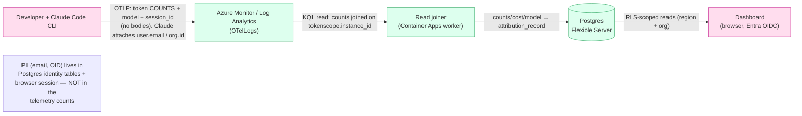

# Data Protection

For InfoSec / data-privacy review of TokenScope. What data the system holds,
where it lives, how it's protected, and the one property that matters most:
**TokenScope stores token-usage *metadata* only — never prompt or response
content.**

See also [Security Overview](Security-Overview.md)
([Authentication & Security](Authentication-and-Security.md) as-built),
[Architecture](Architecture.md), [Data Model](Data-Model.md). Region/tenant
specifics for the Insight instance are in
your deployment's own configuration.

Labels used throughout: **[Current]** = as-built and running; **[Planned]** =
designed, not yet enforced; **[VERIFY]** = needs deployment-owner confirmation.

---

## The headline: metadata, not content

> **TokenScope never ingests prompts, responses, file contents, or any
> message body.** It records *counts*.

Claude Code emits OpenTelemetry `api_request` **log events** carrying token
**counts** — `input_tokens`, `output_tokens`, `cache_read_tokens`,
`cache_creation_tokens`, `cost_usd`, `model`, `request_id`, `duration_ms`.
There is **no message-body field** in the telemetry contract. The read joiner
records counts / cost / model / timestamp per session into `attribution_record`.

Confirmed against the as-built schema — `attribution_record`
(`drizzle/schema/attribution.ts`) has these columns and **no content column**:

| Carries | `tokens` (count) · `cost_usd` · `model` · `token_type` · `ts_event` · session/teammate/project/org FKs |
|---|---|
| **Does NOT carry** | prompt text · response text · file paths · code · message bodies |

This is the system's primary **data-minimisation** property: the most sensitive
data class (conversation content) is never collected, transmitted, or stored.
(Sources: [Data Model](Data-Model.md) `attribution_record`;
`docs/development/claude-code-telemetry-contract.md`.)

---

## Data classification

What TokenScope holds, ranked by sensitivity.

| Data | Class | Where stored | Retention |
|---|---|---|---|
| **Identity** — Entra OID, email (`teammate`, `instance_attestation.principal_email`, `teammate_identity_map`) | **PII** | Postgres | ~12 mo active, then soft-purge **[Planned]** |
| **Session token** (CLI auth handle) | Secret | Postgres — **hashed** (HMAC-SHA-256, KV service key) | session-duration; raw never stored |
| **Org / project metadata** — units, project codes, `raw_project_code`, client-facing name | Confidential (business) | Postgres | life of project (soft-retire) |
| **Telemetry-derived usage** — token counts, model, cost, timestamps, session id, token-type (`attribution_record`, `actual_spend`) | Internal (non-PII per row, but joins to a person) | Postgres | ~7 yr finance horizon **[VERIFY w/ finance]** |
| **Governance** — budgets, allocations, limits, tiers | Internal | Postgres | life of policy |
| **Audit log** (`audit_event`) | Internal — security record | Postgres (append-only) | indefinite **[Current]** |
| **Raw telemetry events** (`OTelLogs`) | Internal — counts only | Azure Log Analytics Workspace — **query private** (AMPLS PE, in-VNet only); **ingestion public** (DCE) | workspace-configured **[VERIFY]** |

> Telemetry rows are not content, but a row keyed to a `teammate` is
> *attributable to a person*. Treat the joined view as PII-adjacent; the raw
> count rows are not PII on their own.

---

## Data flow — PII vs non-PII at each hop

- **Dev → Azure:** OTLP carries **counts only**. Claude Code does attach
  `user.email` / `organization.id` / hashed `user.id` to each point by default;
  TokenScope joins on its own `tokenscope.instance_id` (the device/enrolment
  INSTANCE id), not Claude's identity attributes (the per-SESSION
  `session.id` is captured per-record as `claude_session_id`). **[Current]** — strip/keep policy for Claude's identity attrs is a
  decision point **[VERIFY / Planned]**.
- **Azure → Joiner:** KQL pulls counts; identity is resolved *in TokenScope* via
  the attestation row, not carried in the telemetry payload.
- **Joiner → Postgres:** writes the non-content ledger row.
- **Postgres → Dashboard:** the only hop where PII is read back, gated by Entra
  OIDC + region/org scope.

---

## Encryption

| Layer | Posture | Status |
|---|---|---|
| **In transit — edge** | TLS 1.2+ at the upstream WAF (OWASP ruleset); HTTPS-only ingress. *(In a Front-Door-fronted topology the edge is Azure Front Door + WAF policy — optional, `enableFrontDoor`.)* | **[Current]** |
| **In transit — data plane** | Postgres, Redis, Key Vault reached over **private endpoints inside the VNet** (no public exposure / no TLS-over-internet hop) | **[Current]** |
| **In transit — telemetry** | TLS 443 to Azure Monitor's Data Collection Endpoint (`monitor.azure.com`) | **[Current]** |
| **At rest — Postgres** | Flexible Server platform-managed encryption | **[Current]** |
| **At rest — Key Vault** | HSM-backed; soft-delete + purge-protection for prod | **[Current]**, prod hardening **[Planned]** |
| **At rest — Log Analytics** | Azure platform-managed encryption | **[Current]** |
| **CMK (customer-managed keys)** | Available where data classification mandates | **[Planned / on demand]** |

"Platform defaults" = Azure-managed keys everywhere unless CMK is required.
(Source: `architecture.md` §Encryption posture; per-store settings in
[Deployment & Operations](Deployment-and-Operations.md).)

---

## PII handling & minimisation

- **The PII is emails and Entra OIDs** — held in `teammate`,
  `teammate_identity_map`, and denormalised onto `instance_attestation`
  (`principal_oid`, `principal_email` for audit display).
- **`raw_project_code` is audit/display only.** It can embed client identity
  (`PRJ-CLIENTX-RENEWAL`), so the canonical `code_hash` (SHA-256) is the value
  that crosses any AI-coaching boundary — the raw code and client name **never**
  do. **[Current]** for the hashing; the coach itself isn't built (see Planned).
- **Soft-purge over hard-delete.** A purge clears the PII fields
  (`principal_email`, `raw_project_code`, notes) and sets `ts_purged`, while
  *retaining* the row and `instance_id` so the
  `attribution_record → instance_attestation` FK stays valid across the much
  longer finance-audit horizon. The schema column
  exists **[Current]**; the nightly sweep worker is **[Planned]**.
- **Session tokens never stored raw** — only an HMAC-SHA-256 hash (Key-Vault
  service key), enabling en-masse invalidation via key rotation. **[Current]**
- **k-anonymity suppression on the directory diagnostic.** The Region-rules
  "which directory attribute maps to region on my tenant?" diagnostic
  (`GET /api/v1/admin/directory/field-distribution`,
  `shared/placement/field-distribution.ts`) samples the directory and returns,
  per attribute, coverage + the top distinct values. It is **PII-safe by
  construction**: only attribute *values* (company / country / …) and counts —
  never names or emails — and a **k-anonymity floor of `MIN_CELL = 5`** suppresses
  any value cell seen fewer than 5 times (rare values fold into an "other"
  bucket), so a rare value + count can't de-anonymise one person. The endpoint is
  **global-roles-only** (`requireRole('global-finops', 'platform-admin')`), the
  same posture as the region rules it feeds. **[Current]**

---

## Retention

| Item | Window | Status |
|---|---|---|
| Setup token | short-lived, single-use | **[Current]** |
| Session token | session-duration, hashed | **[Current]** |
| `instance_attestation` PII | ~12 mo active → soft-purge (PII cleared, row kept) | column **[Current]**; purge job **[Planned]** |
| `attribution_record` | ~7 yr finance-audit horizon | **[Current]** (no automated purge); ~7 yr **[VERIFY w/ finance]** |
| `audit_event` | indefinite, append-only (trigger-enforced) | **[Current]** |
| Log Analytics `OTelLogs` | workspace-configured | **[Current]**, value **[VERIFY]** |
| Coaching-nudge text | ~30 day purge | **[Planned]** — coach not built |

> **No formal retention/purge jobs run today.** Retention windows are designed
> and the soft-purge *column* exists, but the sweep workers that enforce them
> are **[Planned]**. Append-only audit retention is the one enforced-today
> control (DB trigger denies UPDATE/DELETE).

---

## Data residency

- **Single-region deployment.** TokenScope deploys into one region and resource
  group (chosen via `location` / passed at `-g`); all stores live in that region.
  The concrete region, RG, and tenant for the Insight instance are in
  your deployment's own configuration. **[Current]**
- **Region-scoped RLS still applies.** Multi-tenant tables carry `region_id` /
  `org_unit_id` and are designed for **Row-Level Security** (region +
  org-subtree) at the DB layer. **[Planned-enforcement]:** RLS policies ship but
  are inert at runtime today (app connects as table owner; needs a non-owner
  role + `FORCE ROW LEVEL SECURITY`). The **app-level scope predicates are the
  live authorization boundary** until then. **[Current]**
- **Sovereignty posture:** all stores (Postgres, Key Vault, Log Analytics) are
  Azure PaaS within the deploying tenant and the single deployment region — data
  does not leave Azure / the deployment region. Cross-region data isolation is
  enforced today by *single-region deployment*, with RLS region-scoping as the
  in-database backstop once activated. **[VERIFY]** the tenant/region against the
  deployment owner's data-classification policy for the target dataset.

---

## Planned (not yet enforced) — summary for reviewers

| Control | State |
|---|---|
| Soft-purge sweep worker (enforce the `ts_purged` PII window) | **[Planned]** — column exists, job not built |
| Formal retention/expiry jobs (attribution, Log Analytics tiering) | **[Planned]** |
| RLS as the live boundary (non-owner DB role + FORCE RLS) | **[Planned]** — policies shipped, inert today |
| Deployment-time region choice (residency) | **[Planned]** — a single region is fixed per deployment today (via `location`) |
| AI-coaching privacy boundary (hash-only, aggregates-only, 30 d purge) | **[Planned]** — coach not built; the privacy *contract* is documented as the bar any future build must meet |
| Strip/keep policy for Claude's own identity attrs in telemetry | **[VERIFY / Planned]** |

The coaching data-path contract (only aggregates + hashed `code_hash` cross the
boundary; raw code / client name / message content never do) is a **binding
design constraint** for the future feature, not shipped behaviour.
