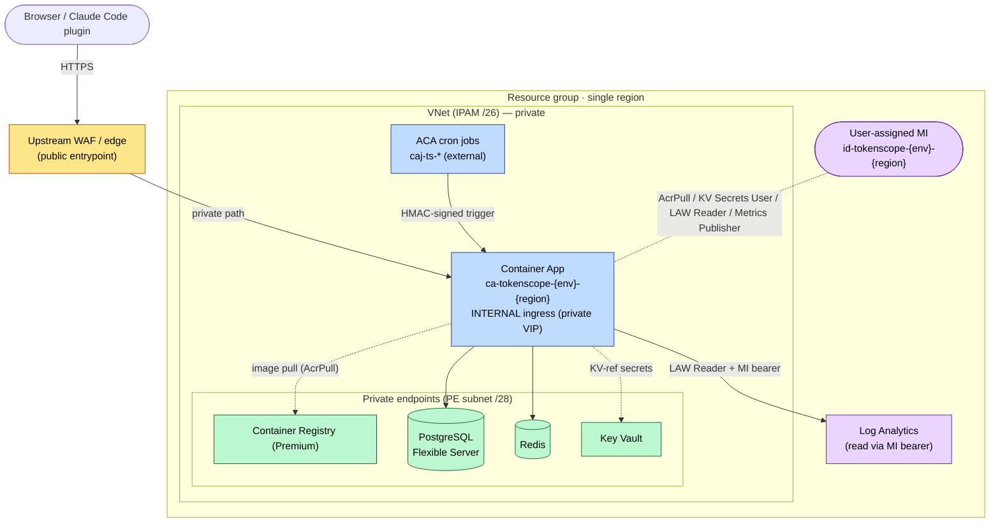
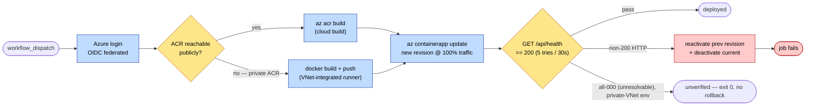

# Deployment and Operations

How TokenScope is deployed and operated on Azure. Audience: developers,
maintainers, operators. See also [Architecture](Architecture.md) and
[Background Workers](Background-Workers.md).

> TokenScope ships two deployment **modes**: a simpler **sandbox** shape (public
> ingress + RBAC) and a **VNet-integrated** shape (internal ACA behind an upstream
> WAF, data plane over private endpoints). This page documents the
> VNet-integrated mode; every env follows the same Bicep with different switches.

> Insight-specific deployment details (real hostnames, subscription / RG / VNet
> names, IPAM CIDRs, the private build runner, the internal runbook) live in the
> your deployment's own configuration.

## Azure topology

In the VNet-integrated mode everything sits behind an **upstream WAF/edge** (the
public entrypoint). The ACA environment has a **private VIP** (internal ingress)
and the data plane — Postgres, Redis, Key Vault, and **ACR** — is reached over
**private endpoints**. A single **user-assigned Managed Identity** carries every
grant the app needs.

- **Public entrypoint is an upstream WAF/edge**, not a per-app Front Door (in this
  mode). The ACA environment is **INTERNAL** (`internalIngress=true`, driven by
  `enablePrivateNetworking`), so the Container App has a private VIP — it is not
  directly reachable on the public internet.
- **Data plane and ACR are all private.** KV, PG, Redis, and the **Premium ACR**
  each sit behind a private endpoint on the PE subnet (`/28`, 11 usable — 4 PEs
  plus headroom), resolved through private DNS. ACR public access is Disabled;
  image pull is MI-only.
- **All secrets** resolve via Key Vault references using the **user-assigned MI**.
  The same MI holds AcrPull (image pull), KV Secrets User, Log Analytics Reader,
  and Monitoring Metrics Publisher. RBAC role assignments are gated on
  `deployRbac`.
- **Telemetry read** is via MI: the app mints an MI bearer and reads token-usage
  from Log Analytics (the LAW shared key is fetched in-module via `listKeys()`,
  never crossing a module-output boundary).
- **Cron jobs** (`caj-ts-*`) are **external** ACA jobs that HMAC-trigger the
  in-app worker endpoint `/api/v1/internal/run-worker/{name}` — see
  [Background Workers](Background-Workers.md).

## Deploy pipeline

Infra (Bicep) and image rolls are separate cycles. Bicep is applied once per infra
change; the deploy below rolls a new image on every code change. The pipeline has
**two shapes**, selected by environment: a public-ACR **cloud build**
(`az acr build`) where the registry accepts public traffic, and a **private-ACR
path** (build + push from a **VNet-integrated runner**) where ACR is
private-endpoint-only.

- **Runner selection is by environment.** Public-ACR envs run on a default
  GitHub-hosted runner with `az acr build`. A **private-ACR env** cannot — ACR
  Tasks agents run outside the VNet and are 403'd by
  `publicNetworkAccess=Disabled`. Those envs run on a **VNet-integrated runner**
  with line-of-sight to the ACR private endpoint and build with
  `docker build` + `az acr login` + `docker push`.
- **`az containerapp update --image`** rolls the new revision at 100% traffic; the
  previous ready revision (`latestReadyRevisionName`) is captured first for
  rollback.
- **Health gate**: polls `https://<ca-fqdn>/api/health` (5 attempts, 30s apart).
  A non-200 HTTP response fails and the **Rollback on failure** step reactivates
  the saved previous revision. **On a private-VNet env**, if the gate never sees
  **any** HTTP response (all `000` — the internal FQDN is unresolvable from the
  runner until IT links the ACA private DNS zone to the runner's network), it
  treats the roll as **unverified, not failed**: exit 0 with a loud warning, **no
  rollback** (verify from inside the corporate network instead).
- Azure login is OIDC federated (no stored client secret); the CI/CD service
  principal has Owner on the deployment RG.

> **VNet-runner cutover is committed.** `deploy.yml` already selects the runner
> and build path by environment (the conditional `runs-on`, the docker
> build/push step, and `az acr build` gated to public-ACR envs). The only pending
> item for a private-ACR env is the **runtime prerequisite** — the runner's subnet
> must have line-of-sight to the ACR private endpoint (peering / hub transit) and
> the central `privatelink.azurecr.io` zone must be linked to the runner's
> network. For the Insight dev instance, the exact runner name and the open IT
> confirmation are in your deployment's own configuration.

## Reference

### Resource naming

Child resources follow `{kind}-tokenscope-{env}-{regionShort}`. `regionShort` is
**derived from `location`** in `main.bicep`. ACR is the exception — alphanumeric
only, hyphens stripped: `crtokenscope{env}{region}`.

| Kind | Pattern |
|---|---|
| Resource group | Passed at `-g` (may follow an org naming standard set by IT) |
| Container App | `ca-tokenscope-{env}-{region}` |
| Container Registry | `crtokenscope{env}{region}` (Premium, private) |
| Key Vault | `kv-tokenscope-{env}-{region}` |
| Managed Identity | `id-tokenscope-{env}-{region}` |

Only the child resources follow the `{kind}-...` scheme; the RG name is passed at
`-g` and may follow an org standard.

### Parameters

The per-env contract lives in an `infra/parameters/{env}.bicepparam`
(`using ../main.bicep`). Key switches: `env`, `location`,
`enablePrivateNetworking` (VNet + internal ingress + private endpoints),
`deployRbac` (MI role assignments), `enableFrontDoor` (per-app AFD — off in the
VNet-integrated mode), `monitorQueryPrivateOnly` (private Log Analytics query).
The VNet `/26` and its `/27` (Container Apps) + `/28` (private endpoints) + optional
`/28` (AMPLS) subnets are sized to the Azure minimum; the `10.0.0.0` base is a
placeholder IT replaces with its IPAM-assigned `/26` (keep the masks and the
offsets). All `@secure()` params (DB, session/HMAC keys, OIDC secrets) are passed
at apply time by the workflow from `secrets.*` — never hardcoded.

### Configurable options & IT coordination

- **Build runner ↔ VNet line-of-sight** — a private-ACR env needs a
  VNet-integrated runner whose subnet reaches the deployment VNet (gates the
  docker build/push path).
- **WAF ↔ internal ACA path** — how the upstream WAF reaches the internal
  Container App (private link, or an injected header the ingress can gate on). The
  public hostname the WAF exposes feeds `entraIdRedirectUri` and (when the WAF may
  rewrite Host) `appPublicOrigin`.
- **Private DNS — self-owned vs central** — `networking.bicep` either creates the
  `privatelink` zones (vaultcore / postgres / redis / azurecr) and links them, or
  consumes IT-provided central zone resource IDs
  (`centralDnsZonesSubscriptionId` / `centralDnsZonesResourceGroup`) when IT runs
  centralised private DNS. Pick per environment. (Insight dev consumes central
  zones — see your deployment's own configuration.)

## Ops alerting

Degradation pages the operator; it never waits to be looked at
(`docs/design/ops-alerting.md` is the planning record — this is the shipped
state).

- **Evaluator**: the `ops-alert` worker (cron `9,24,39,54 * * * *`, see
  [Background-Workers](Background-Workers)) checks four condition groups each
  tick: a bounded read of the joiner's real telemetry table, attribution stall
  (people emitting, no rows landing), a cadence-aware worker-fleet predicate,
  and admin alert-inbox aging. Criticals notify on first detection; warnings
  need two consecutive runs; reminders every 6h while unresolved; recovery
  notices only for alerts that were actually delivered.
- **Channel**: a public ntfy.sh topic — the 64-char random topic name is the
  access control. The URL lives as GH env secret `OPS_ALERT_NTFY_URL` → Key
  Vault `ops-alert-ntfy-url` → container `secretRef`
  `NUXT_OPS_ALERT_NTFY_URL`; empty = alerting disabled (local default). The
  payload is allowlisted to severity, condition key, env tag, UTC timestamp
  and an aggregate count — nothing else, enforced by tests. Logs record
  host + HTTP status + condition key, never the URL. Rotation = new topic,
  update the GH secret, re-apply.
- **Azure-native legs** (`infra/modules/ops-alerts.bicep`, the existing action
  group + `alertNotificationEmail`): Container App `Replicas` < 1, Postgres
  `is_db_alive` < 1, and a dead-man on the `caj-ts-ops-alert` job's successful
  executions — these fire from inside Azure even when the app, AMPLS or the
  worker itself is down.
- **Parity**: every externally-notified condition also upserts one admin inbox
  item (platform-admin + global-finops) and writes
  `ops-alert-{delivered,failed,reminded,recovered}` audit events.
- **User surface**: while the stall condition holds, Home and My usage show a
  degradation banner ("recent spend may be missing"), and the freshness dot
  never shows green for an age it cannot vouch for — worker and UI share one
  decision function (`server/usage/attribution-stall.ts`).

## Operator pointers

- **Secret rotation** always goes through the workflow path — update the GH
  secret, re-apply the Bicep. **Never** `az keyvault secret set` by hand. An
  empty-string secret is a no-op (does NOT clear the existing value — the
  keyvault-secrets SAFETY CONTRACT).
- **CI**: a static job (typecheck + lint + `docker compose config` +
  `bicep build` compile-only), an integration job (testcontainers Postgres), and
  a smoke job (playwright-cli). Deploy is gated entirely behind the manual deploy
  workflow.
- **Operators have Contributor on the RG** — enough to read resources and
  `az containerapp logs`, not to rewrite RBAC. The CI/CD service principal has
  Owner.
- **Key Vault soft-delete** is 7 days for non-prod; switch
  `keyVaultCreateMode=recover` if the KV is torn down and re-applied within that
  window.
</content>
