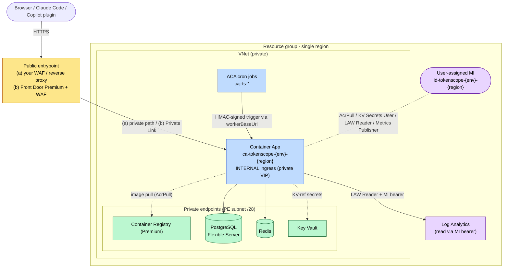
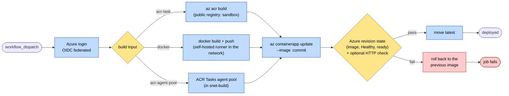

# Deployment and Operations

How TokenScope is deployed and operated on Azure. Audience: developers,
maintainers, operators. See also [Architecture](Architecture.md) and
[Background Workers](Background-Workers.md).

> TokenScope ships two deployment **modes**: a simpler **sandbox** shape (public
> ingress + RBAC, `example-sandbox.bicepparam`) and a **VNet-integrated** shape
> (internal ACA, data plane over private endpoints, `example-vnetted.bicepparam`)
> for staging and production. This page documents the VNet-integrated mode;
> every environment follows the same Bicep with different switches. The
> step-by-step walkthrough is [DEPLOY-AZURE.md](../DEPLOY-AZURE.md).

## Azure topology

In the VNet-integrated mode the ACA environment has a **private VIP** (internal
ingress) and the data plane (Postgres, Redis, Key Vault and **ACR**) is reached
over **private endpoints**. The public entrypoint is one of:

- **(a) your own WAF / App Gateway / reverse proxy** in front of the internal
  app, or
- **(b) Azure Front Door Premium over Private Link** (`enableFrontDoor=true`,
  `frontDoorSku='Premium'`), the recommended production shape: nothing is
  exposed except through Front Door's WAF.

A single **user-assigned Managed Identity** carries every grant the app needs.

```mermaid
flowchart TB
  client([Browser / Claude Code / Copilot plugin])
  edge["Public entrypoint<br/>(a) your WAF / reverse proxy<br/>(b) Front Door Premium + WAF"]

  subgraph rg["Resource group · single region"]
    subgraph vnet["VNet (private)"]
      ca["Container App<br/>ca-tokenscope-{env}-{region}<br/>INTERNAL ingress (private VIP)"]
      cron["ACA cron jobs<br/>caj-ts-*"]
      subgraph pe["Private endpoints (PE subnet /28)"]
        acr["Container Registry (Premium)"]
        pg[("PostgreSQL<br/>Flexible Server")]
        redis[("Redis")]
        kv["Key Vault"]
      end
    end
    mi(["User-assigned MI<br/>id-tokenscope-{env}-{region}"])
    law["Log Analytics<br/>(read via MI bearer)"]
  end

  client -->|HTTPS| edge
  edge -->|"(a) private path / (b) Private Link"| ca
  ca -. KV-ref secrets .-> kv
  ca --> pg
  ca --> redis
  ca -. image pull (AcrPull) .-> acr
  ca -->|LAW Reader + MI bearer| law
  cron -->|HMAC-signed trigger via workerBaseUrl| ca
  mi -. AcrPull / KV Secrets User / LAW Reader / Metrics Publisher .- ca

  classDef public fill:#fde68a,stroke:#b45309,color:#000;
  classDef app fill:#bfdbfe,stroke:#1e40af,color:#000;
  classDef data fill:#bbf7d0,stroke:#166534,color:#000;
  classDef ident fill:#e9d5ff,stroke:#6b21a8,color:#000;
  class edge public;
  class ca,cron app;
  class acr,pg,redis,kv data;
  class mi,law ident;
```

- **The ACA environment is INTERNAL** (`internalIngress=true`, driven by
  `enablePrivateNetworking`), so the Container App has a private VIP and is not
  directly reachable on the public internet.
- **Front Door in this mode must be Premium.** Standard can only reach a public
  origin, and the template refuses `enablePrivateNetworking` + `enableFrontDoor`
  + `frontDoorSku='Standard'` at validation, before anything is created. Premium
  requests a private endpoint on the managed environment, which must be
  **approved while the apply runs**: start the apply with `--no-wait`, then run
  `infra/scripts/approve-front-door-private-link.sh <rg>`. Premium adds the
  managed WAF rule sets (DRS 2.1, Bot Manager 1.1), which start in `Log` mode
  (`frontDoorWafManagedRuleAction`); switch to `Block` once the logs are clean.
- **Data plane and ACR are all private.** KV, PG, Redis and the **Premium ACR**
  each sit behind a private endpoint on the PE subnet (`/28`, 11 usable: 4 PEs
  plus headroom), resolved through private DNS. ACR public access is Disabled;
  image pull is MI-only.
- **All secrets** resolve via Key Vault references using the **user-assigned MI**.
  The same MI holds AcrPull (image pull), KV Secrets User, Log Analytics Reader,
  and Monitoring Metrics Publisher. RBAC role assignments are gated on
  `deployRbac`.
- **Telemetry read** is via MI: the app mints an MI bearer and reads token-usage
  from Log Analytics (the LAW shared key is fetched in-module via `listKeys()`,
  never crossing a module-output boundary).
- **Cron jobs** (`caj-ts-*`) are ACA jobs in the same environment that
  HMAC-trigger the in-app worker endpoint `/api/v1/internal/run-worker/{name}`
  at `workerBaseUrl`: the internal Container App address with your own WAF, or
  the Front Door endpoint once `frontDoorId` is set (the app then refuses direct
  calls). See [Background Workers](Background-Workers.md).

## Deploy pipeline

Any deployment can be run by hand from [DEPLOY-AZURE.md](../DEPLOY-AZURE.md), or
automated with the two copy-in example workflows in `examples/github-actions/`
(setup: [examples/github-actions/README.md](../../examples/github-actions/README.md)).
Copy both into `.github/workflows/` in your fork. Both sign in to Azure with OIDC
(a federated credential, no stored Azure secret) and share a concurrency group
per environment, so they never overlap.

Infra (Bicep) and image rolls are separate cycles:

- **`tokenscope-infra.yml`** compiles your committed parameter file, runs
  `what-if`, and in `apply` mode starts `az deployment group create --no-wait`
  and runs `infra/scripts/approve-front-door-private-link.sh`, which approves
  Front Door Premium's Private Link request while the apply runs (for any other
  posture it just waits for the deployment). The parameter file reads every
  secret from environment variables, which the workflow maps from the GitHub
  environment's secrets.
- **`tokenscope-deploy.yml`** builds the image under the commit tag, rolls the
  Container App, verifies the new build, and only then moves `latest`.

```mermaid
flowchart LR
  start([workflow_dispatch]) --> oidc[Azure login<br/>OIDC federated]
  oidc --> build{"build input"}
  build -->|acr-task| cloud["az acr build<br/>(public registry: sandbox)"]
  build -->|docker| dbuild["docker build + push<br/>(self-hosted runner in the network)"]
  build -->|acr-agent-pool| pool["ACR Tasks agent pool<br/>(in snet-build)"]
  cloud --> roll["az containerapp update<br/>--image :commit"]
  dbuild --> roll
  pool --> roll
  roll --> verify{"Azure revision state<br/>(image, Healthy, ready)<br/>+ optional HTTP check"}
  verify -->|pass| promote["move latest"] --> ok([deployed])
  verify -->|fail| rollback["roll back to the<br/>previous image"]
  rollback --> failed([job fails])

  classDef ci fill:#bfdbfe,stroke:#1e40af,color:#000;
  classDef gate fill:#fde68a,stroke:#b45309,color:#000;
  classDef bad fill:#fecaca,stroke:#b91c1c,color:#000;
  class oidc,cloud,dbuild,pool,roll,promote ci;
  class build,verify gate;
  class rollback,failed bad;
```

- **Build path is chosen by the `build` input.** `acr-task` builds in Azure and
  only works against a registry that accepts public traffic (sandbox). A
  VNet deployment's registry is private-endpoint-only, so it builds from inside
  the VNet: `docker` on a self-hosted runner that can reach the registry's
  private endpoint, or `acr-agent-pool` (an ACR Tasks agent pool, a preview
  feature) while the workflow stays on a GitHub-hosted runner. Both use the
  build subnet (`buildSubnetPrefix`, below).
- **Verification needs no network path to the app.** The workflow first checks
  Azure's view: the newest revision runs this commit's image, is `Healthy`
  (its `/api/health` probes pass) and is the ready revision. If
  `TOKENSCOPE_HEALTH_URL` is set (or the environment is not internal) it also
  checks over HTTP that `/api/v1/meta/build` reports this commit and
  `/api/health` returns 200.
- **`latest` moves only after verification**, so worker jobs and the next infra
  apply always get a build that passed. On failure the workflow rolls the app
  back to the image it ran before (pinned by digest where the registry is
  readable) and leaves `latest` alone.
- The deployment identity needs **Owner** on the resource group, because the
  template creates role assignments.

## Reference

### Resource naming

Child resources follow `{kind}-{projectName}-{env}-{regionShort}` (`projectName`
defaults to `tokenscope`). `regionShort` is **derived from `location`** in
`main.bicep`. ACR is the exception — alphanumeric only, hyphens stripped:
`cr{projectName}{env}{region}`. The scheduled worker jobs are named
`caj-ts-{worker}` regardless of project or env, so one resource group holds one
deployment. ACA job names are capped at 32 characters, so a long worker name
takes a short override: `privileged-identity-cleanup` runs as
`caj-ts-priv-identity-cleanup`.

| Kind | Pattern |
|---|---|
| Resource group | Passed at `-g` (may follow your organisation's naming standard) |
| Container App | `ca-{projectName}-{env}-{region}` |
| Container Registry | `cr{projectName}{env}{region}` (Premium when private, else Basic/Standard) |
| Key Vault | `kv-{projectName}-{env}-{region}` (truncated to 24 characters) |
| Managed Identity | `id-{projectName}-{env}-{region}` |

Only the child resources follow the `{kind}-...` scheme; the RG name is passed at
`-g` and may follow an org standard.

### Parameters

The per-env contract lives in a `.bicepparam` file (`using ../main.bicep`); start
from `infra/parameters/example-sandbox.bicepparam` or
`infra/parameters/example-vnetted.bicepparam`. Key switches: `env`, `location`,
`enablePrivateNetworking` (VNet + internal ingress + private endpoints),
`deployRbac` (MI role assignments), `enableFrontDoor` + `frontDoorSku` (Standard
fronts a public app; Premium is required with `enablePrivateNetworking`),
`frontDoorWafManagedRuleAction` (Premium only), `monitorQueryPrivateOnly`
(private Log Analytics query), and `buildSubnetPrefix` (optional `snet-build`
subnet for a self-hosted runner or an ACR Tasks agent pool).

Subnet minimums: `/27` for Container Apps, `/28` for private endpoints, and a
`/28` for AMPLS (its endpoint is multi-IP). A `/26` VNet holds exactly those
three subnets and nothing more; `example-vnetted` uses a `/24` so there is room
for `snet-build` (e.g. `10.0.0.64/27`). Replace the `10.0.0.0` base with the
range your IPAM assigns. Declare every subnet in the parameter file rather than
adding one by hand: the template lists the VNet's subnets, so the next apply
removes any it does not know.

`@secure()` params (DB, session/HMAC keys, OIDC secrets, provider credentials)
are never hardcoded: the example files read them from environment variables
(`readEnvironmentVariable`), from your secrets file when applying by hand or
from the GitHub environment's secrets in the example workflow.

### Configurable options & network coordination

- **Build subnet ↔ registry line-of-sight.** A private registry refuses builds
  from outside the VNet. Set `buildSubnetPrefix` and build from `snet-build`
  (self-hosted runner or ACR Tasks agent pool); the subnet needs outbound
  internet (GitHub, base images, Azure services), e.g. through a NAT gateway or
  your firewall.
- **Public entrypoint ↔ internal ACA path.** With your own WAF, decide how it
  reaches the internal Container App; with Front Door Premium it is Private Link.
  The public hostname feeds `entraIdRedirectUri` and `appPublicOrigin`.
- **Private DNS: self-owned vs central.** `networking.bicep` either creates the
  `privatelink` zones (vaultcore / postgres / redis / azurecr) and links them, or
  consumes central zones (`centralDnsZonesSubscriptionId` /
  `centralDnsZonesResourceGroup`) when a platform team runs centralised private
  DNS. Pick per environment.

## Ops alerting

Degradation pages the operator; it never waits to be looked at.

- **Evaluator**: the `ops-alert` worker (cron `9,24,39,54 * * * *`, see
  [Background Workers](Background-Workers.md)) checks, each tick: a bounded read
  of the joiner's real telemetry table, the private-link network sweep,
  attribution stall (people emitting, no rows landing), and per-worker fleet
  failures. Every condition needs two consecutive runs at the same severity
  before it is announced; **only `critical` is pushed** to the channel, while
  warnings go to the admin inbox and audit log. Reminders every 6h while
  unresolved; recovery notices only for alerts that were actually delivered.
- **Channel**: a public ntfy.sh topic — the 64-char random topic name is the
  access control. The URL is the `@secure()` `opsAlertNtfyUrl` parameter → Key
  Vault `ops-alert-ntfy-url` → container `secretRef`
  `NUXT_OPS_ALERT_NTFY_URL`; empty = alerting disabled (the default). Read it
  from an environment variable in your parameter file, like the other secrets. The
  payload is allowlisted to severity, condition key, env tag, UTC timestamp
  and an aggregate count — nothing else, enforced by tests. Logs record
  host + HTTP status + condition key, never the URL. Rotation = new topic,
  update the value, re-apply.
- **Azure-native legs** (`infra/modules/ops-alerts.bicep`, the existing action
  group + `alertNotificationEmail`): Container App `Replicas` < 1, Postgres
  `is_db_alive` < 1, and a dead-man on the `caj-ts-ops-alert` job's successful
  executions — these fire from inside Azure even when the app, AMPLS or the
  worker itself is down.
- **Parity**: every externally-notified condition also upserts one admin inbox
  item (platform-admin) and writes
  `ops-alert-{delivered,failed,reminded,recovered}` audit events.
- **User surface**: while the stall condition holds, Home and My usage show a
  degradation banner ("recent spend may be missing"), and the freshness dot
  never shows green for an age it cannot vouch for — worker and UI share one
  decision function (`server/usage/attribution-stall.ts`).

## Operator pointers

- **Secret rotation** goes through an apply: update your secrets file or the
  GitHub environment's secrets, then re-apply `main.bicep`. **Never**
  `az keyvault secret set` by hand. An
  empty-string secret is a no-op (does NOT clear the existing value — the
  keyvault-secrets SAFETY CONTRACT).
- **CI** (`.github/workflows/ci.yml`) runs static, unit, integration
  (testcontainers Postgres) and smoke jobs. It never deploys.
- **Access split**: Contributor on the RG is enough to read resources and
  `az containerapp logs`, not to rewrite RBAC. The deployment identity needs
  Owner.
- **Key Vault soft-delete** is 7 days for non-prod; switch
  `keyVaultCreateMode=recover` if the KV is torn down and re-applied within that
  window.
</content>
