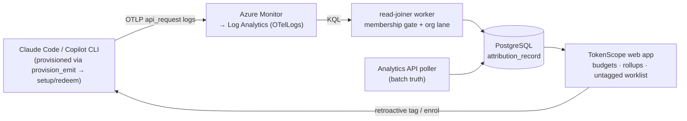

# TokenScope — Engineering Wiki

The **built spec** for TokenScope: the living, as-built reference for developers,
maintainers, and operators. For _why_ the system is shaped this way see the
design docs (`docs/design/`) and ADRs (`docs/decisions/`); this wiki is _what is
actually running_.

> **Status: 1.0.0-rc.1 — release candidate.** TokenScope runs end to end in an
> internal, IT-hosted Azure environment. **Claude Code and the GitHub Copilot CLI
> are both supported clients**, on a shared MCP server + OAuth 2.1 backbone.
> Usage is reconciled against the provider APIs on both lanes — Anthropic's
> Analytics API and GitHub's Copilot billing API — and reporting covers
> attributed usage, chargeback and budgets.
>
> The tenant OTLP bridge and finance-system connectors are designed but **not
> built**. Every page marks _Planned_ items explicitly, and the
> [Security Overview](Security-Overview.md) keeps an open register of accepted
> residual risks — read both before assuming a control is in force.

## The system at a glance

TokenScope joins AI-tool usage telemetry to project financials so every token of
spend is attributed to a project (or spills to a named cost-owning unit). It
governs by _financial gravity_ — additive budgets, velocity limits, a spill
bucket — not static quotas.

## Pages

**Engineering (built spec):**

- **[Architecture](Architecture.md)** — logical + technical architecture, the attribution data flow, the trust model.
- **[Data Model](Data-Model.md)** — the as-built Postgres schema, by domain.
- **[Reporting](Reporting.md)** — showback vs chargeback, the three axes (provenance, billing status, lane), the per-metered-lane §A ≥ §B invariant, and the contract every report is built against.
- **[API Reference](API-Reference.md)** — every `/api/v1` endpoint, its auth gate and purpose.
- **[Background Workers](Background-Workers.md)** — the external-cron scheduler + the 31 workers.
- **[Claude Code Client](Claude-Code-Client.md)** — the plugin, provisioning flow, and the OTel telemetry contract.
- **[Copilot CLI Client](Copilot-CLI-Client.md)** — the GitHub Copilot CLI plugin, file-forwarder, and Copilot spend model.
- **[Deployment & Operations](Deployment-and-Operations.md)** — Azure topology, the deploy pipeline, environments, runbooks.

**Security & network (review surfaces):**

- **[Security Overview](Security-Overview.md)** — InfoSec entry point: trust boundaries, threat-model summary, controls (current + planned), risk register.
- **[Authentication & Security](Authentication-and-Security.md)** — auth flows, RBAC, RLS, CSRF, Front Door.
- **[Data Protection](Data-Protection.md)** — data classification, PII, what is _not_ collected, retention, residency.
- **[Network Architecture](Network-Architecture.md)** — current vs target Azure network: VNet isolation, ingress/egress, public surfaces, ingestion points.

## Conventions

This wiki is published from `docs/wiki/` in the main repo by the **Publish Wiki**
GitHub Action — edit the Markdown there, not the wiki directly. Pages are
diagram-forward and concise by design.
