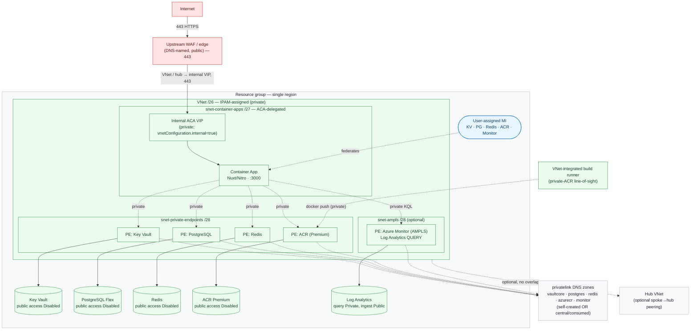

# Network Architecture

The network model for a **VNet-integrated** TokenScope deployment — the topology,
ingress/egress paths, and the Bicep switches that produce it. Everything here is
sourced from `infra/` Bicep and `server/`. Sandbox runs a simpler public shape;
this page documents the private, VNet-integrated mode.

> Insight-specific deployment details (real hostnames, subscription / RG / VNet
> names, IPAM CIDRs, the private build runner) live in the internal
> [Insight Deployment](Insight-Deployment.md) page.

> Siblings: [Architecture](Architecture.md) · [Security Overview](Security-Overview.md) · [Deployment & Operations](Deployment-and-Operations.md)

**At a glance**
- Deploys into a **single region** and resource group. Child resources follow
  `{kind}-tokenscope-{env}-{regionShort}` (`regionShort` derived from `location`
  in `main.bicep`).
- One **IPAM-sized VNet (a /26 suffices)**: `snet-container-apps` **/27**
  (INTERNAL ACA env) + `snet-private-endpoints` **/28** (data-plane PEs) +
  optional `snet-ampls` **/28** (Azure Monitor private-query PE).
- **Ingress:** an **upstream WAF / edge** is the only public entrypoint; it
  routes inbound over the VNet (or hub peering) to the **internal ACA private
  VIP**. Per-app Azure Front Door is an *optional* topology (`enableFrontDoor`),
  off in the VNet-integrated mode.
- **Data plane** (Key Vault, PostgreSQL, Redis, ACR, **and Log Analytics QUERY**):
  private endpoints, `publicNetworkAccess: Disabled`, Managed-Identity auth.
- **Telemetry INGESTION** stays Azure-Monitor-side (public DCE
  `*.ingest.monitor.azure.com`, **by design** — clients emit from outside the
  zone), **not** into the VNet. **Telemetry QUERY** (Log Analytics KQL read) is
  **private** — AMPLS + private endpoint, `publicNetworkAccessForQuery: Disabled`
  — reachable only from inside the VNet.

---

## 1. Topology

**Boundary legend:** red = internet-facing / public; green = private (VNet or
private endpoint); blue = identity; grey = zone / shared. The **only** public box
is the upstream WAF. Everything else lives in or behind the VNet.

The network perimeter is the ingress control; the app still enforces Entra OIDC +
RBAC + Postgres RLS + CSRF on every request.

---

## 2. Ingress / egress / ingestion paths

| # | Source | Destination | Port / proto | Public / private | Auth / control |
|---|--------|-------------|--------------|------------------|----------------|
| I1 | Browser (end users) | Upstream WAF / edge | 443 / HTTPS | **Public** | WAF + TLS; the only public entrypoint |
| I2 | Upstream WAF | Internal ACA VIP | 443 / HTTPS | Private (VNet / hub) | ACA env is `internal=true`; reachable only over the VNet |
| E1 | App | Key Vault | 443 / HTTPS | Private (PE) | User-assigned MI, *Key Vault Secrets User*; `publicNetworkAccess: Disabled` |
| E2 | App | PostgreSQL Flexible Server | 5432 / TLS | Private (PE) | DB credentials from KV (`database-url`); `publicNetworkAccess: Disabled` |
| E3 | App | Redis | 6380 / TLS | Private (PE) | Redis key from KV (`redis-url`); `publicNetworkAccess: Disabled` |
| E4 | App | Azure Monitor / Log Analytics (KQL read) | 443 / HTTPS | Private (PE) — AMPLS, `queryAccessMode=PrivateOnly` | MI bearer (`monitor.azure.com`), *Log Analytics Reader*; query reachable only from inside the VNet |
| P1 | ACA env | ACR image pull | 443 / HTTPS | Private (PE) | User-assigned MI, *AcrPull*; admin user disabled |
| B1 | VNet-integrated build runner | ACR push | 443 / HTTPS | Private (PE) | `docker build` / `docker push` from inside the VNet |
| G1 | Claude Code CLI (dev laptops) | Azure Monitor DCE ingest (DCE → DCR) | 443 / HTTPS | **Public — Azure-Monitor-side, NOT into the VNet** | MI-minted Entra bearer (`monitor.azure.com/.default`), *Monitoring Metrics Publisher* on the DCR; `application/x-protobuf` |

**Telemetry note (G1):** token-usage telemetry is ingested at the **Azure Monitor
data plane (DCE/DCR), not into TokenScope's VNet**. Claude Code on developer
machines POSTs OTLP/HTTP to a Microsoft-managed public DCE. The app never
receives raw telemetry on its ingress; it *reads* it back from Log Analytics via
KQL (E4). The private VNet does not change this path.

---

## 3. Public-facing surfaces

### Public-facing endpoints (VNet-integrated mode)

The public surface is **exactly two**:

1. **App URL** — the upstream **WAF/edge** (inbound, public), fronting the
   **internal** Container App. The CA ingress itself is **internal-only**, not
   public (`vnetConfiguration.internal=true`); per-app Azure Front Door is **off**
   in this mode.
2. **OTLP telemetry ingest** — the Data Collection Endpoint
   (`*.ingest.monitor.azure.com`, `publicNetworkAccess: Enabled`) — public on the
   **Azure-Monitor side**, so developer clients can emit telemetry from
   **outside** the zone. Auth = Entra MI bearer, **publish-only**
   (`Monitoring Metrics Publisher`).

Everything else — **PostgreSQL, Key Vault, Redis, ACR, AND Log Analytics QUERY**
— is private-endpoint only (`publicNetworkAccess: Disabled`).

---

The detail behind those two surfaces:

- **Upstream WAF endpoint — 443 / HTTPS.** The only internet-reachable surface
  for the app.

Everything else is private:
- **ACA ingress** is an **internal VIP** (`vnetConfiguration.internal=true`) — no
  public endpoint; reachable only over the VNet via the WAF. App `targetPort` is
  `3000`, internal to the env.
- **Key Vault, PostgreSQL, Redis, ACR, and Log Analytics QUERY** — private
  endpoints, `publicNetworkAccess: Disabled`. (Log Analytics QUERY is fronted by
  an AMPLS + private endpoint, `queryAccessMode=PrivateOnly`; ingestion stays
  public — row G1.)
- **OTel ingestion is NOT an inbound opening on our infrastructure** — Claude Code
  POSTs over 443 to **Azure Monitor's** public DCE (row G1), an outbound concern
  for the developer machine.

---

## 4. VNet design

`infra/modules/networking.bicep`, parameterised per-env via the bicepparam file.
Sized to the Azure minimum the app needs, so IT carves only a small **/26** from
IPAM.

| Element | Value | Notes |
|---|---|---|
| Address space | **`/26`** (64 addr) | `vnetAddressSpace`. Smallest block holding a /27 + two non-overlapping /28s. IT replaces the `10.0.0.0` placeholder with its IPAM-assigned /26; keep the masks + the offsets. |
| `snet-container-apps` | **`/27`** | Delegated to `Microsoft.App/environments`. **`/27` is the minimum for a workload-profiles ACA env.** Env is **INTERNAL** (`internal=true`). |
| `snet-private-endpoints` | **`/28`** | `privateEndpointNetworkPolicies: Disabled`. **4 PEs** — KV / PG / Redis / **ACR**. /28 = 11 usable (Azure reserves 5 of 16) → 4 + 7 spare headroom. |
| `snet-ampls` (optional) | **`/28`** | `amplsSubnetPrefix`. Dedicated subnet for the Azure Monitor Private Link Scope PE — the `azuremonitor` PE allocates several IPs (one per Monitor data-plane endpoint), overflowing the shared PE subnet, so it gets its own /28. Empty ⇒ no AMPLS subnet / PE (public query). |
| Private DNS zones | `privatelink.vaultcore.azure.net`, `privatelink.postgres.database.azure.com`, `privatelink.redis.cache.windows.net`, `privatelink.azurecr.io` (+ the AMPLS `privatelink.monitor.azure.com` set when private query is on) | One per private data-plane type. **Self-created or consumed from central** — see §6. |
| Hub peering (optional) | `hubVnetId`; one-way spoke→hub | `allowGatewayTransit: false` on the spoke; `useRemoteGateways` defers to IT. **Reverse peering created by IT.** Address spaces must not overlap. |

**AMPLS subnet + PE (private telemetry query).** When `monitorQueryPrivateOnly`
is on, Log Analytics QUERY is fronted by an Azure Monitor Private Link Scope +
private endpoint on `snet-ampls`, with `publicNetworkAccessForQuery: Disabled`.
The `azuremonitor` PE registers A records into the `privatelink.monitor.azure.com`
zone family; ingestion (DCE) stays public by design.

**ACR (private).** Premium SKU + private endpoint + `privatelink.azurecr.io`,
public access Disabled — the 4th data-plane PE. Pull is via the user-assigned MI
(*AcrPull*); admin user disabled. Because a default GitHub-hosted runner can't
reach a private ACR, image build/push runs from a **VNet-integrated build runner**
(with line-of-sight to the ACR private endpoint) via `docker build` /
`docker push`.

---

## 5. Ports to publish

### Inbound

| Port | Where | Exposure |
|---|---|---|
| **443 / HTTPS** | Upstream WAF endpoint | **The only internet-published port** — the entire app ingress surface. |

Nothing else is internet-published:
- **PostgreSQL (5432)** and **Redis (6380, TLS)** are private-endpoint-only,
  `publicNetworkAccess: Disabled` — app→data-plane egress, never published
  inbound.
- The Container App `targetPort` **3000** is internal to the ACA env, reachable
  only through the internal VIP.
- **OTel ingest is outbound-to-Azure-Monitor**, not an inbound rule on our side
  (row G1).

### Outbound 443 allow-list (developer machines)

Corporate egress must allow **outbound 443 / HTTPS** from dev laptops to:
- the app hostname the **upstream WAF** exposes — web app + plugin API calls;
- the **Azure Monitor DCE ingest** endpoint (`*.ingest.monitor.azure.com` / the
  DCR's DCE FQDN) — OTLP telemetry;
- **`login.microsoftonline.com`** — Entra sign-in;
- the **plugin marketplace** source (GitHub) — one-time plugin install.

Everything the *app* reaches (KV, PG, Redis, ACR, Azure Monitor read) is
server-side egress via Managed Identity — not a developer-machine or
inbound-firewall concern.

---

## 6. Configurable options & IT coordination

1. **WAF ↔ ACA path.** How the upstream WAF reaches the internal ACA VIP (VNet
   route / hub peering / private link) is an environment-integration decision.
   Note the CSRF coupling: with no per-app Front Door, `AZURE_FRONT_DOOR_ID` is
   empty, so the app does **not** trust `X-Forwarded-*`. Instead the app **pins
   its public origin** via `appPublicOrigin` (→ `APP_PUBLIC_ORIGIN`,
   `server/utils/public-url.ts`), so CSRF same-origin validation is correct
   **regardless of whether the WAF preserves or rewrites the `Host` header** —
   no reliance on the WAF forwarding the original Host.
2. **Private DNS — two modes.** `networking.bicep` supports both:
   **self-owned** (default — the module creates the four `privatelink.*` zones and
   VNet-links them; correct for standalone environments), and **central** (set
   `centralDnsZonesSubscriptionId` + `centralDnsZonesResourceGroup` — zones/links
   are **not** created; the outputs compose resource IDs of the central zones and
   IT creates the VNet links). Pick the mode that matches the target
   environment's DNS ownership. (The Insight dev instance consumes central zones —
   see [Insight Deployment](Insight-Deployment.md).)
3. **Build runner ↔ VNet line-of-sight.** A VNet-integrated build runner needs a
   subnet that peers/shares the deployment VNet so it has line-of-sight to the ACR
   private endpoint for `docker push`.
4. **Hub peering (optional).** If IT requires spoke→hub peering for on-prem
   connectivity / central security tooling, supply: (a) the hub VNet resource ID,
   (b) a non-overlapping IPAM-assigned /26 for `vnetAddressSpace`, (c) whether the
   hub gateway carries egress (`useRemoteGateways` / `allowGatewayTransit` on the
   reverse peering).
</content>
