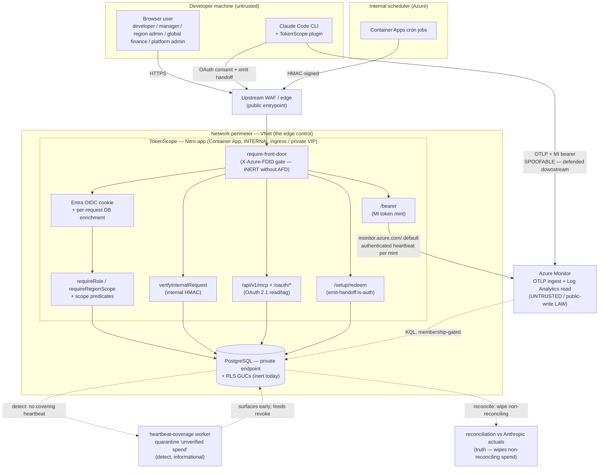

# Security Overview

> **Audience: InfoSec / security reviewers.** Entry point for a security review
> of TokenScope. Read this in ~15 minutes to get the whole posture, then drill
> into the linked domain pages. For mechanism-level depth see
> [Authentication & Security](Authentication-and-Security.md); for the network
> and data domains see [Network Architecture](Network-Architecture.md) and
> [Data Protection](Data-Protection.md). Deployment-specific values for the
> Insight instance are in [Insight Deployment](Insight-Deployment.md).

> **Status: MVP-Beta-1 — in active development.** Claude Code is the **only**
> supported client today. Copilot, the tenant OTLP bridge, FIN connectors, and
> the MCP/OAuth surface are **designed but not built**. Throughout this page,
> controls are tagged **Today** (as-built, running in the **VNet-integrated**
> deployment mode — internal ACA behind an upstream WAF, data plane over private
> endpoints) or **Planned** (roadmap / pre-pilot). Don't review the roadmap as if
> it shipped.

## What it is, and what data it touches

- **What:** TokenScope joins Claude Code usage telemetry to project financials so
  every token of spend is attributed to a project (or spills to a named
  cost-owning unit). It governs by additive budgets and velocity limits.
- **Data it touches:** developer identity (Entra `oid` / email / name), session
  attestations, **token-usage counts and computed cost** (not prompt/response
  bodies), project + org-unit registries, and an append-only audit trail.
- **Data it does NOT touch:** prompt or completion **content**. Telemetry is
  metadata only — `api_request` log events with token counters, never message
  bodies. This is the core architectural boundary.

## Trust boundaries

Four caller classes cross into the app, each with a distinct auth mechanism. In
the VNet-integrated mode there is **no per-app Azure Front Door**: the Container
Apps environment is **internal** (private VIP) and the public entrypoint is an
**upstream WAF/edge**. The live network control is therefore the **network
perimeter — VNet + the WAF**, not a per-app header check. The `X-Azure-FDID`
header gate is **inert** in this mode (there is no Front Door to inject it); it is
retained in the code as a defence-in-depth control for any Front-Door-fronted
environment. Data-plane and ACR access are over **private endpoints**.

| Boundary crossing | What crosses | Control |
|---|---|---|
| Browser → app | Entra OIDC cookie | OIDC + DB enrichment + RBAC + RLS *(RLS inert today)* |
| MCP/CLI → app | OAuth 2.1 access token (read/tag); one-time emit handoff | PKCE consent; tokens hashed at rest; handoff single-use (~5-min TTL), redeemed at `/setup/redeem` for the durable emit credential (never via the LLM) |
| Scheduler → app | HMAC-signed worker trigger | `verifyInternalRequest` (separate key, ±300s window) |
| App → Azure Monitor | App-level MI bearer | Write-only, narrow scope (`monitor.azure.com/.default`) |
| CLI → Azure Monitor | OTLP token-usage logs + MI bearer | Metadata only; no message bodies |
| Azure Monitor → app | Read joiner KQL results | Membership gate + per-org reconciliation lane |

## Security model summary

| Domain | Mechanism (Today) | Notes |
|---|---|---|
| **AuthN — browser** | Entra OIDC (`nuxt-oidc-auth`) cookie + per-request DB enrichment | Only path that reads "my data" or changes attribution; revocation honoured against `revoked_at` |
| **AuthN — telemetry** | App-level **Managed Identity** bearer | Write-only to one DCR; same token every session; Azure never sees a TokenScope token |
| **AuthN — MCP/CLI** | **OAuth 2.1** PKCE (read/tag); one-time **emit handoff** (handoff-is-auth) for device provisioning | Tokens HMAC-hashed at rest; non-rotating refresh (revoke is the control); handoff single-use via atomic conditional `UPDATE`, ~5-min TTL; durable emit secret redeemed process→server, never through the LLM |
| **AuthN — internal** | **HMAC-SHA256** worker-trigger signature | Key separate from session key (blast-radius isolation); constant-time compare; uniform 401 |
| **AuthZ — roles** | **RBAC** — 5 assignable roles: developer / manager / admin ("Region admin") / global-finops ("Global finance") / platform-admin. A 6th enum member, `finance`, is **retired/unassignable** (excluded from `SELECTABLE_ROLES`, kept only for historical rows) | `requireRole` + `requireRegionScope`; `platform-admin` short-circuits |
| **AuthZ — data scope** | App-level scope predicates **+ Postgres RLS** (defence-in-depth) | App predicates are the **live** gate; RLS is shipped but **inert** under owner connection (see risk register) |
| **CSRF** | `assertSameOrigin` on mutating verbs | OIDC cookie is `sameSite=lax`; token-is-auth endpoints carry no cookie so are exempt. Expected origin = the PUBLIC origin via `getPublicRequestURL` — a pinned `appPublicOrigin` (WAF-fronted; correct regardless of Host rewriting), else the AFD-forwarded host gated on `AZURE_FRONT_DOOR_ID`, else the request Host |
| **Persona override** | `allowPersonaOverride` (non-production demo affordance) | **Allowlist floor:** enabled only when env ∈ {`local`, `sandbox`}; `dev`/`staging`/`production`/`unknown` refuse structurally (404) **before any flag or role**. A non-demo env runs real Entra only, and no flag drift can re-open it |
| **Audit** | Append-only `audit_event` (DB trigger blocks UPDATE/DELETE) | Single allocation point `recordAuditEvent`; immutable rows |

Full mechanism detail (env vars, headers, cookies, sequence diagrams):
**[Authentication & Security](Authentication-and-Security.md)**.

## Threat model summary (STRIDE × trust boundary)

As-built components only. The full per-component enumeration lives in the
design-era threat model at
[`docs/design/stride-mvp-lite-threat-model.md`](../design/stride-mvp-lite-threat-model.md)
— note it **predates some as-built changes** (it still references the retired
launcher / broker / bridge model and BullMQ workers; the as-built uses external
cron + HMAC trigger and an **MCP-first OAuth 2.1** client backbone — the
setup-token enrolment it may reference was itself retired in PR #38).

| Boundary / component | S | T | R | I | D | E |
|---|---|---|---|---|---|---|
| **Plugin (dev machine)** | Marketplace impersonation — manual known-good install today; `strictKnownMarketplaces` Planned. Identity anchored to authed device attestation (DEVICE_SID), not the emitted `user.email` | Plugin emits wrong `project_code` claim — membership gate spills it (R7 / [ADR-0004](../decisions/0004-attribution-trust-model.md)) | `session-attested` / `attribution-spill-unauthorized` audit | No header logging; bearer never persisted | Rate-limit (fail-open, Planned hardening) | Runs as dev; no privileged path |
| **MCP / OAuth / provision API** | Code/handoff forgery — CSPRNG, HMAC-hashed, single-use; PKCE S256 binds the code | Replay/concurrent redeem → 0 rows → 401; non-rotating refresh + revoke | `emit-handoff-minted` / `emit-provisioned` audit | Emit credential is `tokenscope.emit`-only (**read→emit one-way wall**: an emit bearer is rejected by every read/tag/MCP/admin surface; the audited `provision_emit` is the only crossing — a leaked emit token can spoof telemetry but can never read, tag, or bootstrap privilege); handoff never carries the secret | Single-use cap; short TTL | Consent runs on the Entra session (`POST /oauth/authorize` asserts same-origin); emit bearer can't authenticate a user; no privileged surface derives authority from an emitted field |
| **OIDC sign-in** | Dev-mode mock gated by an env **allowlist** (`NUXT_DEPLOY_ENV` ∈ {local, sandbox}; every other env refuses structurally) | Group→role mapping at deploy; JIT defaults `developer` | `teammate-jit-created` audit | Per-request enrichment, frozen session | IdP outage out of scope | Revocation vs `revoked_at`; last-admin protection |
| **RLS Postgres** | MI → least-priv DB role (Planned; owner conn today) | App predicates ≥ RLS-restrictive | `audit_event` trigger immutable | App scope predicates are the live region/org gate | LTREE GIST index | RLS inert today — app predicates are the boundary |
| **Azure Monitor read joiner** | Teammate resolved from attestation by `tokenscope.instance_id` (DEVICE_SID); project is membership-gated claim. **Untrusted public-write LAW channel** — spoofed rows claiming a victim's instance/project are defended by **revoke + detect + reconcile** ([ADR-0008](../decisions/0008-emission-spoof-detection-and-quarantine.md)): the **heartbeat-coverage** worker quarantines spend with no covering authenticated `/bearer` heartbeat as "unverified spend" (`/api/v1/me/quarantined-spend`), catching the **cross-instance spoof early** (informational only — never auto-revokes/deletes); reconciliation wipes non-reconciling spend | `cost_usd` computed server-side from rate card | Reconciliation lanes per org; `spend-quarantined` detection audit (non-enforcement) | KQL filtered by attested DEVICE_SIDs | Stale dashboards on outage | Background worker, not a user surface |
| **Internal worker trigger** | HMAC-signed; separate key | Body SHA in signed payload | Worker actor in audit | Uniform 401 (no oracle) | Idempotent workers | M2M only; no user identity |

## Supply chain & audit posture

- **Scanner bundle** (`/security-audit`, full mode, latest overnight run): **secure
  state, 0 non-cosmetic findings**.

  | Scanner | Real findings | Disposition |
  |---|---|---|
  | gitleaks / trufflehog (secrets) | 0 | All false positives; local secret files gitignored & untracked |
  | semgrep (217 SAST rules) | 0 | False positives (template-literal logs; dev/test mock HMAC seed) |
  | osv-scanner / `npm audit` (deps) | 0 (post-fix) | 2 LOW dev-only CVEs **fixed** via `package.json` overrides (`tmp`, `esbuild`) |
  | trivy (vuln / secret / IaC) | 0 | No HIGH/CRITICAL across deps, secrets, or Bicep |
  | hadolint (Dockerfile) | 1 cosmetic | DL3008 apt-pin — accepted for pilot image |

- **Dep-CVE override fix:** both flagged CVEs were transitive **dev/build-only**
  deps (not in the pruned `.output` prod bundle); pinned via overrides anyway —
  `tmp@>=0.2.6`, `esbuild@>=0.25.0`. Post-fix scanners report 0.
- **Append-only audit trail:** all security-relevant actions flow through
  `recordAuditEvent` into the immutable `audit_event` table (DB trigger rejects
  UPDATE/DELETE). Events: JIT teammate creation, session attestation, setup
  exchange, persona impersonation, admin mutations.
- Scanner SARIFs are retained under `.claude-audit/current/`. Full report:
  [`docs/security-audit-report.md`](../security-audit-report.md).

## Risk register (current — accepted residuals)

Honest, precise list of known-and-accepted gaps as-built. None blocking for
MVP-Beta-1; each has a documented disposition.

| # | Residual | Why accepted today | Closes |
|---|---|---|---|
| R1 | **Internal-HMAC replay window** — ±300s, **no nonce** | Harm neutralised: every worker entrypoint is idempotent (joiner `ON CONFLICT`, poller upsert); behind the VNet perimeter + IT WAF + TLS + HMAC | Planned: replay nonce |
| R2 | **`admin`-role RLS region-unbounded** (`0002_rls.sql`) | RLS is **inert** under the owner DB connection until the non-owner role lands; the **app-level region predicate is the live gate** | Epic 10 (non-owner DB role) |
| R3 | **~~`/instances/attest` not yet on a real Entra bearer~~ — CLOSED by the cutover** | The standalone direct-attest route was removed; the device binding is now minted by the OAuth-authenticated `provision_emit` (a read+tag consent token, validated via `requireOAuthBearer`), and `/bearer` / `/end` gate on the OAuth `tokenscope.emit` token. The placeholder-principal-OID gap no longer exists | Closed (PR #38) |
| R4 | **CSP `style-src 'unsafe-inline'`** | `@nuxt/ui` v4 baseline requirement for injected styles; rest of CSP is tight (`frame-ancestors 'none'`, constrained `img-src`/`font-src`) | Track upstream |
| R5 | **`X-Azure-FDID` header gate is inert in the VNet-integrated mode** — no per-app Front Door to inject it | The **network perimeter (VNet + upstream WAF) is the edge control** here; the ACA environment is internal (private VIP), so the header check is not the gate. The code retains it as defence-in-depth for any Front-Door-fronted environment | n/a (env-specific; gate re-activates only behind a Front Door) |
| R6 | **~~`assertSameOrigin` must trust the IT WAF's forwarded `Host`~~ — RESOLVED by origin pinning** | The public hostname (at the WAF) differs from the internal ACA FQDN. The app now **pins its public origin** via `appPublicOrigin` (`APP_PUBLIC_ORIGIN`), resolved through `getPublicRequestURL`, so same-origin validation uses the user-facing origin **regardless of whether the WAF preserves or rewrites `Host`** — no dependency on WAF Host-forwarding | Closed (origin pinning) |
| R7 | **Shared app-level emit bearer is the attribution spoof-root** | Attribution **identity is anchored to the authed device attestation** (resolved by `tokenscope.instance_id` / DEVICE_SID, bound at an authenticated enrol) — **not spoofable per-event**; the **project is a membership-gated claim**. The residual: an *enrolled insider* who extracts the shared MI bearer from the global config can emit **arbitrary** resource attrs (foreign DEVICE_SID and/or project). Bounded to **noise-class** — no quota gain (attribution never grants/blocks compute), membership-gated, and reconciliation against Anthropic Analytics nets it out. **Accepted** per [ADR-0004](../decisions/0004-attribution-trust-model.md); insider-bounded (bearer needs an authed enrol). Pre-pilot guardrail: ingestion-volume / anomaly alert (below) | Re-open per ADR-0004 triggers (e.g. enforcement coupling, per-user bearer) |
| R8 | **Spoofed emissions over the untrusted, public-write LAW channel** — anyone holding the broadly-readable `tokenscope.emit` credential (it lives in `~/.claude/settings.json` on every host) or LAW write access can hand-write **spoofed** `attribution_record` rows claiming a victim's `instance_id` / `project.code_hash` / email | Defended by **revoke + detect + reconcile** with strict emit-credential isolation, **not** by trusting the wire or per-record signing (a signing collector was rejected as over-engineering — [ADR-0008](../decisions/0008-emission-spoof-detection-and-quarantine.md), [ADR-0005](../decisions/0005-durable-emission-auth-and-attestation.md)). **Detect (built, PR #37):** each `/bearer` mint stamps an **authenticated heartbeat** (`last_bearer_at`); the heartbeat-coverage worker **quarantines** spend whose session window has no covering heartbeat as "unverified spend" (`/api/v1/me/quarantined-spend`), **catching the cross-instance spoof early** (before reconciliation's ~1h+ lag). **Quarantine is informational only — never auto-revokes/deletes.** **Reconcile** wipes non-reconciling spend (the truth backstop). **Isolation:** the read→emit one-way wall (an emit bearer is rejected by every read/tag/MCP/admin surface). **Residual not caught by quarantine:** full emit-credential **theft** — a thief's `/bearer` mints heartbeat **as the victim**, so theft-spend looks covered → stays on **revoke + reconcile** | Re-open per ADR-0008 triggers; admin/region quarantine view is the tracked follow-up |
| R9 | **Query-side exfiltration of the telemetry corpus via a stolen `Log Analytics Reader` credential** — the app MI holds `Log Analytics Reader`; before this hardening the query path was the one data egress reachable over the public internet, so a stolen credential could mass-exfiltrate attribution metadata from anywhere | **Mitigated:** Private query (AMPLS + PE), in-VNet only; ingestion stays public. `publicNetworkAccessForQuery=Disabled` + an Azure Monitor Private Link Scope (`queryAccessMode=PrivateOnly`) + a private endpoint make the corpus queryable **only from inside the VNet** — same private-endpoint pattern as KV/PG/Redis/ACR; OTLP ingestion stays public by design (clients emit from outside the zone). Leak is bounded to metadata (NFR-SEC-3/5: no prompt/response bodies); does **not** defend against code execution inside the VNet/on the app, and **does not touch** the write/spoof path (R8) | Mitigated (dev; rolls to staging/prod via `monitorQueryPrivateOnly`) |

## Planned security hardening (pre-pilot checklist)

Roadmap controls — **not yet in place**. These are the pre-pilot gates before
scale-out beyond the dogfood/beta footprint.

- [x] **OAuth-authenticated device binding** — the legacy `/instances/attest`
      placeholder-OID path was retired (PR #38); device provisioning runs through
      the OAuth-authenticated `provision_emit` and `/bearer`/`/end` gate on the
      OAuth `tokenscope.emit` token (closes R3).
- [x] **VNet + private endpoints** — **in place** (VNet-integrated mode): the ACA
      environment is internal (private VIP) behind an upstream WAF, and the data
      plane + ACR are reached over private endpoints (see
      [Network Architecture](Network-Architecture.md)). Remaining: per-app edge
      hardening as the footprint scales out.
- [ ] **Per-worker Managed Identity separation** — split the shared app MI as worker scope grows.
- [ ] **Internal-HMAC replay nonce** (closes R1).
- [x] **Authenticated-heartbeat coverage / quarantine** — the per-session detect
      leg for spoofed emissions (R8): the heartbeat-coverage worker flags spend with
      no covering `/bearer` heartbeat as "unverified spend"
      (`/api/v1/me/quarantined-spend`), catching the cross-instance spoof early.
      **Built (PR #37); informational only.** See
      [ADR-0008](../decisions/0008-emission-spoof-detection-and-quarantine.md).
      (Does **not** replace the ingestion-volume alert below — they are
      complementary detect signals.)
- [ ] **Ingestion-volume / anomaly alert** — detect abnormal OTLP emit volume or
      attribution patterns on the Azure-Monitor ingest path (there is **no
      app-side rate-limit** there). The detect-side guardrail for the shared-bearer
      spoof-root (R7); required by [ADR-0004](../decisions/0004-attribution-trust-model.md) before pilot.
- [ ] **`strictKnownMarketplaces` plugin pin** — lock the pilot to the TokenScope
      marketplace (manual known-good install today).
- [ ] **Rate-limit fail-open posture** — define behaviour on the rate-limiter
      backing-store outage before pilot.
- [ ] **Standalone STRIDE for the Copilot / tenant OTLP bridge** before it ships
      (out of scope for the current as-built model).

---

**Reviewer notes:**
- **R3** — CLOSED by the MCP-first OAuth cutover (PR #38): `/instances/attest`
  was removed; device binding is OAuth-authenticated (`provision_emit`) and the
  ingest endpoints gate on the OAuth `tokenscope.emit` token. No placeholder
  principal remains.
- **R6** — CLOSED by origin pinning: `assertSameOrigin` validates against the
  pinned `appPublicOrigin` (the public WAF hostname), so it no longer depends on
  the WAF forwarding the original `Host`.
