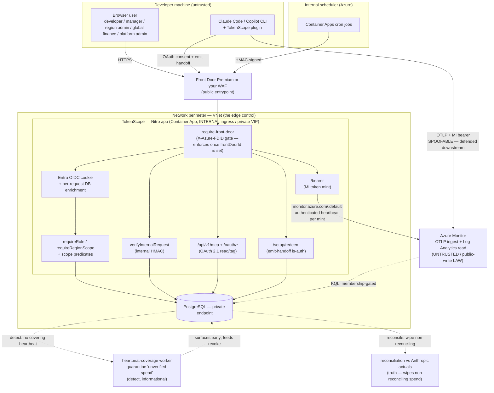

# Security Overview

> **Audience: InfoSec / security reviewers.** Entry point for a security review
> of TokenScope. Read this in ~15 minutes to get the whole posture, then drill
> into the linked domain pages. For mechanism-level depth see
> [Authentication & Security](Authentication-and-Security.md); for the network
> and data domains see [Network Architecture](Network-Architecture.md) and
> [Data Protection](Data-Protection.md).

> **Status: 1.0.0-rc.1 — release candidate.** Claude Code is the primary client;
> the **MCP/OAuth surface** and a **GitHub Copilot** lane (the plugin's usage
> extension reads Copilot's `assistant.usage` events and sends OTLP logs) are
> built and running. The tenant OTLP bridge and
> finance-system connectors are **designed but not built**.
>
> Throughout this page, controls are tagged **Today** (as-built, running in the
> **VNet-integrated** deployment mode — internal ACA behind Front Door Premium
> over Private Link or your own WAF, data plane over private endpoints) or **Planned** (roadmap / pre-pilot). **A release
> candidate is not a claim that every control below is in force** — the register
> further down lists the residuals that are accepted today, each with its
> disposition. Read the tags; don't review the roadmap as if it shipped.

## What it is, and what data it touches

- **What:** TokenScope joins Claude Code usage telemetry to project financials so
  every token of spend is attributed to a project (or spills to a named
  cost-owning unit). It governs by additive budgets and velocity limits.
- **Data it touches:** developer identity (Entra `oid` / email / name), session
  attestations, **token-usage counts and computed cost** (not prompt/response
  bodies), project + org-unit registries, and an append-only audit trail.
- **Data it does NOT touch:** prompt or completion **content**. Telemetry is
  metadata only — `api_request` log events with token counters, never message
  bodies. This is the core architectural boundary.

## Trust boundaries

Four caller classes cross into the app, each with a distinct auth mechanism. In
the VNet-integrated mode the Container Apps environment is **internal** (private
VIP) and the public entrypoint is either **Azure Front Door Premium over Private
Link** (recommended) or **your own WAF/edge**. The network perimeter is the edge
control in both. With Front Door, once `frontDoorId` is set, the `X-Azure-FDID`
header gate also enforces: a request without Front Door's header is refused. With
your own WAF the gate is **inert** (there is no Front Door to inject it). An
operator can close the pre-`frontDoorId` window explicitly by setting
`AZURE_FRONT_DOOR_REQUIRED=true`, which makes the middleware refuse every path but
`/api/health` rather than no-op; the templates do not set it (R5). Data-plane and
ACR access are over **private endpoints**.

```mermaid
flowchart TB
    subgraph DevZone["Developer machine (untrusted)"]
        BR["Browser user<br/>developer / manager / region admin / global finance / platform admin"]
        CC["Claude Code / Copilot CLI<br/>+ TokenScope plugin"]
    end
    subgraph InternalZone["Internal scheduler (Azure)"]
        CRON["Container Apps cron jobs"]
    end

    WAF["Front Door Premium or your WAF<br/>(public entrypoint)"]

    subgraph Perimeter["Network perimeter — VNet (the edge control)"]
    subgraph AppZone["TokenScope — Nitro app (Container App, INTERNAL ingress / private VIP)"]
        FD["require-front-door<br/>(X-Azure-FDID gate — enforces once frontDoorId is set)"]
        OIDC["Entra OIDC cookie<br/>+ per-request DB enrichment"]
        RBAC["requireRole / requireRegionScope<br/>+ scope predicates"]
        HMACI["verifyInternalRequest<br/>(internal HMAC)"]
        OAUTH["/api/v1/mcp + /oauth/*<br/>(OAuth 2.1 read/tag)"]
        SETUP["/setup/redeem<br/>(emit-handoff is-auth)"]
        BEARER["/bearer<br/>(MI token mint)"]
    end
    PG[("PostgreSQL — private endpoint")]
    end

    AZ["Azure Monitor<br/>OTLP ingest + Log Analytics read<br/>(UNTRUSTED / public-write LAW)"]
    HB["heartbeat-coverage worker<br/>quarantine 'unverified spend'<br/>(detect, informational)"]
    REC["reconciliation vs Anthropic actuals<br/>(truth — wipes non-reconciling spend)"]

    BR -->|HTTPS| WAF
    CC -->|OAuth consent + emit handoff| WAF
    CRON -->|HMAC-signed| WAF
    WAF --> FD
    FD --> OIDC --> RBAC --> PG
    FD --> HMACI --> PG
    FD --> OAUTH --> PG
    FD --> SETUP --> PG
    FD --> BEARER -->|monitor.azure.com/.default<br/>authenticated heartbeat per mint| AZ
    CC -->|OTLP + MI bearer<br/>SPOOFABLE — defended downstream| AZ
    AZ -.->|KQL, membership-gated| PG
    PG -.->|detect: no covering heartbeat| HB
    HB -.->|surfaces early; feeds revoke| PG
    PG -.->|reconcile: wipe non-reconciling| REC
```

| Boundary crossing | What crosses | Control |
|---|---|---|
| Browser → app | Entra OIDC cookie | OIDC + DB enrichment + RBAC |
| MCP/CLI → app | OAuth 2.1 access token (read/tag); one-time emit handoff | PKCE consent; tokens hashed at rest; handoff single-use (~5-min TTL), redeemed at `/setup/redeem` for the durable emit credential (never via the LLM) |
| Scheduler → app | HMAC-signed worker trigger | `verifyInternalRequest` (separate key, ±300s window) |
| App → Azure Monitor | App-level MI bearer | Write-only, narrow scope (`monitor.azure.com/.default`) |
| CLI → Azure Monitor | OTLP token-usage logs + MI bearer | Metadata only; no message bodies |
| Azure Monitor → app | Read joiner KQL results | Membership gate + per-org reconciliation lane |

## Security model summary

| Domain | Mechanism (Today) | Notes |
|---|---|---|
| **AuthN — browser** | Entra OIDC (`nuxt-oidc-auth`) cookie + per-request DB enrichment | Only path that reads "my data" or changes attribution; revocation honoured against `revoked_at`, and a teammate with `is_active = false` resolves no session at all |
| **AuthN — telemetry** | App-level **Managed Identity** bearer | Write-only to one DCR; same token every session; Azure never sees a TokenScope token |
| **AuthN — MCP/CLI** | **OAuth 2.1** PKCE (read/tag); one-time **emit handoff** (handoff-is-auth) for device provisioning | Tokens HMAC-hashed at rest; non-rotating refresh (revoke is the control); handoff single-use via atomic conditional `UPDATE`, ~5-min TTL; durable emit secret redeemed process→server, never through the LLM. An emit credential is checked against its bound `instance_id` **at use** on every instance-scoped route, not only at mint. Deactivation (`teammate.is_active = false`) refuses bearer validation, refresh, code exchange and issuance alike, so no credential survives it and none is minted after it |
| **AuthN — internal** | **HMAC-SHA256** worker-trigger signature | Key separate from session key (blast-radius isolation); constant-time compare; uniform 401 |
| **AuthZ — roles** | **RBAC** — 4 assignable roles: developer / manager / admin ("Region admin") / platform-admin. TWO further enum members, `finance` and `global-finops`, are **retired/unassignable** (excluded from `SELECTABLE_ROLES`, kept only so historical rows render a label) | `requireRole` + `requireRegionScope`; `platform-admin` short-circuits |
| **AuthZ — data scope** | App-level scope predicates | Region + org-subtree clamps applied in-query on every scoped surface; report reach is a revocable per-teammate grant. This is the only data-scope gate — the schema's RLS policies do not execute under the owner connection |
| **CSRF** | `assertSameOrigin` on mutating verbs | OIDC cookie is `sameSite=lax`; token-is-auth endpoints carry no cookie so are exempt. Expected origin = the PUBLIC origin via `getPublicRequestURL` — a pinned `appPublicOrigin` (WAF-fronted; correct regardless of Host rewriting), else the AFD-forwarded host gated on `AZURE_FRONT_DOOR_ID`, else the request Host |
| **Persona override** | `allowPersonaOverride` (non-production demo affordance) | **Allowlist floor:** enabled only when env ∈ {`local`, `sandbox`}; `dev`/`staging`/`production`/`unknown` refuse structurally (404) **before any flag or role**. A non-demo env runs real Entra only, and no flag drift can re-open it |
| **Audit** | Append-only `audit_event` (DB trigger blocks UPDATE/DELETE) | Single allocation point `recordAuditEvent`; immutable rows |

Full mechanism detail (env vars, headers, cookies, sequence diagrams):
**[Authentication & Security](Authentication-and-Security.md)**.

## Threat model summary (STRIDE × trust boundary)

As-built components only: scheduled workers are triggered by external cron + HMAC,
and clients connect through an **MCP-first OAuth 2.1** backbone.

| Boundary / component | S | T | R | I | D | E |
|---|---|---|---|---|---|---|
| **Plugin (dev machine)** | Marketplace impersonation — manual known-good install today; `strictKnownMarketplaces` Planned. Identity anchored to authed device attestation (DEVICE_SID), not the emitted `user.email` | Plugin emits wrong `project_code` claim — membership gate spills it (R7 / ADR-0004) | `session-attested` / `attribution-spill-unauthorized` audit | No header logging; bearer never persisted; the durable OAuth refresh token is not written into tagged repos | Rate-limit (fail-open, Planned hardening) | Runs as dev; no privileged path. A cloned repository's `.claude/settings.local.json` cannot choose the plugin's credential-bearing endpoints, its API base or its state dir (see [Claude Code Client](Claude-Code-Client.md)) |
| **MCP / OAuth / provision API** | Code/handoff forgery — CSPRNG, HMAC-hashed, single-use; PKCE S256 binds the code | Replay/concurrent redeem → 0 rows → 401; non-rotating refresh + revoke | `emit-handoff-minted` / `emit-provisioned` audit | Emit credential is `tokenscope.emit`-only (**read→emit one-way wall**: an emit bearer is rejected by every read/tag/MCP/admin surface; the audited `provision_emit` is the only crossing — a leaked emit token can spoof telemetry but can never read, tag, or bootstrap privilege); handoff never carries the secret | Single-use cap; short TTL | Consent runs on the Entra session (`POST /oauth/authorize` asserts same-origin); emit bearer can't authenticate a user; no privileged surface derives authority from an emitted field |
| **OIDC sign-in** | Dev-mode mock gated by an env **allowlist** (`NUXT_DEPLOY_ENV` ∈ {local, sandbox}; every other env refuses structurally) | Group→role mapping at deploy; JIT defaults `developer` | `teammate-jit-created` audit | Per-request enrichment, frozen session | IdP outage out of scope | Revocation vs `revoked_at`; last-admin protection |
| **Postgres** | Admin credential in Key Vault, private endpoint | App predicates clamp region + org subtree | `audit_event` trigger immutable | App scope predicates are the region/org gate | LTREE GIST index | Data scope is enforced in the app |
| **Azure Monitor read joiner** | Teammate resolved from attestation by `tokenscope.instance_id` (DEVICE_SID); project is membership-gated claim. **Untrusted public-write LAW channel** — spoofed rows claiming a victim's instance/project are defended by **revoke + detect + reconcile** (ADR-0008): the **heartbeat-coverage** worker quarantines spend with no covering authenticated `/bearer` heartbeat as "unverified spend" (`/api/v1/me/quarantined-spend`), catching the **cross-instance spoof early** (informational only — never auto-revokes/deletes); reconciliation wipes non-reconciling spend | `cost_usd` computed server-side from rate card | Reconciliation lanes per org; `spend-quarantined` detection audit (non-enforcement) | KQL filtered by attested DEVICE_SIDs | Stale dashboards on outage | Background worker, not a user surface |
| **Internal worker trigger** | HMAC-signed; separate key | Body SHA in signed payload | Worker actor in audit | Uniform 401 (no oracle) | Idempotent workers | M2M only; no user identity |

## Supply chain & audit posture

- **Scanner bundle** (`/security-audit`, full mode, latest overnight run): **secure
  state, 0 non-cosmetic findings**.

  | Scanner | Real findings | Disposition |
  |---|---|---|
  | gitleaks / trufflehog (secrets) | 0 | All false positives; local secret files gitignored & untracked |
  | semgrep (217 SAST rules) | 0 | False positives (template-literal logs; dev/test mock HMAC seed) |
  | osv-scanner / `npm audit` (deps) | 0 (post-fix) | 2 LOW dev-only CVEs **fixed** via `package.json` overrides (`tmp`, `esbuild`) |
  | trivy (vuln / secret / IaC) | 0 | No HIGH/CRITICAL across deps, secrets, or Bicep |
  | hadolint (Dockerfile) | 1 cosmetic | DL3008 apt-pin — accepted for pilot image |

  **Read that table for what it is.** A clean scanner bundle means no *pattern-matchable*
  secret, dependency or IaC defect — it is not evidence of a clean authorization model.
  The deeper agentic pass that runs alongside it produced 81 findings the triage stood
  behind, remediated across the surfaces described on this page; the residuals it could
  not close are the risk register above and the checklist below, and the two it accepted
  on the record are R12/R13.
- **Dep-CVE override fix:** both flagged CVEs were transitive **dev/build-only**
  deps (not in the pruned `.output` prod bundle); pinned via overrides anyway —
  `tmp@>=0.2.6`, `esbuild@>=0.25.0`. Post-fix scanners report 0.
- **`@hono/node-server` override (temporary — remove when upstream catches up):**
  GHSA-frvp-7c67-39w9 (MEDIUM, CVSS 5.9 — `serve-static` path traversal via an
  encoded `%5C` on Windows) is patched only in **2.0.5+**; no 1.x release carries
  the fix. `@modelcontextprotocol/sdk` 1.29.0 (current latest) still declares
  `^1.19.9`, so there is no in-range transitive bump to take. `package.json`
  therefore carries a **scoped** override — `@modelcontextprotocol/sdk` →
  `@hono/node-server: ^2.0.5` — which forces the major only inside the SDK's
  subtree rather than repo-wide.
  The SDK's only use of the package is `getRequestListener` in
  `@modelcontextprotocol/sdk/server/streamableHttp.js`; that export and its `{ overrideGlobalObjects }`
  option are unchanged in v2, and the override was runtime-verified by driving a
  real MCP `initialize` over a real `node:http` server (200 + SSE handshake) —
  this is the live path behind `server/api/v1/mcp/[...].ts`.
  Our own exposure to the CVE is nil — we never mount `serve-static` and the
  deployed app is Linux — but the alert is closed rather than dismissed.
  **This is a hidden fork: delete the override once `@modelcontextprotocol/sdk`
  ships a release depending on `@hono/node-server@^2`.**
- **`fast-uri`** (GHSA-v2hh-gcrm-f6hx, HIGH — host confusion via a literal
  backslash authority delimiter) needed no override: `ajv@8` allows `^3.0.1`, so
  the patched `3.1.4` is a real in-range transitive bump.
- **`@unhead/vue` override** (`^3.2.3`) is a *build-correctness* pin, not a
  security one — nuxt 4.5 requires unhead v3 while `@nuxt/ui` still declares v2.
  Same removal discipline: drop it once `@nuxt/ui` declares `^3`. See the
  `chore(deps)` commit for the full reasoning.
- **Append-only audit trail:** all security-relevant actions flow through
  `recordAuditEvent` into the immutable `audit_event` table (DB trigger rejects
  UPDATE/DELETE). Events: JIT teammate creation, session attestation, setup
  exchange, persona impersonation, admin mutations.

## Risk register (current — accepted residuals)

Honest, precise list of known-and-accepted gaps as-built. None blocking for
1.0.0-rc.1; each has a documented disposition.

| # | Residual | Why accepted today | Closes |
|---|---|---|---|
| R1 | **Internal-HMAC replay window** — ±300s, **no nonce** | Harm neutralised: every worker entrypoint is idempotent (joiner `ON CONFLICT`, poller upsert); behind the VNet perimeter + the entrypoint WAF + TLS + HMAC | Planned: replay nonce |
| R2 | **The app layer is the only data-scope boundary** — a handler that omits its scope predicate has nothing behind it | Deliberate: the schema's RLS policies key on role, while report reach is a revocable per-teammate grant, so enabling them would contradict configured access rather than back it up. The exposure is mitigated by a CI gate (`check-handler-rls-context.mjs`), shared scope-predicate helpers rather than hand-rolled clauses, and route-level tests | Not planned — the policies would first have to express grants rather than roles |
| R3 | **~~`/instances/attest` not yet on a real Entra bearer~~ — CLOSED by the cutover** | The standalone direct-attest route was removed; the device binding is now minted by the OAuth-authenticated `provision_emit` (a read+tag consent token, validated via `requireOAuthBearer`), and `/bearer` / `/end` gate on the OAuth `tokenscope.emit` token. The placeholder-principal-OID gap no longer exists | Closed (PR #38) |
| R4 | **CSP `style-src 'unsafe-inline'`** | `@nuxt/ui` v4 baseline requirement for injected styles; rest of CSP is tight (`frame-ancestors 'none'`, constrained `img-src`/`font-src`) | Track upstream |
| R5 | **`X-Azure-FDID` header gate enforces only once `frontDoorId` is set** — with your own WAF there is no Front Door to inject the header, and with Front Door the gate is a no-op until the apply that sets `frontDoorId` | The **network perimeter (VNet + the entrypoint) is the edge control**; the ACA environment is internal (private VIP), so the header check is defence in depth, not the gate. `AZURE_FRONT_DOOR_REQUIRED=true` makes the middleware **fail closed** (403 on everything but `/api/health`) even before an FDID is wired, but the templates do not set it. Coupled effect: `container-app.bicep` sets `NUXT_SECURITY_RATE_LIMITER_IP_HEADER` to `x-azure-clientip` **only** when the FDID is non-empty, so without it nuxt-security's global 150 req / 5 min limiter is keyed on a spoofable forwarded hop | Set `frontDoorId` in the Front Door shape (see the pre-pilot checklist) |
| R6 | **~~`assertSameOrigin` must trust the WAF's forwarded `Host`~~ — RESOLVED by origin pinning** | The public hostname (at the WAF) differs from the internal ACA FQDN. The app now **pins its public origin** via `appPublicOrigin` (`APP_PUBLIC_ORIGIN`), resolved through `getPublicRequestURL`, so same-origin validation uses the user-facing origin **regardless of whether the WAF preserves or rewrites `Host`** — no dependency on WAF Host-forwarding | Closed (origin pinning) |
| R7 | **Shared app-level emit bearer is the attribution spoof-root** | Attribution **identity is anchored to the authed device attestation** (resolved by `tokenscope.instance_id` / DEVICE_SID, bound at an authenticated enrol) — **not spoofable per-event**; the **project is a membership-gated claim**. The residual: an *enrolled insider* who extracts the shared MI bearer from the global config can emit **arbitrary** resource attrs (foreign DEVICE_SID and/or project). Bounded to **noise-class** — no quota gain (attribution never grants/blocks compute), membership-gated, and reconciliation against Anthropic Analytics nets it out. **Accepted** per ADR-0004; insider-bounded (bearer needs an authed enrol). Pre-pilot guardrail: ingestion-volume / anomaly alert (below) | Re-open per ADR-0004 triggers (e.g. enforcement coupling, per-user bearer) |
| R8 | **Spoofed emissions over the untrusted, public-write LAW channel** — anyone holding the broadly-readable `tokenscope.emit` credential (it lives in `~/.claude/settings.json` on every host) or LAW write access can hand-write **spoofed** `attribution_record` rows claiming a victim's `instance_id` / `project.code_hash` / email | Defended by **revoke + detect + reconcile** with strict emit-credential isolation, **not** by trusting the wire or per-record signing (a signing collector was rejected as over-engineering — ADR-0008, ADR-0005). **Detect (built, PR #37):** each `/bearer` mint stamps an **authenticated heartbeat** (`last_bearer_at`); the heartbeat-coverage worker **quarantines** spend whose session window has no covering heartbeat as "unverified spend" (`/api/v1/me/quarantined-spend`), **catching the cross-instance spoof early** (before reconciliation's ~1h+ lag). **Quarantine is informational only — never auto-revokes/deletes.** **Reconcile** wipes non-reconciling spend (the truth backstop). **Isolation:** the read→emit one-way wall (an emit bearer is rejected by every read/tag/MCP/admin surface). **Residual not caught by quarantine:** full emit-credential **theft** — a thief's `/bearer` mints heartbeat **as the victim**, so theft-spend looks covered → stays on **revoke + reconcile** | Re-open per ADR-0008 triggers; admin/region quarantine view is the tracked follow-up |
| R9 | **Query-side exfiltration of the telemetry corpus via a stolen `Log Analytics Reader` credential** — the app MI holds `Log Analytics Reader`; before this hardening the query path was the one data egress reachable over the public internet, so a stolen credential could mass-exfiltrate attribution metadata from anywhere | **Mitigated:** Private query (AMPLS + PE), in-VNet only; ingestion stays public. `publicNetworkAccessForQuery=Disabled` + an Azure Monitor Private Link Scope (`queryAccessMode=PrivateOnly`) + a private endpoint make the corpus queryable **only from inside the VNet** — same private-endpoint pattern as KV/PG/Redis/ACR; OTLP ingestion stays public by design (clients emit from outside the zone). Leak is bounded to metadata (NFR-SEC-3/5: no prompt/response bodies); does **not** defend against code execution inside the VNet/on the app, and **does not touch** the write/spoof path (R8) | Mitigated where `monitorQueryPrivateOnly` is on |
| R10 | **~~Copilot flat-seat showback does not populate for an App-mode enterprise~~ — CLOSED (UF-19)** | The enterprise seats pull is a PAT surface (it presents a Bearer PAT header an App-constructed client does not have), so App mode 401'd. It was a functional gap, never a leak — the call failed loud and isolated, no credential crossed a boundary and no wrong number was written. **The seat DATA path now branches on credential kind** like the construction path already did: the flat-seat writer reads `/orgs/{org}/copilot/billing/seats` per onboarded license org with that org's installation token, and org discovery reads the enterprise's `installable_organizations` census. The per-org pull reports whether the App was installed on the org at all, so the seat-convergence prune cannot read an unreadable org as "these seats are gone" | Closed |
| R11 | **The anonymous OAuth client-registration ceiling is per-process, not per-deployment** — the per-source sliding window is an in-memory counter, so N Container Apps replicas give N independent counters and the effective ceiling is N × the intended one | Bounded and low. The global `MAX_OAUTH_CLIENTS` cap still bounds total damage, the 1-hour sweep reclaims never-transacted clients, and registration mints nothing of value on its own — a registered client still needs a user to complete PKCE consent. This is defence-in-depth against registration spam, not the control that stops an attacker. **Do not read the code as a deployment-wide rate limit** | A shared counter substrate (the existing Redis session-store connection is the recommendation) |
| R12 | **The provisional enrolment credential is served on a deliberately weak gate** (`/api/v1/setup/enroll`) | Ratified as a threat-model invariant in the route's own header: the credential is **PROVISIONAL, EMIT-ONLY, CONSTANT-SHAPE**, and it binds a *shadow* teammate — `confirm-instance` refuses to join that shadow to a real teammate without an email match. The residual rests entirely on **enrolment-secret rotation**, for which **no application writer exists today** | Re-rate if rotation is still absent when the pilot widens beyond the dogfood cohort |
| R13 | **`provision_emit` returns a live handoff code into the agent transcript** — in the response field and again inside the printed redeem command | The handoff hop exists *precisely* so the durable emit credential never enters the LLM channel. The code is HMAC-hashed at rest, ~5-min TTL, single-use CAS, instance-bound, and prior handoffs are revoked on each mint. The residual is **at-rest transcript exposure** for the code's 5-minute life — a window in which it can only be redeemed once, for the device it is already bound to | Re-open if transcripts become long-lived or externally synced, or if the TTL is ever raised |

R12 and R13 are both **CRITICAL by computed blast radius**, and that is not a
contradiction: severity measures what a failure would reach, while acceptance is a
judgement that the *residual* after the compensating controls above is
proportionate. They are recorded here so a future audit that re-raises either finds
the analysis instead of re-deriving it and landing somewhere else.

## Planned security hardening (pre-pilot checklist)

Roadmap controls — **not yet in place**. These are the pre-pilot gates before
scale-out beyond the dogfood/beta footprint.

- [x] **OAuth-authenticated device binding** — the legacy `/instances/attest`
      placeholder-OID path was retired (PR #38); device provisioning runs through
      the OAuth-authenticated `provision_emit` and `/bearer`/`/end` gate on the
      OAuth `tokenscope.emit` token (closes R3).
- [x] **VNet + private endpoints** — **in place** (VNet-integrated mode): the ACA
      environment is internal (private VIP) behind Front Door Premium or your own
      WAF, and the data
      plane + ACR are reached over private endpoints (see
      [Network Architecture](Network-Architecture.md)). Remaining: per-app edge
      hardening as the footprint scales out.
- [ ] **`FORCE ROW LEVEL SECURITY` + a non-owner DB role** — the control that makes
      the shipped RLS policies actually execute (closes R2). **Enabling it today
      would be an outage, not a hardening:** 47 of 173 API handlers and **0 of 19**
      RLS-touching workers set the session GUCs, so with `FORCE` on their `SELECT`s
      would silently return zero rows (`current_setting(...)` evaluates NULL — a
      result indistinguishable from "no data") and their `INSERT`s would error. The
      sequence is: universal GUC coverage → policies for the tables a phase
      actually enables → the non-owner role, created by `drizzle/provision-app-role.ts`
      at boot (Azure PG Flexible Server has no ARM/Bicep resource for a native
      login, so it is SQL rather than Bicep — it does NOT need a human with a psql
      prompt: the migration runner already connects as the Flexible Server
      administrator) → a `database-url-app` KV secret + `secretRef` + an
      apply of `main.bicep` → the bootstrap-table `DISABLE` sweep → `FORCE`
      **per table**, on dev, watching for
      empty-result regressions at each step. A CI guard
      (`scripts/check-handler-rls-context.mjs`) holds the line: it started by
      pinning 47 context-less handlers so the debt could not grow, and now that
      every convertible one has been put on a lane it enforces a **reasoned**
      allowlist of 14 — each entry naming why that handler has no identity to
      carry (the OAuth bootstrap §5 rules on, two cross-identity provisional
      paths that need a `SECURITY DEFINER` reader, two provider probes that
      interleave DB reads with HTTP, and the two worker entry points).
- [ ] **Postgres `verify-full` TLS** — `sslmode=require` maps to
      `rejectUnauthorized=false` in `postgres@3`, so every connection encrypts but
      never **authenticates** the server. The KV-secret change and a single
      connection factory for all nine `postgres()` call sites are **shipped in
      code**, and the boot pre-flight now **warns** when `DATABASE_URL` names a
      non-loopback host without `verify-full` — but the change only takes effect on
      an apply of `main.bicep` that rewrites the secret, and a certificate/hostname
      mismatch turns a working app into a **boot loop** (migrations run first and
      are fatal). Probe each environment's PG FQDN from inside its network, apply
      one environment at a time, then flip the warning to a hard failure.
- [ ] **Front Door origin enforcement** (closes R5) — set `frontDoorId` in every
      Front Door deployment, and plumb `AZURE_FRONT_DOOR_REQUIRED` through
      `main.bicep`/`container-app.bicep` so one source owns both. The fail-closed
      code half is shipped; the templates do not set the flag. `/api/health` must
      stay excluded or ACA's probe restart-loops the replicas.
- [x] **A missing public origin fails closed where it matters** — the origin is
      baked into every device's durable emit credential, the OAuth issuer and the
      MCP `WWW-Authenticate` challenge. The setup routes (`/setup/enroll`,
      `/setup/redeem`) and the emit-bundle builder refuse (`500 Server
      Misconfigured`) unless `APP_PUBLIC_ORIGIN` is pinned, the request came
      through Front Door (`AZURE_FRONT_DOOR_ID` set and `X-Forwarded-Host`
      present), or the host is loopback. Both example parameter files document
      `appPublicOrigin`; after setting it, verify
      `/.well-known/oauth-authorization-server`.
- [ ] **Per-worker Managed Identity separation** — split the shared app MI as worker scope grows.
- [ ] **Split the deploy identity off the infra service principal** — the example
      workflows (`tokenscope-infra.yml`, `tokenscope-deploy.yml`) sign in with the
      same client id, and that principal holds **Owner**
      on the resource group for `deployRbac`. The far more frequently dispatched
      image-roll workflow therefore inherits role-assignment write it has no use for.
      Needs a second app registration + federated credential (AcrPush on the one
      registry, Contributor scoped to the one container app).
- [ ] **Internal-HMAC replay nonce** (closes R1).
- [x] **Authenticated-heartbeat coverage / quarantine** — the per-session detect
      leg for spoofed emissions (R8): the heartbeat-coverage worker flags spend with
      no covering `/bearer` heartbeat as "unverified spend"
      (`/api/v1/me/quarantined-spend`), catching the cross-instance spoof early.
      **Built (PR #37); informational only.** See
      ADR-0008.
      (Does **not** replace the ingestion-volume alert below — they are
      complementary detect signals.)
- [ ] **Ingestion-volume / anomaly alert** — detect abnormal OTLP emit volume or
      attribution patterns on the Azure-Monitor ingest path (there is **no
      app-side rate-limit** there). The detect-side guardrail for the shared-bearer
      spoof-root (R7); required by ADR-0004 before pilot.
- [ ] **Alarm on unreconcilable (telemetry-only) spend** — the **measurement** half
      is in place: the read joiner records the telemetry-only total per (region, day)
      on its worker run result, so the gap is countable. Nothing alarms on it. Which
      surface receives the signal (a Diagnostics card, a `worker_run` threshold, or a
      consumer of the existing `attribution-org-unclassified` audit event) and at what
      threshold is an open product decision; set the threshold from a fortnight of the
      recorded values, not from a guess.
- [ ] **`strictKnownMarketplaces` plugin pin** — lock the pilot to the TokenScope
      marketplace (manual known-good install today).
- [x] **Regression net in CI** — `npm run test:unit` now runs in CI (it previously
      did not), every workflow `uses:` is pinned to a commit SHA, the unverified
      bicep-binary `curl` was replaced with `az bicep build`, both dependabot
      ecosystems carry a 7-day cooldown, `ci.yml`'s `GITHUB_TOKEN` is scoped to
      `contents: read`, and a gate fails the build when plugin code changes without a
      version bump — Claude Code caches plugins by version and only re-installs when
      the number **increases**, so an unbumped fix reaches no device.
- [ ] **Rate-limit fail-open posture** — define behaviour on the rate-limiter
      backing-store outage before pilot. The two concrete loops the audit found
      (`provision_emit` minting, anonymous OAuth client registration) are now closed
      with **per-endpoint caps** rather than a general brake, so every "an
      authenticated caller loops this endpoint" argument rests on those caps; note
      that the registration cap is per-process (R11) and that the global limiter's
      key is only trustworthy once `frontDoorId` is set (R5).
- [ ] **Standalone STRIDE for the Copilot lane and the tenant OTLP bridge** — the
      bridge is not built and is out of scope for the as-built model above. The
      Copilot lane **is** in the footprint and carries the same client-side
      controls as the Claude lane (shared endpoint validator, device-store
      credentials — see [Copilot CLI Client](Copilot-CLI-Client.md)),
      but it has never had its own per-component enumeration; the STRIDE table above
      does not cover it.

---

**Reviewer notes:**
- **R3** — CLOSED by the MCP-first OAuth cutover (PR #38): `/instances/attest`
  was removed; device binding is OAuth-authenticated (`provision_emit`) and the
  ingest endpoints gate on the OAuth `tokenscope.emit` token. No placeholder
  principal remains.
- **R6** — CLOSED by origin pinning: `assertSameOrigin` validates against the
  pinned `appPublicOrigin` (the public hostname), so it no longer depends on
  the WAF forwarding the original `Host`.
